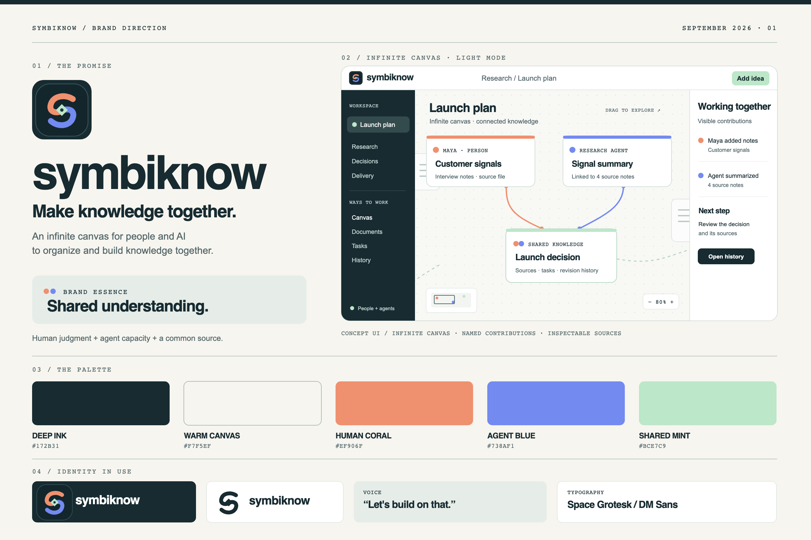
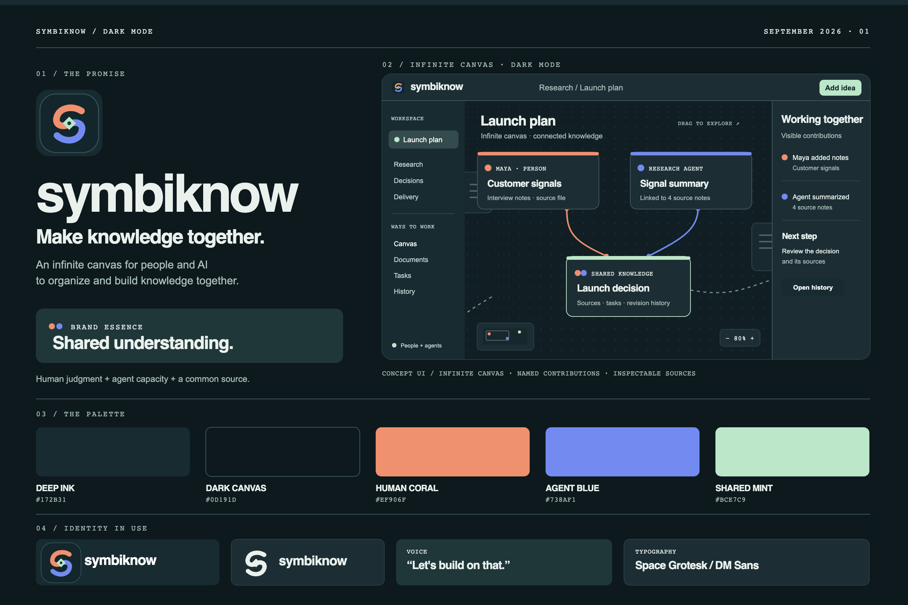

# SymbiKnow

**Brand identity for the SymbiKnow canvas · 26 September 2026**

**Name:** **SymbiKnow** (SIM-bee-no). The name combines *symbiosis* and *know*: people and AI contribute to one body of knowledge. Its first-use descriptor must always be plain: **“An infinite canvas where people and AI organize ideas and build knowledge together.”** The short line is **“Make knowledge together.”** The assistant inside the product is named **Symbi**.

This identity is implemented in the product UI and project documentation in this checkout. It is not a claim that a legal name or trademark has been cleared. The editable [light](./symbiknow-identity-board.svg) and [dark](./symbiknow-identity-board-dark.svg) boards, [logo](./symbiknow-logo.svg), and [favicon](./symbiknow-favicon.svg) are design sources. The [light PNG](./symbiknow-identity-board.png) and [dark PNG](./symbiknow-identity-board-dark.png) are presentation images.

## The product truth

The [repository README](../README.md), code, and running UI show an infinite canvas of separate Markdown files, visual links and groups, a document reader/editor, per-document Git history with named people and agents, shared tasks, an AI assistant, Jev suggestions, and MCP tools for external agents. The assistant can build a [session research canvas](../docs/research-canvas.md) from cited sources, then save it as a regular canvas. People and agents work in the same visible workspace, and a document's history shows who changed it. The product can be self-hosted.

Implemented UI captures: [light canvas](./symbiknow-app-light.png), [dark canvas](./symbiknow-app-dark.png), [populated dark canvas](./symbiknow-app-dark-populated.png), and [mobile dark canvas](./symbiknow-app-mobile-dark.png).

**Audience hypothesis:** product, research, and engineering teams that have many notes, plans, decisions, and tasks made by both teammates and agents. Their problem is fragmented context: an answer in chat, a document elsewhere, an agent edit with uncertain provenance, and a decision with no visible relationship to its evidence. This audience choice comes from the product and sample use cases; it needs customer interviews before it becomes a market fact.

**The job:** “Give us one open space to turn contributions from people and AI into knowledge everyone can find, connect, inspect, and build on.”

## Market position

| Product | Primary-source observation | Implication for SymbiKnow |
| --- | --- | --- |
| [Miro](https://miro.com/products/platform-overview/) | AI agents and people collaborate on an intelligent canvas; Miro also offers MCP. | “AI canvas” is not a unique claim. Show that the canvas holds durable, linked source documents and revisions. |
| [Notion Agents](https://www.notion.com/en-gb/product/agents) | Agents work with connected documents and databases. | Show the spatial relationship between contributions and the path from source to decision. |
| [Heptabase](https://support.heptabase.com/en/articles/17060792-heptabase-mcp-tool-reference) | Visual knowledge work has MCP access. | Present the product as a shared project knowledge workspace with tasks and named change history. |
| [Weft](https://heyweft.com/) | Explicitly calls itself a multiplayer knowledge base for humans and AI, with Markdown and MCP. | “Humans and AI building knowledge” is a category promise, not a defensible exclusive claim. SymbiKnow should show its visual organization, reviewable per-file history, and shared tasks in every demonstration. |

**Category:** infinite knowledge canvas for people and AI.

**Positioning statement:** For teams creating knowledge with AI agents, SymbiKnow is an infinite visual workspace where both contribute to connected source documents, decisions, and tasks. People can spread ideas out, group them, link them, and follow their development across an open canvas. The relationship between ideas and the authorship of changes stay visible, so the team can review and keep building on what it knows.

**Proof in the current product:** each card is a Markdown file; links and groups organize cards; history names contributors; tasks are shared; agents can read and edit through MCP; insights can suggest grouping and connections. These are capabilities visible in the current project. The board is an illustrative composition; the running app now uses the identity in both light and dark modes.

## Name and availability

**SymbiKnow** is more distinctive than a plain phrase such as “Know Together,” while *know* keeps the subject recognizable. It needs the first-use descriptor because *symbi* alone does not tell a new visitor this is a knowledge workspace. Write **SymbiKnow** in prose and **symbiknow** in the wordmark and product chrome. **Symbi** names the assistant, never the product.

| Candidate | Decision | Reason |
| --- | --- | --- |
| **SymbiKnow** | **Adopted product name** | Encodes the human–AI relationship and knowledge; the public source repository uses this name. |
| KnowPair | Reject | An existing [KnowPair knowledge-sharing project](https://www.cake.me/resumes/goli5408-2nd?locale=zh-CN) was found. |
| KnowWeave | Reject | An active [AI knowledge graph company](https://www.knowweave.com/en-gb/index.html) uses it. |
| KnowTandem | Reject | The base word “Tandem” is crowded among [AI products](https://tandem.inc/research/from-reactive-tools-to-proactive-partners-in-hardware-engineering); it also suggests only a pair. |
| CoKnow | Reject | Used for adjacent knowledge-related work; too close to existing uses. |

**Preliminary screen, 26 September 2026:** exact searches for `SymbiKnow` with brand, software, trademark, and domain terms returned no results. RDAP lookups for [`symbiknow.com`](https://rdap.org/domain/symbiknow.com), [`.app`](https://rdap.org/domain/symbiknow.app), [`.ai`](https://rdap.org/domain/symbiknow.ai), and [`.io`](https://rdap.org/domain/symbiknow.io) returned HTTP 404 at the time checked. The exact npm package and GitHub user endpoints also returned 404. A domain lookup is a time-sensitive registration check, not a reservation. It does not establish trademark freedom or catch confusingly similar names. Before adoption, run professional clearance in launch markets and check company registries, handles, pronunciation, and translations. The [USPTO notes](https://www.uspto.gov/trademarks/search/federal-trademark-searching) that related marks require more than an exact-string search.

## 1 · Strategy and foundations

| Element | Definition |
| --- | --- |
| **Essence** | **Shared understanding.** The feeling that the team and its agents are adding to one knowable whole. |
| **Purpose** | Help people make good use of AI contributions without losing human context, authorship, or the sources behind decisions. |
| **Mission** | Give people and agents one infinite canvas to create, connect, organize, and revise useful knowledge together. |
| **Vision** | Teams can build knowledge continuously with AI and still understand what they know, why, and who contributed. |
| **Promise** | **Make knowledge together.** |
| **Personality** | Collaborative, curious, clear, careful, quietly capable. |

### Values as product behavior

1. **Human direction.** People decide the goals, review consequential changes, and can compare or restore a document.
2. **Visible contribution.** Show whether a person or an agent created, edited, summarized, or suggested something. Use the actual name and revision where available.
3. **Knowledge with a source.** Link summaries, decisions, and answers to the files behind them. Express uncertainty where sources are incomplete.
4. **Build on one another.** Connect related ideas and show how new work draws from earlier contributions; avoid an isolated chat as the only place an insight lives.
5. **Portable work.** Keep source content in usable files and make the workspace accessible to external tools through documented connections.

These values guide software choices and claims. No sourcing or manufacturing claim is appropriate for the software itself.

### Messaging hierarchy

| Level | Copy | Purpose |
| --- | --- | --- |
| Brand line | **Make knowledge together.** | Emotional promise and active verb. |
| Immediate descriptor | **An infinite canvas where people and AI organize ideas and build knowledge together.** | Explains the product in one reading. |
| Proof line | **See the ideas, the links, the contributors, and the changes.** | Grounds the promise in visible behavior. |
| Short explanation | “Turn notes, agent findings, decisions, and tasks into a connected body of work your team can review and grow.” | Explains the workflow. |

**Homepage hero:** “People and AI. One infinite canvas.”
**Supporting copy:** “Add source files, connect ideas, group work, and see how people and agents build knowledge together.”
**CTA:** “Open a workspace.”

The homepage should show a concrete sequence on a pannable canvas: **person adds research → agent connects or summarizes sources → team groups related work → people review a decision → the result remains linked and editable.** Show cards continuing beyond the viewport and a minimap or zoom control so “infinite” is visible, not merely stated.

## 2 · Visual identity

### Mark and variants

The mark uses two equal open forms around one document. The coral and blue sides represent distinct contributors; the mint page is the common knowledge they build. Equal size avoids implying that the agent is only an invisible helper or that it owns the work. It is an abstract collaboration mark, not a literal robot or human face.

The SymbiKnow project mark is [04 Ribbon](./symbi-options/ribbon.svg): coral and blue loops around a mint center. It appears in the [favicon](./symbiknow-favicon.svg), product wordmark, and app chrome. **Symbi** is a separate robot character based on the supplied reference: a dark rounded screen, mint eyes and antenna, and coral and blue headphones. Its small head is used in chat; the larger welcome view includes the torso. Real chat tool events drive distinct search, read, canvas work, navigation, and other-tool animations. Thinking has thought bubbles and eye movement; answering animates the mouth. Completion and errors have brief reactions. Jev motion is tied to source routing, analysis, verification, and applying changes, with distinct antenna, eye, headphone, screen scan, and chest-light behavior. Reduced-motion settings remove looping motion while keeping state labels visible. The [five-option gallery](./symbi-icon-options.html) preserves the project-mark alternatives considered before choosing 04.

[Try the interactive Symbi preview](./symbi-avatar-demo.html) or see it in [dark](./symbi-avatar-preview-dark.png) and [light](./symbi-avatar-preview-light.png).

| Variant | Use |
| --- | --- |
| Full-color icon + wordmark | [Light-surface logo](./symbiknow-logo.svg) for website, app masthead, and reports. |
| Light wordmark + icon | [Dark-surface logo](./symbiknow-logo-dark.svg) for dark navigation, splash screens, and video end cards. |
| Icon on Deep Ink | App icon, social avatar, loading state. |
| Single-color mark | Small print and surfaces where color is unavailable. |
| [Ribbon favicon](./symbiknow-favicon.svg) | 16–32 px browser tab and app icon. |

Use clear space around the mark at least as wide as the mint diamond. Keep coral and blue in the master. The robot belongs to assistant surfaces; use the Ribbon for product identity. The [SVG logo](./symbiknow-logo.svg) is a concept master that needs optical refinement and small-size testing before launch.

### Color system

| Token | Hex | Use |
| --- | --- | --- |
| Deep Ink | `#172B31` | Primary text, dark rail, dark logo tile. |
| Warm Canvas | `#F7F5EF` | Light mode reading and canvas background. |
| Human Coral | `#EF906F` | Contribution accent and one half of the mark. |
| Agent Blue | `#738AF1` | Contribution accent and the other half of the mark. |
| Shared Mint | `#BCE7C9` | Joint outcome, reviewable completion, primary light action. |
| White | `#FFFFFF` | Cards and panels. |
| Slate | `#52666A` | Secondary copy and borders. |

The warm ground and ink support long reading sessions; coral adds a human pulse, blue indicates technical contribution, and mint is reserved for work brought together. Treat these as brand accents, not semantic success/error colors. Keep contributor labels in text and history.

### Dark mode

Dark mode is part of the core identity for long sessions on a dense canvas. The [dark board](./symbiknow-identity-board-dark.png) uses the same contribution colors and spacing while changing the reading surfaces, grid, borders, and text. It should feel like the same workspace at a different brightness, with clear links and quiet empty space around cards.

| Dark token | Hex | Use |
| --- | --- | --- |
| Dark Canvas | `#0D191D` | App and canvas background. |
| Canvas Field | `#111F24` | Pannable work area. |
| Raised Surface | `#1C2E34` | Cards, panels, and toolbar. |
| Deep Ink | `#172B31` | Navigation rail and darker inset controls. |
| Light Text | `#EAF1ED` | Primary type. |
| Muted Text | `#AABFBA` | Secondary type. |
| Quiet Border | `#3D5558` | Card edges, panel dividers, and controls. |

The coral, blue, and mint accents keep their light-mode values. Use text labels and distinct shapes in addition to color to identify contributors. Keep canvas dots subtle and avoid large glowing gradients that compete with document content.

Calculated contrast: Deep Ink on Warm Canvas **13.5:1**; Deep Ink on Mint **10.8:1**; Deep Ink on Coral **6.2:1**; Deep Ink on Agent Blue **4.7:1**. In dark mode, Light Text on Dark Canvas is **15.6:1** and on Raised Surface **12.3:1**; Muted Text on Raised Surface is **7.3:1**. White on Agent Blue is only **3.2:1**, so use Deep Ink on that blue for normal-sized type. Validate other pairings in the actual UI.

### Typography and hierarchy

**Space Grotesk 700**: wordmark, large campaign headlines, page headings. **DM Sans 400/500/700**: product UI, cards, and long-form reading. **IBM Plex Mono 400/500**: author labels, file types, paths, and revision IDs. The licensed files are hosted locally in [`public/fonts`](../public/fonts); their sources are in the [Google Fonts repository](https://github.com/google/fonts).

Suggested sizes: hero 56–72 px; page title 32–40 px; section title 22–28 px; card title 16–20 px; body 14–16 px; metadata 11–13 px. Preserve a generous line height in document reading views.

### Graphics and imagery

Show **contribution becoming shared knowledge on an infinite canvas**: two source cards converge on one decision, with visible links back to authors and files. Keep some cards partly beyond the viewport, and show panning, zoom, or a minimap when explaining the product. The infinite space is for arranging and discovering relationships, not decorative emptiness. Use a subtle dot grid in both themes. Cards stay clean and editorial. Photography, if used, should show actual teams working with material on screen, with consent and believable context. Avoid AI brains, humanoid robots, glowing network spheres, and stock handshakes. Use consistent 1.75–2 px line icons.

Motion can animate a newly confirmed relationship with two short paths arriving at the shared card in roughly 180–240 ms. Never suggest a source link exists before it does. Respect reduced-motion preferences.

### Packaging

The real packaging is digital: icon, first screen, invite, share preview, onboarding, and exported knowledge summary. The first encounter should make the collaboration model clear: **join workspace → pan across the canvas → add a source → see a person or agent contribution → inspect what changed**. A share preview can show the title, linked sources, last contributor, and the mark in both light and dark variants. For events, use a single folded A5 card on recycled uncoated paper with a real example canvas on one side and a demo QR code on the other. There is no physical product container to design.

## 3 · Voice and sensory identity

**Voice:** a thoughtful teammate who names the source and the next useful action. Use “we” for collective work, but identify who performed a specific edit. Say “the agent suggested” when work is still a suggestion. Avoid magical certainty, exaggerated autonomy, and copy that makes AI sound like an employee with feelings.

| Situation | Example copy |
| --- | --- |
| First canvas | “Start with a note. Your team and its agents can build from there.” |
| AI contribution | “Research Agent summarized four notes. Review the sources.” |
| Suggested connection | “These two documents may describe the same decision. Review the link.” |
| Human and AI work meet | “Maya's notes and the agent's summary are linked to this decision.” |
| Save conflict | “This document changed while you were editing. Compare versions before saving.” |
| Empty task list | “No open tasks yet. Add a next step for your team or an agent.” |

**Tone:** welcoming on first use; precise and compact in the workspace; calm and explicit for conflicts; appropriately uncertain for AI suggestions. Never call unreviewed model output “verified knowledge.”

**Tagline:** “Make knowledge together.”
**Campaign line:** “People and AI. One infinite canvas.”
**Alternative proof line:** “Every contribution has a place. Every decision has a trail.”

**Assistant character:** Symbi is the robot guide in assistant surfaces. The paired Ribbon remains the project mark. Use text to name the person or agent behind each change; the robot's expression must not replace that attribution.

**Audio:** no default UI sounds. If a launch video needs a sonic signature, use two distinct soft notes converging into one sustained chord, under one second, with a warm mallet and a clean synth. This echoes the visual structure without pretending the software has a voice. In-product sound should be opt-in for explicit actions and always paired with visual feedback.

## Adoption checks

1. Show the brand board and one real workflow to five prospective users. Ask them what the product does after five seconds and whether they can pronounce “SymbiKnow.” If they cannot, use the plain descriptor more prominently or revisit the name.
2. Test whether named agent activity and linked sources improve trust in a real decision task. Do not infer trust from visual appeal alone.
3. Complete trademark and similar-mark clearance, register the chosen domain and handles, and finalize the logo before public launch.
4. Review the implemented light and dark UI on desktop and mobile as the product grows. Keep the app title, favicon, first-run copy, share preview, and invitation consistent with the descriptor. Apply these tokens to any new canvas, card, side panel, editor, overlay, history, or task view.

**Verified here:** local product code and UI, primary-source competitor scan, exact-name web and RDAP screen, rendered identity board, contrast calculations, and the implemented light and dark UI. **Still open:** customer response to the name, legal availability, event card, and audio motif.
