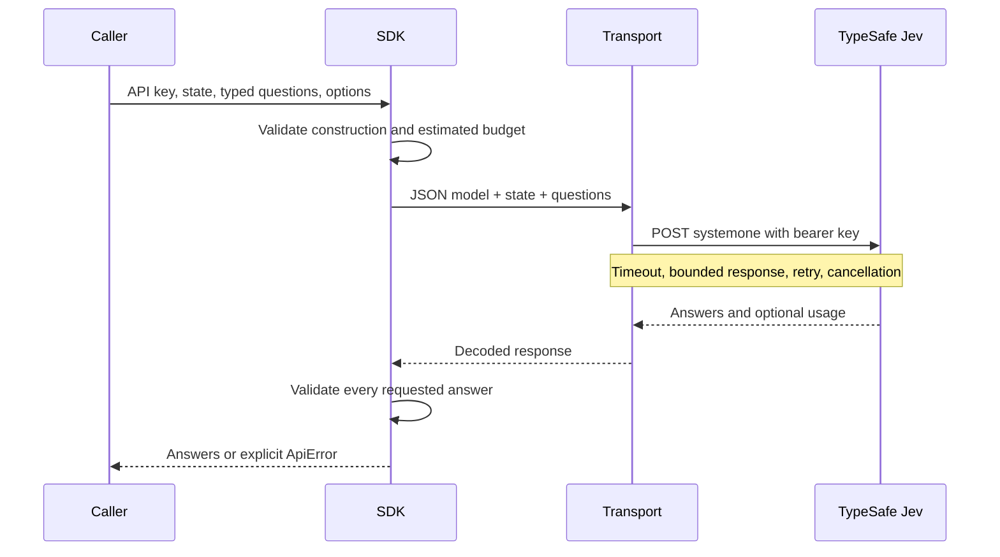

# How the decision engine works

A caller supplies context and defines questions. Jev returns typed decisions and the SDK validates them. Symbi Reflex checks each result against the current source, ownership, permissions, and evidence before saving an eligible automatic change or recording why it was skipped.

Jev sees the JSON `state` supplied by the caller and the instructions and criteria of the submitted questions. It has no automatic access to application documents or files. Symbi Reflex supplies scoped, allowed source passages and action-specific questions through this SDK when workspace processing is enabled and a provider key is available.

The caller defines the possible outcomes:

| Question | Caller defines | Jev returns |
| --- | --- | --- |
| Choice | Instructions and named options | Selected option, option probabilities, confidence. |
| Score | Instructions and ordered labels | Selected numeric level, level probabilities, confidence, optional legend. |
| Noul | Instructions and optional true/false criteria | A probability between zero and one. |

The SDK checks the response contract and returns the result to the caller. The Symbi Reflex runtime runs all six retained actions automatically, checks exact evidence and current revisions, respects manual ownership, and persists findings and eligible changes. Probabilities and confidence must satisfy the typed response contract; confidence alone does not authorize a write. Unsupported changes retain an explanation without waiting for an approval click.

The runtime understands documents, groups and labels sources, checks connections, and compares possible duplicates. Labels use existing names or bounded source-derived candidates, without running vocabulary maintenance. Home-canvas movement runs last. Source and workspace-context changes refresh these checks; durable checkpoints and bounded retries prevent repeated work while allowing recovery after provider failures.

The Reflex panel observes this daemon. It cannot launch command recipes, select review/automatic modes, submit source edits, or approve findings. Chat-agent proposals use a separate review boundary and cannot approve their own writes. SDK callers remain free to define their own questions and workflows without importing application policy.

`server/jev.ts` contains builders, types, request/answer validation, and usage subscriptions. `server/jev-transport.ts` handles HTTP reliability. `server/jev-answers.ts` contains typed accessors and score helpers. `server/errors.ts` supplies `ApiError`. `server/sdk.ts` exports the public boundary without application dependencies.

The current client calls the HTTP API directly; it is the local typed SDK boundary, not an installed third-party TypeSafe SDK package. Core behavior and native HTTP integration tests are retained.
