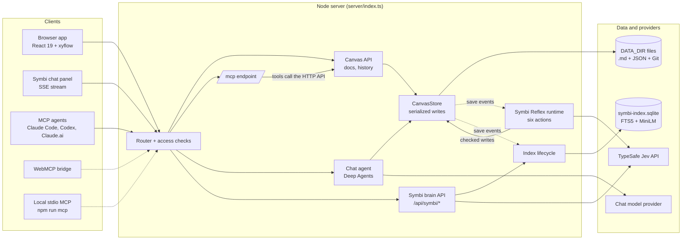

# SymbiKnow Project Atlas

How SymbiKnow is built: an infinite canvas where people and AI agents keep knowledge as ordinary files, connect it, and change it safely. Start here, then open the page for the part you are working on.

> Snapshot of the `main` working tree on 2026-10-06, uncommitted changes included. `docs/plans/symbi-engine.md` was still being implemented when this was written, so check the code before relying on exact details.

## What SymbiKnow is

Every card on a canvas is a real `.md` file on the server. The canvas stores only positions, sizes, groups, labels, and links. People work in the browser. AI agents join in three ways:

- **Symbi**, the chat assistant inside the app.
- **MCP**, from Claude Code, Codex, Claude.ai, or any MCP client.
- **WebMCP**, which drives an open browser tab.

Every content change is a Git commit in that document's own history, named after the person or agent who made it. Writers pass the `contentHash` they read, so nobody silently overwrites someone else. A background organizer, **Symbi Reflex** (internally **Jev**), reads each saved document. It profiles, labels, links, groups, and places the document, and checks every change against exact source evidence before saving.

## System map

One Node.js process serves the web app, the JSON API, and the MCP endpoint. Everything durable lives under `DATA_DIR`. The search index is a rebuildable SQLite file next to it. A drawn version is in [system-map.html](system-map.html).

MCP tools never touch files directly. Each tool calls the same HTTP API the browser uses, so every rule applies to agents too.

## Five ideas the whole codebase follows

| Idea | In practice |
| --- | --- |
| Files are the source of truth | Documents are plain Markdown. Indexes and caches can be deleted and rebuilt from them. |
| Every change is named and restorable | Each document has its own Git repository. Commits carry the author: `Browser`, `Symbi`, `Claude Code - laptop`. |
| No blind overwrites | Writes compare a `contentHash`, revision, or review token inside a serialized write; changed state returns `409`. |
| Evidence before automation | Reflex changes only what exact source passages support at or above the confidence threshold. Manual choices always win. |
| Agents use the same tools as people | MCP, WebMCP, and chat reach the same API, checks, scopes, and history. |

## Pages in this atlas

**Start here**

| Page | Read it when you need to… |
| --- | --- |
| [Architecture](architecture.md) | find your way around the repository, the server request flow, and the React app |
| [System map (HTML)](system-map.html) | see the architecture as one drawn diagram |
| [Data model](data-model.md) | know what is stored where in `DATA_DIR` and what each field means |
| [Project history](history.md) | understand the 11 commits, what the big refactor removed and added, and old names |
| [Plan status](plan-status.md) | see which `docs/plans/symbi-engine.md` tasks are done, partial, or open, plus test results and known issues |

**Documents and the canvas**

| Page | Read it when you need to… |
| --- | --- |
| [Canvas UI](canvas-ui.md) | understand zoom bands, groups and supergroups, reading order, navigation, refresh |
| [Document operations](document-operations.md) | create, upload, move, merge, or build website documents; Git history internals |
| [Safe collaboration](safe-collaboration.md) | change documents without conflicts: hashes, locks, branches, deletion checks |

**AI: Symbi, Reflex, and search**

| Page | Read it when you need to… |
| --- | --- |
| [Assistant and research canvas](assistant-and-research.md) | what Symbi chat does, its tools, proposal review, the research canvas |
| [Chat internals](chat-internals.md) | how the chat is built: limits, prompt, SSE, proposals, saved investigations, outside MCP servers |
| [Symbi Reflex](symbi-reflex.md) | the Jev engine and the six automatic actions |
| [Symbi Reflex internals](reflex-internals.md) | job lifecycle, batching, caches, storage codecs, safety, reset |
| [Search and brain tools](search-and-brain-tools.md) | the SQLite index, ranking, `ask_symbi`, `symbi_reflex`, older search paths, chat retrieval |
| [Jev SDK and WebMCP](sdk-and-webmcp.md) | use the typed Jev SDK, or drive the browser tab through WebMCP |

**Agents, API, and operations**

| Page | Read it when you need to… |
| --- | --- |
| [MCP and API](mcp-and-api.md) | connect an agent, call an endpoint, or add a tool |
| [Security and access](security-and-access.md) | tokens, sessions, principals, scopes, sandboxing, secrets |
| [Errors and status codes](errors.md) | understand an error and what to do next |
| [Run and test](operations.md) | run and configure the app, environment variables, glossary |
| [Testing and CI](testing.md) | test layout, fixtures, acceptance features, CI pipeline, how to write a test |
| [Brand, theme, and UI system](brand-and-ui.md) | colors, fonts, Symbi avatar, CSS files, UI conventions |

## Size of the project

| Measure | Value | Note |
| --- | --- | --- |
| Commits on `main` | 11 | Public release 2026-09-27; last commit 2026-09-28 |
| Uncommitted changes | ~730 paths | 564 new, 110 modified, 58 deleted: a large refactor plus the `docs/plans/symbi-engine.md` work |
| Source lines (TS/TSX, no tests) | ~33,000 | `src/`, `server/`, `shared/` |
| Unit and integration tests | 4,048 in 395 files | Vitest; 57 failing in the latest run while work was in progress (see [Plan status](plan-status.md)) |
| Acceptance features | 13 | Cucumber + Playwright in `features/` |
