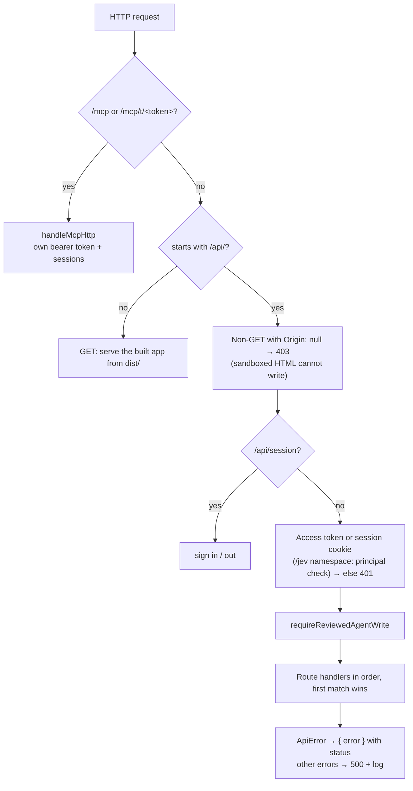

# Architecture

The repository layout, the technology stack, how one HTTP request moves through the server, and how the React app is put together.

## Repository map

| Path | What lives there |
| --- | --- |
| `server/` | Node server: HTTP routes (`api-*.ts`), storage (`storage*.ts`), Git history (`version-*.ts`), chat agent (`chat-*.ts`), MCP (`mcp*.ts`), search index (`symbi-*.ts`), Jev engine (`jev*.ts`) |
| `server/jev/` | Symbi Reflex runtime: queue, scheduler, document plans, proposals, receipts, Undo, reset, compact state codecs |
| `server/jev/actions/` | The six actions and their questions: profile, label, link (`graph.ts`), duplicates, grouping, placement, plus question batching and caches |
| `shared/` | Types and pure helpers used by both sides: `types.ts`, `jev-types.ts`, `symbi-contract.ts`, groups, excerpts, evidence, file transfer |
| `src/` | React app: canvas, reader/editor, assistant panel, research canvas, settings, version panel, Tasks board, WebMCP tools |
| `features/` | Cucumber acceptance scenarios (`.feature` + `.feature.yaml`) and step definitions, run in Playwright Chromium |
| `docs/` | Research canvas guide, Jev engine docs (`docs/jev/`), this atlas (`docs/project-atlas/`) |
| `brand/`, `public/` | Brand guide, identity boards, Symbi avatar art and preview, fonts, favicon, WebMCP adapter |
| `examples/html/` | Three self-contained HTML documents showing uploaded HTML pages |
| `vendor/` | Pinned `@jason.today/webmcp@0.1.13` tarball |
| `docs/plans/` | Product and implementation plans |
| `work/` | Local benchmark runs, traces, and implementation scratch files; ignored by Git |
| `data/` | Local `DATA_DIR` with the example workspace *Acme Team*; ignored by Git |

## Technology stack

| Layer | Choice | Why it is there |
| --- | --- | --- |
| Runtime | Node.js 20.19+ / 22.12+ (CI: 24), TypeScript 6, `tsx` | One process for API, app, and MCP; plain `node:http`, no framework |
| Web app | React 19, Vite 8, Tailwind 4, Base UI | Single-page app served by the same server in production |
| Canvas | `@xyflow/react` 12 | Pan, zoom, nodes, edges, groups; reused by the Tasks board |
| Rendering | react-markdown + GFM + rehype-sanitize, shiki, mermaid, Marp, MDX, react-player | Markdown, code, diagrams, slides, safe MDX components, video |
| Editor | CodeMirror 6 | Markdown/HTML source with Source / Split / Preview |
| History | Git CLI, one repository per document | Authored revisions, branches, merge, restore |
| Chat agent | LangChain + Deep Agents, AI SDK, AI Elements, Streamdown | Tool-using assistant streaming to the chat panel |
| Agent protocol | `@modelcontextprotocol/sdk`, WebMCP | External agents use the same tools as the UI |
| Organizer | TypeSafe Jev HTTP API (default model `jev-1.13.0`) | Typed Choice, Score, Noul answers for Symbi Reflex |
| Search index (new) | `better-sqlite3` 12.8 (FTS5), `@huggingface/transformers` 3.8.1 | Local keyword + MiniLM vector search, rebuildable |
| Validation | zod 4 | MCP tool schemas and API input checks |
| Tests | Vitest 5 + jsdom + Testing Library; Cucumber 13 + Playwright | Unit, native-persistence, and browser acceptance tests |

## How a request moves through the server

`createApiServer` in `server/index.ts` builds one `CanvasStore`, opens the Symbi index lifecycle, starts the Reflex runtime, and wraps every request in an `AbortController` so a closed connection cancels work.



Route handler order: `jevRoutes`, `symbiRoutes`, workspaces and settings, connections, search and chat, streaming chat, investigations, canvases, documents, versions, moves, layout, tasks, locks, block creation, imports, links, single documents, downloads, website assets.

Each request carries a `RouteContext`: `store`, `symbiIndex`, `request`, `response`, `url`, `actor` (from the `x-symbiknow-actor` header), and `signal`. An endpoint is a small object run by `runEndpoints` in `server/api-router.ts`:

```ts
// server/api-tasks.ts
{ method: 'POST', path: /^\/api\/canvases\/([^/]+)\/tasks\/([^/]+)\/claim$/, handle: async (context, match) => {
    const { force } = await readBody(context.request);
    sendJson(context.response, 200, await context.store.claimTask(match[1], match[2], context.actor, force === true));
} }
```

## Storage layer

`CanvasStore` (`server/storage.ts`) is the only writer. It delegates to focused parts that share a `StorageContext`:

| Part | File | Job |
| --- | --- | --- |
| StorageFiles | `storage-files.ts` | Paths, atomic JSON writes with fsync, one serialized write queue, reads with SHA-256 digests |
| StorageDocuments | `storage-documents.ts` | Create, update, move, link, delete, idempotent imports, branch-targeted reads and edits |
| StorageTasks | `storage-tasks.ts` | Tasks per canvas (max 500), revision checks, dependency cycles, deletion audit |
| StorageMerges | `storage-merges.ts` | Journaled multi-document merges with recovery |
| StorageSettings | `storage-settings.ts` | Providers, secrets, MCP servers and tokens; secrets never reach the browser |
| StorageJevExecutor | `storage-jev-executor.ts` | Applies checked Reflex mutations and their inverse proofs for Undo |
| DocumentLocks | `coordination.ts` | Time-limited edit locks (30 s – 1 h) shown on cards |
| DocumentVersions | `version-control.ts` | Git per document: status, commit, branch, switch, merge, restore, delete branch |

Every saved change emits `{ workspaceId, canvasId, blockIds, kind, actor }`. Reflex and the index lifecycle subscribe through `store.onSaved`.

## The web app

`src/App.tsx` shows a login screen when the server needs a token. Otherwise it renders a four-part shell:

- **Sidebar**: workspaces, canvases, and the Tasks button.
- **MainColumn**: toolbar plus the canvas or the Tasks board.
- **AssistantPanel**: Symbi chat and the Symbi Reflex tab.
- **AppOverlays**: dialogs, reader, editor.

State comes from one composed hook, `useAppModel` (`src/app-model.ts`), built from `useAppState`, `useCanvasData`, navigation, documents, research session, workspaces, intake, chat-canvas actions, and search.

| Area | Main files |
| --- | --- |
| Canvas | `Canvas.tsx`, `CanvasView.tsx`, `CanvasNodes.tsx`, `CanvasOverview.tsx`, `canvas-model.ts`, `canvas-viewport*.ts`, `canvas-hierarchy*.ts` |
| Reading/editing | `AppDocumentReader.tsx`, `AppDocumentEditor.tsx`, `MarkdownEditor`, `Loaders.tsx`, `useDocumentContent.ts` |
| Groups and search | `BrowseGroups.tsx`, `CanvasSearch*.tsx`, `app-search.ts` |
| Assistant | `AppAssistantPanel.tsx`, `AIElementsChat*.tsx`, `chat-*.ts`, `chatStream.ts` |
| Research canvas | `AnswerCanvas*.tsx`, `useAnswerCanvas*.ts`, `research-*.ts` |
| Reflex panel | `JevPanel.tsx`, `JevThresholds.tsx`, `JevReset.tsx`, `JevFacts.tsx`, `useJevWorkspace.ts` |
| History | `VersionPanel*.tsx`, `useVersion*.ts` |
| Settings | `SettingsPage.tsx`, `Settings*.tsx`, `Connection*.tsx` |
| Tasks | `TasksCanvasBoard.tsx`, `tasks-canvas.css` |
| WebMCP | `webmcp*.ts` |

The browser refreshes the canvas every 15 seconds while the tab is visible and idle, and reuses unchanged objects, so agent edits appear without reloading (details in [Canvas UI](canvas-ui.md)). Canvas loads use `?summary=1` (no document bodies); a body loads when the document opens. Each open document has its own URL: `?canvas=…&doc=…`.

## Document loaders

| Kind | Rendered with | Notes |
| --- | --- | --- |
| `markdown` | react-markdown, GFM, sanitized inline HTML, shiki, mermaid, video links | Checkboxes save back to the file |
| `html` | Sandboxed iframe without `allow-same-origin` | Stored as Markdown with `format: html` frontmatter; scripts run but cannot read app data or write to the API |
| `slides` | Marp | Markdown slide decks |
| `mdx` | @mdx-js/mdx | Only built-in `Calculator` and `Chart`; imports and expressions rejected |
| `website` | MkDocs, Hugo, or Docusaurus | Frontmatter names the generator and source folder |
