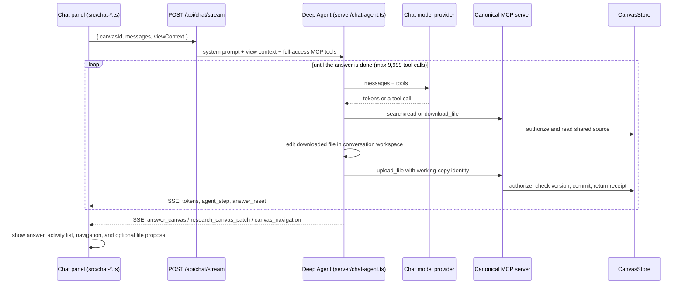

# Assistant and research canvas

Symbi, the chat assistant: how a chat turn runs, which MCP tools the agent has, how it edits working files, and how the research canvas works.

## Who is who

| Name | What it is |
| --- | --- |
| **Symbi** | The chat assistant in the right-hand panel. It uses the chat model chosen in Settings. |
| **Symbi Reflex** | The automatic organizer (Jev) in the panel's second tab. Separate credentials (`TYPESAFE_API_KEY`). |
| **Symbi avatar** | One 56 px animated companion with 16 poses that follow real activity; motion stops for reduced-motion users. |

## A chat turn

- **Providers:** OpenRouter, OpenAI, Anthropic (through its OpenAI-compatible endpoint), or any OpenAI-compatible server such as Ollama or vLLM. Each keeps its own key. `ChatOpenAI` runs in streaming mode.
- **Profiles:** built-in `general`, `research`, `planner`, `builder`, plus custom profiles with their own instructions.
- **Tools:** Symbi discovers the complete canonical MCP catalog under its full-access identity. Configured external MCP servers add their discovered tools. Local Deep Agents filesystem tools edit the conversation workspace.
- **Cancellation:** the stream and MCP/API request share the abort signal. Durable upload receipts let an interrupted caller safely retry the same upload key. Provider errors end the run with an `error` event.

## Agent tools and working files

`server/mcp-registry.ts` collects one set of tool schemas, handlers, descriptions, and required grants. Symbi connects through the MCP SDK in-memory transport; external agents use HTTP or stdio over the same catalog. The active canvas supplies defaults and does not restrict Symbi's authority.

| Tool group | Effect |
| --- | --- |
| `ask_symbi`, `symbi_reflex`, `search_docs`, `read_doc`, `find_by`, `related` | Search saved sources, inspect evidence, and check claims |
| `list_canvases`, `read_canvas` | Discover shared canvases and documents |
| `download_file`, `upload_file` | Download a versioned working copy; commit the locally edited file or propose it for review |
| `claim_doc`, `release_doc` | Coordinate long edits using the authenticated caller's lock identity |
| `delete_doc`, `move_block`, `move_document`, `link_blocks`, `unlink_blocks` | Perform authorized document and canvas operations |
| Todo and version tools | Manage tasks, branches, history, merges, and restoration |
| Jev profile, activity, inbox, job, action, review, and configuration tools | Inspect and operate Reflex under explicit permissions |
| Navigation and research tools | Return presentation requests for the connected UI |

Symbi's files persist in a separate directory for each conversation under `DATA_DIR/.agent-workspaces`. Deep Agents' filesystem backend reads and edits these files. A download writes the source and its `.symbi.json` manifest into that directory. Symbi uploads `sourcePath`; its MCP client adapter reads the local bytes and preserves the manifest's document, canvas, branch, and base version. A file without a manifest requires explicit create mode. An unsaved browser editor buffer blocks a conflicting Symbi upload until the user saves or discards that buffer.

MCP owns shared-document writes. Search and reads remain available; editing happens in the agent's own working environment. Direct agent `create_doc`, `edit_doc`, and `import_documents` tools are absent.

The [canonical catalog and tool origins](mcp-and-api.md#canonical-tool-catalog) lists all 42 application MCP tools, native Deep Agents tools, and the origin of external tools. Shared access always goes through MCP; native filesystem tools operate on conversation working files.

## File proposal review

Symbi can save uploaded files directly with its full-access identity. A caller with proposal access uploads `mode: "propose"`, which creates a durable reviewable replacement while leaving saved source unchanged. `read_file_proposal`, `apply_file_proposal`, and `undo_file_proposal` expose the review lifecycle through MCP. Apply and undo require an explicit approval grant and recheck document versions and website assets. Existing browser review cards use the same proposal storage and execution rules.

## SSE events

| Event | Payload |
| --- | --- |
| *(default)* | OpenAI Chat Completions chunks with answer tokens |
| `agent_step` | A tool call or model step for the activity list |
| `answer_reset` | Text written before a tool call moves into the activity list |
| `answer_canvas` | `{ query, canvasId, selection, sources, layout?, surface? }` |
| `research_canvas_patch` | `{ query, layout?, blocks, edges }` to add to the research canvas |
| `canvas_navigation` | A document or group to reveal |
| `chat_proposal` | A prepared proposal to show in the review card |
| `error` | `{ message }` |

`POST /api/chat` is a non-streaming JSON variant that returns `{ message, changed, proposalId? }`. Details of every stage are in [Chat internals](chat-internals.md).

## View-aware context

The browser sends `viewContext`: selected and visible blocks, active and visible groups, search text, the reader or focused block, zoom, and the focused research answer. The **Using** control picks *Current view*, *Whole canvas*, *Selected documents*, or *Research canvas*. Suggested questions follow that focus. The context is advisory: the server re-checks documents and permissions.

## Research canvas

Ask for a research canvas and the agent draws a temporary graph next to the chat:

- Blocks have a semantic type (`text`, `diagram`, `task`, `section`) and a loader (`markdown`, `html`, `slides`, `mdx`, `website`). Edges have `from`, `to`, and an optional label.
- Citations are `canvasId:blockId` links to the original documents. The browser checks cited hashes and flags changed sources.
- Follow-up questions add to the same graph. Layouts: **Roadmap**, **Kanban**, **Architecture**, **Mind map**.
- You can pan, zoom, search, edit, move, connect, upload, and undo in it.
- **Save canvas** creates a regular canvas; **Export Markdown** downloads a copy. Unsaved research survives reloads in this browser and is cleared by **New chat**.

See `docs/research-canvas.md` for the full workflow.

## Settings page sections

Models · Agents · Secrets · MCP servers · MCP connections · Plugins & loaders. Secrets stay on the server. **Test** on an MCP server lists its tools.
