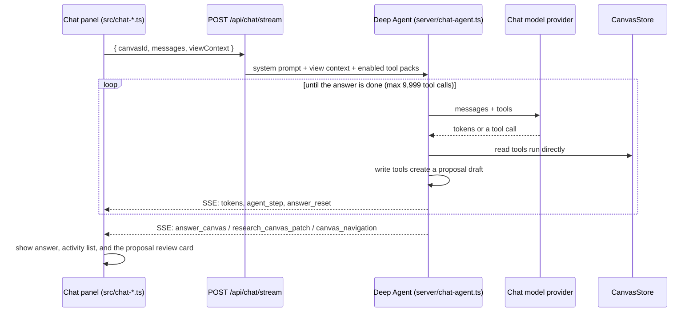

# Assistant and research canvas

Symbi, the chat assistant: how a chat turn runs, which tools the agent has, how its edits are reviewed, and how the research canvas works.

## Who is who

| Name | What it is |
| --- | --- |
| **Symbi** | The chat assistant in the right-hand panel. It uses the chat model chosen in Settings. |
| **Symbi Reflex** | The automatic organizer (Jev) in the panel's second tab. Separate credentials (`TYPESAFE_API_KEY`). |
| **Symbi avatar** | One 56 px animated companion with 16 poses that follow real activity; motion stops for reduced-motion users. |

## A chat turn

- **Providers:** OpenRouter, OpenAI, Anthropic (through its OpenAI-compatible endpoint), or any OpenAI-compatible server such as Ollama or vLLM. Each keeps its own key. `ChatOpenAI` runs in streaming mode.
- **Profiles:** built-in `general`, `research`, `planner`, `builder`, plus custom profiles with their own instructions.
- **Plugins (tool packs):** `document_read`, `document_write`, `tasks`, `external_mcp`.
- **Cancellation:** the stream aborts when the request closes. Provider errors end the run with an `error` event.

## Agent tools (`server/chat-tools.ts`)

| Tool | Effect |
| --- | --- |
| `search_docs`, `read_doc` | Read across workspaces; `sourceCanvasId` reads other canvases |
| `show_doc_on_canvas`, `show_group_on_canvas` | Move the user's view to a document or group; no edits |
| `draw_research_canvas` | Add blocks and edges to the session research canvas |
| `create_doc`, `edit_doc`, `move_block`, `link_blocks` | Prepare **proposals** (`proposed: true, saved: false`) |
| `list_tasks`, `create_task`, `update_task` | Shared task board |
| External MCP tools | From servers configured in Settings, authenticated with saved secrets |

There is no chat delete tool.

## Proposal review

Write tools add changes to a draft. The UI shows a review card. **Apply** calls `POST /api/chat/proposals/:id/apply` with optional `changeIds`, which re-checks every source and returns `409` with conflicts if anything changed. **Undo** reverts applied changes when later edits allow it. Proposals are journaled (`server/chat-proposal-journal.ts`) and recover after a crash.

## SSE events

| Event | Payload |
| --- | --- |
| *(default)* | OpenAI Chat Completions chunks with answer tokens |
| `agent_step` | A tool call or model step for the activity list |
| `answer_reset` | Text written before a tool call moves into the activity list |
| `answer_canvas` | `{ query, canvasId, selection, sources, layout?, surface? }` |
| `research_canvas_patch` | `{ query, layout?, blocks, edges }` to add to the research canvas |
| `canvas_navigation` | A document or group to reveal |
| `chat_proposal` | A prepared proposal to show in the review card |
| `error` | `{ message }` |

`POST /api/chat` is a non-streaming JSON variant that returns `{ message, changed, proposalId? }`. Details of every stage are in [Chat internals](chat-internals.md).

## View-aware context

The browser sends `viewContext`: selected and visible blocks, active and visible groups, search text, the reader or focused block, zoom, and the focused research answer. The **Using** control picks *Current view*, *Whole canvas*, *Selected documents*, or *Research canvas*. Suggested questions follow that focus. The context is advisory: the server re-checks documents and permissions.

## Research canvas

Ask for a research canvas and the agent draws a temporary graph next to the chat:

- Blocks have a semantic type (`text`, `diagram`, `task`, `section`) and a loader (`markdown`, `html`, `slides`, `mdx`, `website`). Edges have `from`, `to`, and an optional label.
- Citations are `canvasId:blockId` links to the original documents. The browser checks cited hashes and flags changed sources.
- Follow-up questions add to the same graph. Layouts: **Roadmap**, **Kanban**, **Architecture**, **Mind map**.
- You can pan, zoom, search, edit, move, connect, upload, and undo in it.
- **Save canvas** creates a regular canvas; **Export Markdown** downloads a copy. Unsaved research survives reloads in this browser and is cleared by **New chat**.

See `docs/research-canvas.md` for the full workflow.

## Settings page sections

Models · Agents · Secrets · MCP servers · MCP connections · Plugins & loaders. Secrets stay on the server. **Test** on an MCP server lists its tools.
