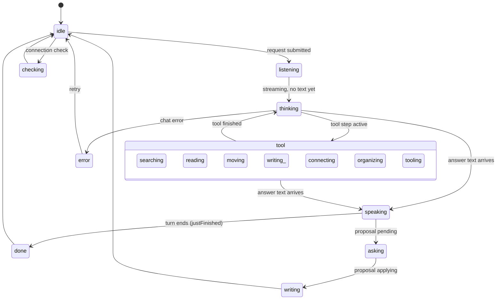

# Brand, theme, and UI system

How SymbiKnow looks and sounds: the brand names and voice, the color tokens for light and dark mode, the fonts, the Symbi avatar and its poses, the CSS files, and the shared UI conventions.

Related: [architecture.md](architecture.md) (app structure), [canvas-ui.md](canvas-ui.md) (canvas behavior), [symbi-reflex.md](symbi-reflex.md) (background organizer).

## Brand summary

Source: `brand/symbiknow-brand-guide.md` (dated 26 September 2026).

| Item | Value |
| --- | --- |
| Product name | **SymbiKnow** (said "SIM-bee-no"): *symbiosis* + *know*. Write `SymbiKnow` in prose and `symbiknow` in the wordmark and app chrome. |
| First-use descriptor | "An infinite canvas where people and AI organize ideas and build knowledge together." |
| Promise / tagline | **"Make knowledge together."** |
| Campaign line | "People and AI. One infinite canvas." |
| Proof line | "See the ideas, the links, the contributors, and the changes." |
| Essence | Shared understanding. |
| Personality | Collaborative, curious, clear, careful, quietly capable. |
| Category | Infinite knowledge canvas for people and AI. |

### Names

| Name | What it is | Rule |
| --- | --- | --- |
| SymbiKnow | The product. | Never call the product "Symbi". |
| 04 Ribbon | The project mark (`brand/symbi-options/ribbon.svg`): coral and blue loops around a mint center. Coral = human, blue = agent, mint = shared knowledge. | Used in the favicon (`public/symbiknow-favicon.svg`), the wordmark, and app chrome (`BrandMark` in `src/AppIcon.tsx`). |
| Symbi | The chat assistant. A robot character: dark rounded screen, mint eyes and antenna, coral and blue headphones. | Belongs to assistant surfaces only. Its face must never replace text attribution of who changed what. |
| Symbi Reflex | The background organizer (internal name **Jev**). Uses the same artwork as Symbi. | See [symbi-reflex.md](symbi-reflex.md). |

The guide's five-option mark gallery is `brand/symbi-icon-options.html`. Logos: `brand/symbiknow-logo.svg` (light surfaces) and `brand/symbiknow-logo-dark.svg` (dark surfaces). Identity boards: `brand/symbiknow-identity-board.svg` / `.png` and `-dark` variants.

### Voice

- A thoughtful teammate who names the source and the next useful action.
- Use "we" for shared work, but name who made a specific edit.
- Say "the agent suggested" while work is still a suggestion. Never call unreviewed model output "verified knowledge".
- Tone: welcoming on first use, compact in the workspace, calm for conflicts, openly uncertain for AI suggestions. No default UI sounds.

## Color tokens

All app tokens live in `src/brand-theme.css`. It is imported by `src/main.tsx` right after `src/app.css`, so its values win over the neutral shadcn defaults (oklch greys) in `app.css`.

### `--sk-*` tokens

| Token | Light (`:root`) | Dark (`html[data-theme='dark']`) |
| --- | --- | --- |
| `--sk-ink` | `#172b31` | (not redefined) `#172b31` |
| `--sk-text` | `#172b31` | `#eaf1ed` |
| `--sk-muted` | `#52666a` | `#aabfba` |
| `--sk-canvas`, `--sk-field` | `#f7f5ef` | `#1c2e34` |
| `--sk-surface` | `#ffffff` | `#1c2e34` |
| `--sk-surface-soft` | `#f1f3ed` | `#23363b` |
| `--sk-border` | `#d5dfd8` | `#3d5558` |
| `--sk-coral` | `#ef906f` | (not redefined) `#ef906f` |
| `--sk-blue` | `#3858b8` | `#afc0ff` |
| `--sk-mint` | `#bce7c9` | (not redefined) `#bce7c9` |
| `--sk-link`, `--sk-focus` | `#3858b8` | `#afc0ff` |
| `--sk-action` / `--sk-action-bg` | `#172b31` / `#bce7c9` | same |
| `--sk-pending` / `-bg` | `#8a5a14` / `#fff4de` | `#ffd28b` / `#3e3423` |
| `--sk-error` / `-bg` | `#a92e43` / `#fff0f2` | `#ffb4be` / `#40272d` |
| `--sk-shadow` | `#172b311a` | `#00000045` |

### shadcn-style tokens

These feed Tailwind through the `@theme inline` block in `src/app.css` (for example `--color-primary: var(--primary)`).

| Token | Light | Dark |
| --- | --- | --- |
| `--background` / `--foreground` | `#f7f5ef` / `#172b31` | `#1c2e34` / `#eaf1ed` |
| `--card`, `--popover` | `#ffffff` (fg `#172b31`) | `#1c2e34` (fg `#eaf1ed`) |
| `--primary` / `--primary-foreground` | `#bce7c9` / `#172b31` | `#bce7c9` / `#172b31` |
| `--secondary`, `--muted` | `#f1f3ed` | `#23363b` |
| `--muted-foreground` | `#52666a` | `#aabfba` |
| `--accent` / `--accent-foreground` | `#e9edff` / `#172b31` | `#263b52` / `#eaf1ed` |
| `--border`, `--input` | `#d5dfd8` | `#3d5558` |
| `--ring` | `#3858b8` | `#afc0ff` |
| `--sidebar` / `-foreground` / `-accent` / `-border` | `#172b31` / `#eaf1ed` / `#263e43` / `#3d5558` | same |

`--destructive`, `--chart-*`, and `--radius` (`0.625rem`) are not set in `brand-theme.css`; they keep the shadcn defaults from `src/app.css`.

### Brand guide palette vs. code

The guide names: Deep Ink `#172B31`, Warm Canvas `#F7F5EF`, Human Coral `#EF906F`, Agent Blue `#738AF1`, Shared Mint `#BCE7C9`, White `#FFFFFF`, Slate `#52666A`. Dark: Dark Canvas `#0D191D`, Canvas Field `#111F24`, Raised Surface `#1C2E34`, Light Text `#EAF1ED`, Muted Text `#AABFBA`, Quiet Border `#3D5558`.

Two differences in the code:

- `--sk-blue` is `#3858b8` (light) and `#afc0ff` (dark), not `#738AF1`.
- Dark `--sk-canvas` and `--sk-field` are `#1c2e34` (Raised Surface), not `#0D191D` / `#111F24`. The dark canvas and its cards share one color.

### Hand-written and generated rules

- `src/brand-theme.css` also has direct rules: sidebar (light `#eef2ec`, dark `#172b31`), active canvas link accent (`#2f7a5b` light, `#bce7c9` dark), mint primary buttons (`#bce7c9`, hover `#a6ddb7`), coral user chat bubbles (`#ef906f` with `#172b31` text in both themes), eight dark canvas group tones (`.canvas-group--tone-0` … `-7`), and the global focus ring.
- `src/brand-theme-generated.css` (1,246 lines) holds "generated dark color counterparts" for rules in `app.css`, `canvas.css`, `ai-chat.css`, `editor.css`, and `settings.css`. Its most used colors: `#AFC0FF`, `#1C2E34`, `#3D5558`, `#AABFBA`, `#EAF1ED`, `#4A5F87`, `#21353A`, `#263B52`. It is imported at the top of `brand-theme.css`, so later rules in `brand-theme.css` win at equal specificity (for example the dark `.primary-button` becomes mint, not `#263B52`).
- Older component CSS still has hard-coded light colors (for example `#e3e8f1`, `#17264a` in `ai-chat.css`); their dark versions come from the generated file.

### Theme switching

`src/theme.ts`:

| Function | Behavior |
| --- | --- |
| `preferredTheme()` | Reads `localStorage['symbiknow.theme']`. If it is `light` or `dark`, use it. Otherwise use `matchMedia('(prefers-color-scheme: dark)')`. Storage errors log a warning and fall back. |
| `applyTheme(theme)` | Sets `document.documentElement.dataset.theme` (so `<html data-theme="dark">`), sets `style.colorScheme`, and saves the value to `symbiknow.theme`. |

Flow:

1. `src/main.tsx` calls `applyTheme(preferredTheme())` before React renders, to avoid a flash of the wrong theme.
2. `src/App.tsx` keeps `theme` in state and re-applies it in a `useLayoutEffect`.
3. `ThemeToggle` (`src/AppIcon.tsx`) flips light/dark. It shows a moon or sun icon and has `aria-label="Switch to dark mode"` (or light).

Because `applyTheme` always saves, the system preference is stored on first load and later system changes are not followed. Tailwind's `dark:` variant follows the same attribute: `@custom-variant dark (&:where([data-theme='dark'], [data-theme='dark'] *))` in `src/app.css`. The shadcn `.dark` class block in `app.css` is not set by `theme.ts`.

## Typography

Fonts are bundled in `public/fonts` with their OFL licenses (`OFL-*.txt`). `@font-face` rules are in `src/app.css` (all `font-display: swap`).

| Font | File | Weights declared | Used for |
| --- | --- | --- | --- |
| DM Sans | `DM-Sans.ttf` | 100–900 | Default UI and reading font (`:root` and Tailwind `--font-sans` / `--font-heading`). Also canvas group counts. |
| Space Grotesk | `Space-Grotesk.ttf` | 300–700 | Wordmark (`.brand strong`), canvas title, empty states, chat header and welcome, modal headings, reader `h1`, login title, drill-board and answer-canvas headings, chat answer headings. |
| IBM Plex Mono | `IBM-Plex-Mono-Regular.ttf` | 400 | `.eyebrow` and `.page-reader__eyebrow` labels (in `brand-theme.css`). |

The guide plans IBM Plex Mono for author labels, paths, and revision IDs, but only the Regular file is bundled. The raw source editor (`.source-editor`) uses the system monospace stack instead. `@fontsource-variable/geist` is in `package.json`, but no file in `src/` references it.

## Symbi avatar

### Components

| File | Role |
| --- | --- |
| `src/avatar-types.ts` | The 16 poses, the extra states, sizes, and `avatarPose(state)`. |
| `src/AssistantAvatar.tsx` | Renders one avatar. Shared by Symbi and Symbi Reflex. |
| `src/SymbiAvatarArt.tsx` | `SymbiAvatar` = `AssistantAvatar` with `name="Symbi"`. |
| `src/SymbiAvatar.tsx` | Imports `assistant-avatar.css` and re-exports `SymbiAvatar` and `SymbiState`. |
| `src/JevAvatar.tsx` | `JevAvatar` = `AssistantAvatar` with `name="Symbi Reflex"`. |
| `src/assistant-avatar.css` | Sprite sheet, sizes, aura, per-pose animations, reduced motion. |
| `src/symbi-avatar.css` | Only `@import './assistant-avatar.css'`, kept so the demo page URL still works. |

Sizes: `small` 28 px, `medium` 36 px, `large` 56 px. The chat header uses `large`.

### How it draws

- The artwork is one 4×4 sprite sheet: `public/assistant/avatar-light.png` and `public/assistant/avatar-dark.png` (CSS variable `--avatar-sheet-image`, switched by `[data-theme]`). `brand/assistant/avatar-*-prepared.png` are copies kept with the brand files.
- Each pose is one cell. `AssistantAvatar` finds the pose index in `avatarPoses` and sets `background-position` from its row and column (`background-size: 400% 400%`).
- A blurred `::before` "aura" (mint `#6ee7b7`, teal `#89dbe3`, violet `#b8a7eb`) flows behind the art. Opacity is `.2` in light and `.3` in dark. Symbi Reflex's aura starts `-2.7s` out of phase.
- The art span has `key={state}`, so a state change remounts it and restarts the animation.
- Accessibility: `role="img"` and `aria-label="{name} {state}"` (for example "Symbi searching"). With `decorative`, it is `aria-hidden` instead. `data-avatar-name`, `-state`, and `-pose` attributes are also set.

### Poses and states

The 16 poses, in sheet order: `resting`, `moving`, `listening`, `talking`, `reading`, `writing`, `asking`, `thinking`, `searching`, `connecting`, `organizing`, `comparing`, `checking`, `summarizing`, `working`, `done`. Each has its own CSS keyframes (1.8 s – 4.8 s loops). `done` plays a short 0.65 s celebrate, then breathes.

Extra states map to a pose (`aliases` in `avatar-types.ts`):

| State | Pose | Note |
| --- | --- | --- |
| `idle` | `resting` | |
| `navigating` | `moving` | |
| `tooling` | `working` | |
| `speaking` | `talking` | |
| `error` | `asking` | Animation replaced by `assistant-breathe`. |
| `paused` | `resting` | Breathe only. |
| `cancelled` | `resting` | Breathe only. |
| `unavailable` | `asking` | Breathe only. |

### What drives Symbi (chat)

`avatarForState` in `src/chat-view-state.ts` picks the state. `useChatPersistence` (`src/chat-persistence.ts`) reports it through `onAvatarStateChange` to `setSymbiState` in `src/app-state.ts`. The header in `src/AppAssistantPanel.tsx` shows the avatar with a caption (for example `searching` → "Searching documents…", `done` → "Answer ready").

While a tool is active, `activeToolState` in `src/chat-turn-state.ts` maps the tool name:

| Tools | State |
| --- | --- |
| `search_docs`, `search_canvas` | `searching` |
| `read_doc`, `read_block`, `read_file`, `list_tasks` | `reading` |
| `show_doc_on_canvas`, `show_group_on_canvas`, `move_block` | `moving` |
| `create_doc`, `edit_doc`, `delete_doc`, `create_task`, `update_task` | `writing` |
| `link_blocks` | `connecting` |
| `draw_research_canvas` | `organizing` |
| any other tool | `tooling` (pose `working`) |

Tool activities arrive as `onStep` events in `src/chat-run-events.ts`; text arrives as `onChunk` and sets status `streaming`.

Priority order in `avatarForState`: `error` first, then `checking` (connection check), then the ready state (`writing` if a proposal is applying, `error` if the proposal failed, `asking` if a proposal is pending, else `done` or `idle`), then `listening` (submitted), then the active tool, then `speaking` if the turn has text, else `thinking`. (`writing_` in the diagram is the `writing` tool state; Mermaid needs a unique name.)

### What drives Symbi Reflex

`jevAvatarState` in `src/jev-workspace-status.ts`, used by `src/useJevWorkspace.ts`:

| Condition | State |
| --- | --- |
| Error / no state yet / settings paused | `unavailable` / `resting` / `paused` |
| Running job: `profile` / `recall` / `link` | `reading` / `searching` / `connecting` |
| Running: `recheck_links`, `score_quality` / `flag_conflict`, `flag_duplicate` | `checking` / `comparing` |
| Running any other action | `organizing` |
| Only queued jobs | `thinking` ("Actions queued in the background") |
| A job completed in the last 5 s, else | `done`, else `resting` ("Organizing automatically") |

### Reduced motion

`@media (prefers-reduced-motion: reduce)` in `src/assistant-avatar.css` sets `animation: none` and `transition: none` on the avatar, its children, and the aura. The pose image still changes, and the `aria-label` and header caption still name the state.

### Demo page and sync script

- `brand/symbi-avatar-demo.html` ("Symbi and Symbi Reflex · avatar and animation preview") loads `../src/symbi-avatar.css`. It has a light/dark toggle, a size selector (56 / 36 / 28 px), Symbi and Symbi Reflex hosts, and its own reduced-motion rule. Screenshots: `brand/symbi-avatar-preview-dark.png`, `-light.png`.
- `scripts/sync-symbi-avatar-preview.ts` runs as `prebuild` (`package.json`). It renders `AssistantAvatar` with `react-dom/server` for every pose plus `paused`, `cancelled`, `error`, `unavailable`, for each `data-avatar-host` element (large / medium / small). It writes the markup between the `// <generated-avatar-markup>` markers in the demo page. It throws if the markers or the three hosts are missing, and writes only when the output changed.

## CSS file map

| File | Loaded by | Styles |
| --- | --- | --- |
| `src/app.css` | `src/main.tsx` | Tailwind import, `@font-face`, shadcn default tokens and `@theme inline`, app shell, sidebar, topbar, buttons, modals, search, chat header, page reader, version panel, settings, login. |
| `src/brand-theme.css` | `src/main.tsx` | Brand tokens (light/dark), focus ring, sidebar and chrome, canvas surface/card colors, dark group tones, dialogs, empty canvas prompt, mobile topbar. |
| `src/brand-theme-generated.css` | `brand-theme.css` | Dark counterparts for `app.css`, `canvas.css`, `ai-chat.css`, `editor.css`, `settings.css`. |
| `src/canvas.css` | `src/Canvas.tsx` | Canvas surface, cards, groups, overview, drill board, inspector, map index, toolbar, Markdown/slides/code/chart loaders. |
| `src/ai-chat.css` | `AIElementsChat.tsx`, `JevPanel.tsx` | All `.ai-chat*` classes: messages, activity list, composer, starters, work status. |
| `src/assistant-avatar.css` | `SymbiAvatar.tsx`, `JevAvatar.tsx` | Avatar sprite, aura, pose animations. |
| `src/jev.css` | `src/JevPanel.tsx` | Symbi Reflex panel: modes, thresholds, inbox, decision cards, group review, previews. |
| `src/settings.css` | `src/SettingsPage.tsx` | Settings page, model picker, servers, providers, tokens, secrets, activity health. |
| `src/editor.css` | `src/MarkdownEditor.tsx` | Code editor, view toggle, block modal, edit lock, external-change notice. |
| `src/answer-canvas.css` | `src/AnswerCanvas.tsx` | Session research ("answer") canvas. |
| `src/tasks-canvas.css` | `src/TasksCanvasBoard.tsx` | Tasks board: header, columns, cards, details, history, comments. Uses `var(--sk-background, #f7faf9)`; `--sk-background` is not defined, so the fallback applies. |
| `src/canvas-search.css`, `src/browse-groups.css`, `src/saved-investigations.css` | `CanvasSearch.tsx`, `BrowseGroups.tsx`, `SavedInvestigations.tsx` | In-canvas search box, browse-groups panel, saved investigations list. |

`src/Canvas.tsx` also imports `@xyflow/react/dist/style.css`.

## Component conventions

### Base UI and shadcn setup

- `components.json`: style `base-nova`, `tsx: true`, no RSC, Tailwind CSS file `src/app.css`, base color `neutral`, CSS variables on, icon library `lucide`. Aliases: `@/components`, `@/components/ui`, `@/lib`, `@/lib/utils`, `@/hooks`.
- Primitives in `src/components/ui/`: `button.tsx`, `input-group.tsx`, `spinner.tsx`, `textarea.tsx`. `button.tsx` wraps `@base-ui/react/button` with `class-variance-authority` variants (`default`, `outline`, `secondary`, `ghost`, `destructive`, `link`; sizes `xs`, `sm`, `default`, `lg`, `icon*`).
- Chat building blocks in `src/components/ai-elements/`: `conversation.tsx`, `message.tsx`, `prompt-input.tsx`, `suggestion.tsx`.
- Most app UI does not use these primitives. It uses plain elements with app classes.

### Icons

- `Icon` in `src/AppIcon.tsx`: a small built-in SVG set (`grid`, `layers`, `plus`, `search`, `settings`, `upload`, `chevron`, `spark`, `send`, `close`, `file`, `arrow`, `trash`, `moon`, `sun`). 24×24 viewBox, `stroke="currentColor"`, stroke width 1.8, round caps, always `aria-hidden="true"`. This matches the guide's "1.75–2 px line icons".
- `lucide-react` is used in 12 files, mostly settings, chat activity, copy buttons, and the ai-elements components (for example `Check`, `Copy`, `ChevronDown`, `Trash2`, `LoaderCircle`).
- `BrandMark` renders the Ribbon favicon in `.brand-mark` with empty `alt`.

### Button classes

- `.primary-button`: mint `#bce7c9`, border `#9bd5ad`, ink text, hover `#a6ddb7`. Same mint in dark.
- `.toolbar-button`, `.secondary-button`, `.chat-toggle`: `--sk-surface` with `--sk-border`; hover border `--sk-blue`. Selected toggle and selected assistant tab are mint.
- `.icon-button` (and `.subtle`): icon-only buttons in headers and sidebar. `.theme-toggle` hides its text label below 1500 px width.

### Accessibility

- Global focus ring: `:where(button, a, input, textarea, select):focus-visible { outline: 2px solid var(--sk-focus); outline-offset: 2px; }` in `brand-theme.css`.
- Icon-only buttons carry both `aria-label` and `title` (for example "New chat", "Symbi settings", "Close Symbi panel"). There are about 210 `aria-label` uses in `src/`.
- Live feedback uses `role="status"` (~39) and `role="alert"` (~38). Dialogs use `role="dialog"` with `aria-modal`. Assistant tabs use `role="tablist"` / `role="tab"` with `aria-selected`.
- Code moves focus with `.focus()` in about 38 places in `src/`.
- Reduced motion is handled in CSS only: `assistant-avatar.css`, `brand-theme.css` (card, toolbar, button, theme-toggle transitions and card highlight), `ai-chat.css` (work-status dot, context value), and `editor.css` (view-toggle thumb).
- The guide's contrast note: white on Agent Blue is only 3.2:1, so use Deep Ink on blue for normal text.
