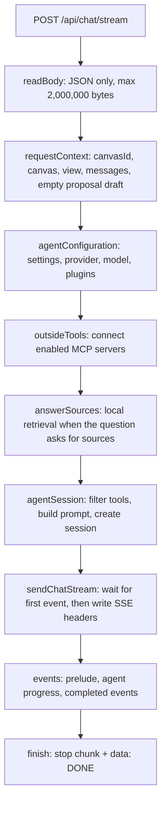
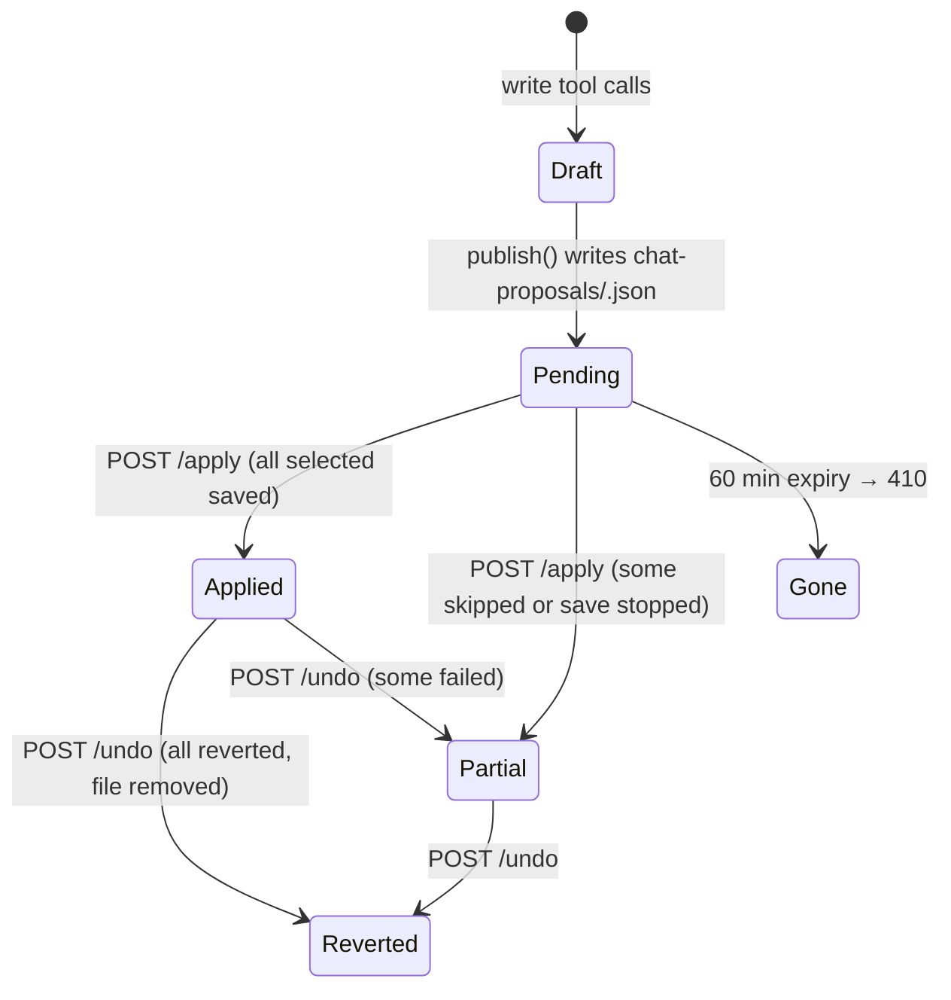
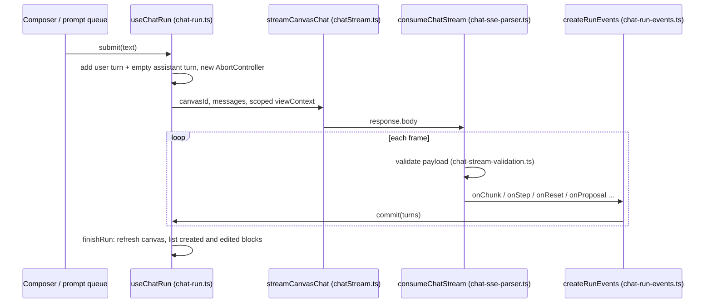
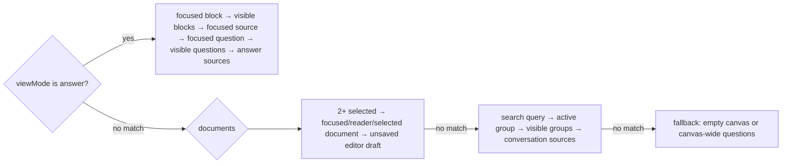

# Chat internals

How the Symbi chat is built, module by module: request checks, agent setup, the event stream, proposals, saved investigations, outside MCP servers, and the browser code that runs a turn.

> Read [Assistant and research canvas](assistant-and-research.md) first. It explains what the chat does for a user. This page explains how the code does it. Endpoint lists live in [MCP and API](mcp-and-api.md); token and access rules live in [Security and access](security-and-access.md).

## File map

| Layer | Files | Job |
| --- | --- | --- |
| Routes | `server/api-chat.ts`, `server/api-chat-proposals.ts`, `server/api-chat-investigations.ts`, `server/api-connections.ts` | HTTP endpoints |
| Request checks | `server/chat-input.ts`, `server/chat-view-context.ts` | Validate messages and the view context |
| Preparation | `server/chat-stream.ts`, `chat-stream-context.ts`, `chat-stream-preparation.ts`, `chat-stream-session.ts`, `chat-stream-prompt.ts`, `chat-stream-types.ts` | Build the request, config, tools, and prompt |
| Agent | `server/chat-agent.ts`, `chat-agent-configuration.ts`, `chat-agent-events.ts`, `chat-agent-output.ts`, `chat-agent-failure.ts`, `chat-agent-types.ts` | Run Deep Agents, turn its stream into events, map errors |
| Session and SSE | `server/chat-session.ts`, `server/chat-sse.ts`, `server/chat-cancellation.ts` | Order events, write SSE, stop work on abort |
| Tools | `server/chat-tools.ts`, `server/jev-chat-tools.ts`, `server/external-mcp.ts` | Canvas, Reflex, and outside tools |
| Proposals | `server/chat-proposals.ts`, `chat-proposal-journal.ts`, `chat-proposal-validation.ts`, `chat-proposal-values.ts`, `chat-proposal-types.ts` | Draft, store, apply, undo |
| Investigations | `server/investigations*.ts` | Saved research sessions |
| Browser | `src/chatStream.ts`, `src/chat-*.ts`, `src/app-chat-actions.ts`, `src/useNewChatConfirmation.ts`, `src/*SavedInvestigation*` | Run a turn, render it, save it |

## A request from start to finish

`POST /api/chat/stream` calls `createChatStream` (`server/chat-stream.ts`) and then `sendChatStream` (`server/chat-sse.ts`).



Notes:

- Every await in preparation is wrapped in `cancellable(work, signal)` (`server/chat-cancellation.ts`). It races the work against the request's abort signal.
- `requestedResearchCanvas` is true when the latest message matches `/\b(?:temporary|research)\s+canvas\b/i` (`server/chat-stream-context.ts`).
- `answerSources` runs only when the `document_read` plugin is on, and only for a research-canvas request or when `asksForSources()` matches (a question mark at the end, or a start word like `what`, `why`, `compare`, `explain`, `find`). Requests that start with `open`, `go to`, `navigate to`, and similar never trigger retrieval (`server/chat-input.ts`). A local retrieval failure is logged and ignored, so chat still works with the document tools.
- `sendChatStream` waits for the **first** event before it writes headers. If preparation or the first step fails, the error becomes a normal JSON error response. After headers are sent, an error becomes an `event: error` frame.
- `POST /api/chat` is a JSON-only compatibility endpoint (`server/chat.ts`). It runs the same session, joins the text, keeps the last `proposalId`, and returns `{ message, proposalId?, changed }`. `changed` compares the canvas blocks before and after the run.

## Input rules and limits

From `server/chat-input.ts` and `server/chat-view-context.ts`:

| Input | Rule |
| --- | --- |
| Body | `content-type` must include `application/json` (else `415`); at most 2,000,000 bytes (else `413`) — `server/api-http.ts` |
| `canvasId` | Required non-empty string; the canvas must exist |
| `messages` | Array of 1–100 items, else `400` |
| Message role | Only `user` and `assistant` are kept; other roles are dropped |
| Message content | String, or an array of `{ type: 'text', text }` parts joined with `\n`; empty messages are dropped |
| Message length | More than 20,000 characters → `400 Chat message is too long` |
| History sent to the model | The last 30 valid messages |
| Last message | Must be from `user` |
| `previousUser` / `previousAssistant` | First 1,500 characters, used by retrieval |

The view context is advisory. The server keeps only IDs that exist on the canvas:

| Field | Limit |
| --- | --- |
| `selectedBlockIds`, `visibleBlockIds` | Known block IDs only, max 12 each |
| `visibleGroups` | Known group paths only, max 16 |
| `readerBlockId`, `editingBlockId`, `focusBlockId` | Must be a known block ID |
| `activeGroup` | Must be a known group or group prefix (`__ungrouped` for no group) |
| `viewMode` | `overview`, `titles`, `documents`, or `answer` |
| `searchQuery` | First 200 characters |
| `viewport` | `{ x, y, zoom }`, all finite numbers |
| `answerSourceIds` | Strings up to 128 characters, deduplicated, max 12 |
| `answerFocus` | `level` is `big-picture`, `answers`, or `sources`; 8 questions × 200 chars; 12 block titles × 160 chars |
| `editorDraft` | Only when `editorHasUnsavedChanges === true` and kind is `markdown`, `mdx`, `slides`, or `website`; title 160 chars, content 16,000 chars, `truncated` flag set when cut |

## Agent setup

### Model and provider

`modelSettings` (`server/chat-agent-configuration.ts`) reads private settings, picks the active provider, and fails early with a `400` such as `Set an OpenAI API key in Settings before using chat` when a key or model is missing. The `custom` provider needs a base URL but no key; it sends `not-needed` (`server/providers.ts`).

| Provider | Base URL | Key source |
| --- | --- | --- |
| `openrouter` | `https://openrouter.ai/api/v1` | Saved key, legacy `apiKey`, or `OPENROUTER_API_KEY` |
| `openai` | `https://api.openai.com/v1` | Saved key or `OPENAI_API_KEY` |
| `anthropic` | `https://api.anthropic.com/v1/` (OpenAI-compatible endpoint) | Saved key or `ANTHROPIC_API_KEY` |
| `custom` | Settings `baseUrl` | Saved key or `CUSTOM_MODEL_API_KEY`, else `not-needed` |

OpenRouter calls also send `HTTP-Referer` (`PUBLIC_URL` or `http://localhost:5173`) and `X-Title: SymbiKnow`.

`chatAgent` (`server/chat-agent.ts`) builds a `ChatOpenAI` model with `streaming: true`, `useResponsesApi: false`, `streamUsage: false`, and passes it to `createDeepAgent` with:

- `toolCallLimitMiddleware({ runLimit: 9_999, exitBehavior: 'error' })`
- `recursionLimit: 20_001`
- `streamMode: ['values', 'messages']` — full state snapshots plus model tokens.

The factory type `DeepAgentFactory` is injected through `context.agentFactory`, so tests replace the real model.

### Prompt assembly

`chatPrompt` (`server/chat-stream-prompt.ts`) joins, in order:

1. The profile text (`profileText`): built-in `general`, `research`, `planner`, `builder`, or a custom profile's `instructions`. Unknown IDs fall back to `general`.
2. `settings.systemPrompt` (default in `defaultPrivateSettings`, `server/settings.ts`).
3. The active canvas ID and `viewDescription(...)` — a JSON summary of the view with titles instead of IDs.
4. A draft notice when the editor has unsaved changes: review the draft, do not claim it was saved.
5. A note about outside MCP tools, only when there are any.
6. The retrieval-selected sources as `{ canvasId, blockId, title, canvasName, sourceId }`, with an instruction to verify them with `read_doc`.
7. A presentation rule: draw on the research canvas when it is enabled, else answer in chat.
8. Fixed rules: write tools only propose, deletion goes to the document UI, Deep Agents scratch files are not canvas documents.

### Tools and plugin gating

`agentSession` (`server/chat-stream-session.ts`) builds `canvasTools(...)` and keeps a tool only when `pluginAllows(name, plugins)` is true (`server/chat-input.ts`). Outside MCP tools are appended after the filter.

| Plugin | Tools |
| --- | --- |
| `document_read` | `search_docs`, `read_doc`, `show_doc_on_canvas`, `show_group_on_canvas`, `jev_profile`, `find_by`, `related`, `memory_map`, `jev_activity`, `brain_inbox` |
| `document_write` | `create_doc`, `edit_doc`, `move_block`, `link_blocks`, `jev_do` |
| `external_mcp` | `<serverId>__<toolName>` from outside servers |
| *(always)* | `draw_research_canvas`, but only kept when the research canvas is enabled for this turn |

Details worth knowing (`server/chat-tools.ts`):

- `read_doc` on the active canvas reads from the **proposal draft**, so the agent sees its own pending edits. Other canvases are read from the store.
- `search_docs` calls `store.search(query)` across all workspaces. It does not use the hybrid index that `GET /api/search` uses.
- `edit_doc` throws `409` when the user is editing that document with unsaved changes.
- `draw_research_canvas`: 1–12 blocks, up to 24 edges, block content up to 20,000 characters, up to 12 `sourceIds` per block. Source IDs not chosen by retrieval are removed; edges to unknown blocks or self-edges are dropped; duplicate block IDs fail.
- Reflex tools (`server/jev-chat-tools.ts`) run as principal `{ id: 'symbi', kind: 'automation', access: 'propose', allowedCanvasIds: [canvasId], canApprove: false }`. `jev_do` accepts up to 20 `blockIds` and a 4,000-character `query`. See [Symbi Reflex](symbi-reflex.md).
- `delete_doc` appears in the plugin map, but no chat tool with that name exists.

## From agent stream to SSE

`agentProgress` reads each Deep Agents stream item. `streamItem` splits it into a `values` snapshot or a `messages` token (`server/chat-agent-events.ts`).

| Source | Internal event | SSE frame |
| --- | --- | --- |
| First activity | `step` `thinking: Working on your request` | `event: agent_step` |
| `AIMessage.tool_calls` in a snapshot | `step` `tool_start` (`Running <name>`) | `event: agent_step` |
| `ToolMessage` in a snapshot | `tool_end` + `thinking: Reviewing the tool result` | `event: agent_step` |
| Top-level model token with text | `text` | default `data:` chunk, OpenAI `chat.completion.chunk` shape |
| Token or snapshot with tool calls after text | `reset` | `event: answer_reset` |
| Outside server warning | `step` `thinking` | `event: agent_step` |
| End of run | `answer_canvas`, `proposal`, `navigate`, `research_patch` | `answer_canvas`, `chat_proposal`, `canvas_navigation`, `research_canvas_patch` |
| Error after headers | — | `event: error` with `{ message }` |

Tool names in steps are cleaned to `[a-zA-Z0-9_:-]` and 64 characters. Only tokens from the `model_request` node at the top level are streamed; sub-agent tokens are skipped.

The session (`server/chat-session.ts`) sends events in this order:

1. **Prelude:** `answer_canvas` (only when the research canvas is on and sources exist), then outside-server warnings.
2. **Progress:** steps, text, and resets as they arrive.
3. **Completion:** `chat_proposal` (from `proposalDraft.publish()`), every navigation request, the research patches, then the final answer. If the streamed text differs from `finalAnswer(...)`, the session sends `answer_reset` and resends the answer in 256-character pieces (`textPieces`).

When the research canvas is on but the agent never called `draw_research_canvas`, `patchFromMarkdown` turns the Markdown answer into one patch.

A frame on the wire looks like this:

```text
event: agent_step
data: {"type":"tool_start","id":"call_1","name":"read_doc","message":"Running read_doc"}

data: {"object":"chat.completion.chunk","model":"openai/gpt-4o","choices":[{"index":0,"delta":{"content":"The roadmap"},"finish_reason":null}]}

event: chat_proposal
data: {"id":"9b1e…","canvasId":"product","status":"pending","expiresAt":"2026-10-06T11:00:00.000Z","changes":[…]}

data: {"object":"chat.completion.chunk","model":"openai/gpt-4o","choices":[{"index":0,"delta":{"content":""},"finish_reason":"stop"}]}

data: [DONE]
```

### Cancellation

- `sendChatStream` aborts its own controller when the response emits `close`, and combines it with the request signal (`combinedSignal` uses `AbortSignal.any`).
- The session copies the combined signal into `toolContext.signal`, so outside MCP calls stop too.
- On abort, no `error` frame and no `[DONE]` are written.
- Outside MCP clients are closed in a `finally` block and also on abort (`closeOnAbort` in `server/chat-stream-preparation.ts`).

### Error mapping

`agentFailure` (`server/chat-agent-failure.ts`) looks for an HTTP status in `status`, `statusCode`, or the message text, up to 3 levels deep in `cause`. Client errors that are already `ApiError` 4xx pass through. Everything else becomes `502`:

| Upstream status | Message tail |
| --- | --- |
| 400 | `The request is too large for this model.` / `The model rejected the agent tools.` / `The model rejected this request.` |
| 401 | `The API key was rejected. Check it in Settings.` |
| 402 | `The account has insufficient credits…` |
| 403 | `This key cannot use the selected model…` |
| 404 | `The selected model was not found…` |
| 408, 504 | `The provider timed out. Retry the request.` |
| 429 | `The provider rate limit was reached. Retry shortly.` |
| 500, 502, 503 | Provider error or unavailable |
| none | `<Provider> request failed. Check the model and API key in Settings.` |

`finalAnswer` throws `502 <Provider> returned no final answer` when the last message is not an AI message or still has tool calls, and `returned no text` when it is empty.

## Proposals

Write tools never save. They change a `ChatProposalDraft` (`server/chat-proposals.ts`), which keeps two maps of the canvas: `original` and `projected`. Each change records `before`, `after`, `expectedContentHash`, and `expectedStateHash`. `stateHash` is a SHA-256 (first 16 hex chars) of the block with sorted keys and without `contentHash` and `lock` (`server/chat-proposal-values.ts`).

New documents get a UUID, size `400 × 320`, and default position `(100, 100)`. A change whose `before` equals its `after` is dropped at publish time.



### Journal

- File: `DATA_DIR/chat-proposals/<uuid>.json`, written to a temporary file and renamed, mode `0600` (`server/chat-proposal-journal.ts`).
- Lifetime: 60 minutes (`lifetime = 60 * 60_000`) for pending proposals and again for applied receipts.
- Shapes: `{ version: 1, kind: 'pending', expires, proposal }` or `{ version: 1, kind: 'applied', expires, canvasId, receipt }`.
- Every read runs `validState` (`server/chat-proposal-validation.ts`): IDs match, snapshots are valid blocks, stored hashes match the `before` snapshot (the older unsorted `legacyStateHash` is also accepted). Any failure, a bad UUID, or a missing file returns `410`.

### Apply

`POST /api/chat/proposals/:id/apply` with optional `{ "changeIds": ["…"] }`:

1. An in-process `busy` set refuses a second apply or undo on the same file with `409`.
2. The state must be `pending`, else `410 … already been applied`.
3. Change IDs must be known and unique. Changes with `canApply: false` (deletes) are skipped with a reason.
4. A selected link to a new document requires that new document to be selected too.
5. Every selected existing document must still match its `stateHash`. Otherwise `409` with `{ error, conflicts: [{ id, reason: 'Document changed since preview' }] }`.
6. Save in three passes as actor `Symbi`: creates, then edits (with `expectedContentHash`), then links on new documents with mapped IDs.
7. If a save throws, `reconcileApplyFailure` re-reads the canvas, finds what was really saved (a new block with the same title and content counts as a saved create), and marks the rest as skipped with `Apply stopped: …`.
8. The receipt is stored as `kind: 'applied'` with status `applied` or `partial`.

```json
{ "id": "9b1e2c4a-…", "status": "partial", "applied": ["3f0c…"],
  "skipped": [{ "id": "a71d…", "reason": "Delete needs a reversible restore path; use the document action outside Chat." }],
  "createdBlockIds": { "3f0c…": "3f0c…" },
  "documents": [{ "id": "3f0c…", "before": null, "after": { "id": "3f0c…", "title": "Launch plan" } }] }
```

### Undo

`POST /api/chat/proposals/:id/undo`:

- Each document must still have the same `incarnation` and `sourceGeneration` as after apply; when no Reflex mutation changed it, the full `stateHash` must match too. Else `409`.
- `preflightCausalParentUndo` and `withCausalParentUndo` (`server/jev/parent-undo.ts`) also undo Reflex changes that were caused by the chat change. Edits are reverted before creates.
- An edit is restored with title, content, kind, geometry, links, link types, placement, cross-links, headline, freshness, and tags, plus Reflex ownership. A create is deleted.
- When every document is reverted, the journal file is removed and the result is `reverted`. Otherwise the remaining documents stay in the receipt and the result is `partial`.

### Recovery in the browser

`useChatProposals` (`src/chat-proposals.ts`) re-fetches every saved proposal on mount with `GET /api/chat/proposals/:id`. A pending proposal comes back with its selection; a receipt becomes `applied` or `failed`; a `410` marks the turn `expired`. Turn states: `pending`, `applying`, `applied`, `reverted`, `expired`, `failed`.

## Outside MCP servers

`server/external-mcp.ts` connects the chat agent to MCP servers saved in Settings.

| Item | Value |
| --- | --- |
| Transports | Streamable HTTP first, then legacy SSE on failure |
| Connect timeout | 6,000 ms per transport during chat; 8,000 ms for **Test** |
| `listTools` timeout | 6,000 ms during chat; 8,000 ms for **Test** |
| Tools per server | First 40 |
| Tool name | `<serverId>__<tool>`, non `[a-zA-Z0-9_-]` replaced with `_`; if changed or longer than 64, cut to 53 chars + `_` + 10 hex of SHA-256 |
| Description | `[Server name] description`, max 1,000 chars |
| Tool output | Text parts joined, max 60,000 chars; `isError` adds `Error from <server>:` |
| Failures | A server that fails is skipped and reported as a `thinking` step: `<name> is unavailable: …` |

Headers come from `resolvedHeaders` (`server/settings.ts`). `${secret:NAME}` in a header value is replaced by the saved secret; an unknown name fails with `400 Secret NAME is not saved`. A `bearerSecret` adds `Authorization: Bearer <secret>`.

```json
{ "id": "linear", "name": "Linear", "url": "https://mcp.linear.app/mcp", "enabled": true,
  "bearerSecret": "LINEAR_TOKEN", "headers": { "X-Workspace": "${secret:LINEAR_WORKSPACE}" } }
```

**Test** is `POST /api/mcp/servers/test` (`server/api-connections.ts`). `candidateServer` (`server/api-connection-server.ts`) merges the body with a saved server of the same `id`, checks the URL (http or https), up to 10 headers with valid names and values up to 1,000 characters, and that the bearer secret exists. The response is `{ ok: true, server, tools: [{ name, description }] }`.

## Settings that change chat

All in `server/settings.ts`, saved with `PUT /api/settings`.

| Setting | Rules |
| --- | --- |
| `provider` | `openrouter`, `openai`, `anthropic`, `custom` |
| `model` | Required, max 120 chars |
| `baseUrl` | http or https URL, max 500 chars, trailing `/` removed; `''` clears it |
| `apiKey` / `providerKeys` | Max 4,096 chars each; never returned — public settings only show `hasApiKey` and per-provider booleans |
| `systemPrompt` | Max 20,000 chars |
| `agentProfile` | A built-in or custom profile ID |
| `customProfiles` | Max 20; name 40 chars; instructions 4,000 chars; IDs `custom-<slug>` |
| `agentPlugins` | Subset of `document_read`, `document_write`, `external_mcp`; default is all three |
| `secrets` | Max 50; names match `^[A-Z][A-Z0-9_]{0,63}$`; values max 8,192 chars; `null` deletes; only names are returned |
| `mcpServers` | Max 20; name 40 chars; URL 500 chars; max 10 headers; ID `^[a-z0-9-]{1,48}$`; a server whose bearer secret is gone is dropped |

## Saved investigations

A saved investigation is a named copy of a chat session: messages, source references, proposal references, and an optional research canvas snapshot.

### API and storage

| Method | Path | Notes |
| --- | --- | --- |
| POST | `/api/investigations` | Create; returns `201 { investigation, accessKey? }` |
| POST | `/api/investigations/list` | Body `{ workspaceId, privateKeys }`; newest first |
| GET | `/api/investigations/:id` | Header `x-investigation-key` for private records |
| PATCH | `/api/investigations/:id` | Needs `expectedRevision`; wrong revision → `409 Investigation changed` |
| DELETE | `/api/investigations/:id` | Returns `{ id, deleted: true }` |

- Files: `DATA_DIR/investigations/<id>.json`, directory mode `0700`, file mode `0600`, written by temp file and rename (`server/investigations-files.ts`).
- Updates and deletes for one file run one at a time through `serial()` (`server/investigations-queue.ts`). The queue key is the real path. A failed action still releases the queue.
- The workspace must exist, and `canvasId` must belong to it.

### Schema limits (`server/investigations-schema.ts`)

| Field | Limit |
| --- | --- |
| `id`, `workspaceId`, `canvasId` | `^[a-z0-9][a-z0-9-]{0,63}$` |
| `title` | 1–160 chars (trimmed) |
| `visibility` | `private` or `shared` |
| `question` | Max 2,000 chars |
| `messages` | Max 100; each 1–20,000 chars |
| `sourceRefs` | Max 100; `contentHash` is 16 hex chars; `excerpt` max 2,000 |
| `proposalRefs` | Max 100; `kind` is `chat` or `jev` |
| `researchSnapshot` | Max 1,000,000 bytes as JSON; up to 100 turns, 300 blocks, 600 edges |
| `privateKeys` (list) | Max 200 keys, each up to 128 chars |

### Access

- `shared`: anyone who can reach the workspace API can list and open it.
- `private`: the server creates a random 32-byte base64url key and stores only its SHA-256 (`server/investigations-access.ts`). It compares with `timingSafeEqual`. A wrong or missing key returns `404`, so the record's existence is hidden.
- Changing `shared` → `private` creates a new key. Changing to `shared` removes the hash.
- The browser keeps keys in `localStorage` under `symbiknow.investigation-keys.v1` (`src/saved-investigation-keys.ts`). If it cannot store a new key, the UI shows the key once so the user can copy it (`SavedInvestigationNotices.tsx`).

### Browser side

- `useSavedInvestigations` composes state, list, open, save, and source-check hooks.
- `saveLimitError` (`src/saved-investigation-input.ts`) checks the same limits before sending. The first user message becomes `question`.
- An `owner()` token in `useSavedInvestigationState.ts` drops results from older actions or a different workspace.
- Opening a record calls `openInvestigation` (`src/chat-investigations.ts`): it cancels the running turn, keeps the previous conversation and research for return, loads the saved messages, and restores the research snapshot.
- **Freshness:** `checkInvestigationSources` loads each cited canvas and compares the saved `contentHash` with the current one: `current`, `changed`, `missing`, or `unknown` (no hash). Changed or missing sources show **Recheck answer against current sources**, which sends a prompt with the earlier answer (first 12,000 chars) and the changed hashes, and asks the agent not to edit documents.
- A saved `jev` proposal reference cannot be reopened; a `chat` reference is fetched and shown as a recovered turn.

## Browser chat machinery



| File | Role |
| --- | --- |
| `src/chat-state.ts` | All chat state and refs; `commit()` updates `turnsRef` and React state together; `cancelConversation()` aborts and clears the queue |
| `src/chat-run.ts` | `submit`, `retry`; checks canvas and model; refuses a second run while one is active |
| `src/chatStream.ts` | `POST /api/chat/stream` with header `x-symbiknow-actor: Browser` |
| `src/chat-sse-parser.ts` | Splits frames on blank lines; maps event names to handlers; `[DONE]` ends; `error` throws; a closed stream without `[DONE]` throws |
| `src/chat-stream-validation.ts` | Type guards for each event; invalid payloads are ignored |
| `src/chat-run-events.ts` | Turns events into turn updates; ignores events from a run that is no longer current |
| `src/chat-turn-state.ts` | Activity list logic, reset notes (max 220 chars), avatar state per tool |
| `src/chat-prompt-queue.ts` | Queues prompts from other parts of the app (`promptRequest.sequence`) and sends one when idle |
| `src/chat-persistence.ts` | Saves history, draft, focus, reconnect probe |
| `src/chat-view-state.ts` | Builds scopes, suggestions, and avatar state |
| `src/app-chat-actions.ts` | Canvas refresh after a turn, per-document undo, **Summarize selection** prompt |
| `src/useNewChatConfirmation.ts` | Asks to save or discard the research canvas before **New chat** |

Details:

- **Persistence:** `localStorage['symbiknow:chat-history']` holds the last 60 turns, written 150 ms after a change and on `pagehide`. `isSavedTurn` (`src/chat-history-values.ts`) validates each turn on load; active activities become `stopped`. The unsent draft lives in `sessionStorage['symbiknow:chat-draft']`.
- **Reconnect:** when the error says the server is unavailable, the panel probes `GET /api/workspaces` every 4,000 ms until it succeeds, and puts the last question back in the composer.
- **Retry:** if the last assistant turn failed, `retry()` drops it and reruns the same history; otherwise it submits the composer text.
- **Changed documents:** after a run, `refreshCanvasAfterChat` reloads the canvas and lists created and edited blocks. It also refreshes an open, untouched editor draft.
- **Per-document undo:** for blocks with `incarnation` and `sourceGeneration`, the browser calls `POST /api/canvases/:id/jev/undo-parent`. Otherwise it deletes or restores with `expectedDocumentState` and fails when the document changed again.
- **New chat:** with no history and no research turns it clears at once. Otherwise it opens a dialog; **Save** saves the research canvas first, and a `generation` counter ignores late results from a closed dialog.

### Suggestions engine

`chatSuggestions(canvas, view, answerCanvas)` (`src/chat-suggestions.ts`) returns the first rule set that matches. Each rule returns a list or `null`.



Titles longer than 42 characters are cut to 39 (38 when the cut would split a surrogate pair) plus `…` (`src/chat-suggestion-titles.ts`).

## Uncertainties

- The proposal `busy` lock is in memory only. Two server processes sharing one data directory would not share it.
- `pluginAllows` maps `delete_doc` to `document_write`, but `canvasTools` defines no such tool. This looks like a leftover.
- The [Assistant page](assistant-and-research.md) SSE table does not list `chat_proposal`; the code sends it.
