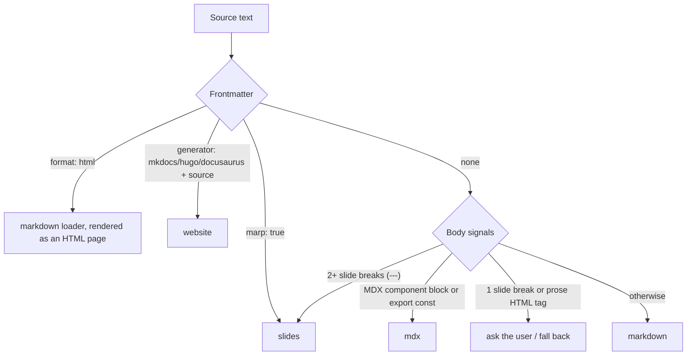

# Document operations

What happens when a document is created, uploaded, moved to another canvas, merged, built as a website, or committed to its history.

## Creating and uploading

| Path | How it works |
| --- | --- |
| `POST /canvases/:id/blocks` | Creates `docs/<id>.md`, a 400 × 320 card, and the first Git commit. `kind: "html"` is a convenience: it is stored as `markdown` with `format: html` frontmatter (`storedDocument` in `shared/file-transfer.ts`) |
| Browser **Upload files** / MCP `upload_file` | `uploadedSource(filename, source)` accepts only `.md`, `.mdx`, `.html`. The title is the file name without its extension. `.html` gets the `format: html` frontmatter; `.mdx` becomes `mdx` |
| `POST /canvases/:id/imports` | 1–20 documents per call, each with an `idempotencyKey`; compact per-document results |
| Replace a whole file | `upload_file` with `blockId` and `expectedContentHash`, or `PUT` with the full `content` |

### Automatic loader detection (`detectLoader`)



## Moving a document to another canvas

`POST /canvases/:id/blocks/:blockId/move { targetCanvasId }` → `moveBlockToCanvas` (`server/storage-documents.ts` + `server/document-moves.ts`).

| Rule | Detail |
| --- | --- |
| Same workspace only | Otherwise `400` |
| Content and history | Unchanged; only metadata and links move |
| Links from the moved card | Links to cards left behind become `crossLinks` (relation kept); cross-links that now point into the same canvas become ordinary typed links |
| Links into the moved card | Cards on the source canvas swap their link for a cross-link to the new canvas; portals from third canvases are retargeted |
| Limit | At most 20 cross-links per document after the move (`409` asks you to review links first) |
| Tasks | Tasks that reference the card are continued on the destination as new tasks (comment "Continued from task …"); source tasks drop the reference and get a comment. Destination may not exceed 500 tasks (`409`) |
| Locks | The document's lock moves with it |
| Review token | Optional `expectedStateHash` is checked inside the serialized write |
| Reflex | The move is stamped (`jev/move-stamps.ts`) so Reflex and Undo know it happened; the search index rebuilds on a move event |

## Merging duplicates

`StorageMerges.mergeDocuments` keeps one document, writes merged content into it, and archives the others. It stays in storage for recovery and Undo of earlier merges; after the refactor no HTTP route starts a new merge, and Reflex only records duplicate findings.

How a merge stays safe (`server/merge-transaction.ts`):

1. Check every document's lock and content hash (`409` if anything changed).
2. Write a journal to `DATA_DIR/jev-merges/<mergeId>.json` (mode 0600) with before/after canvases, tasks, keeper content, and inbound links from other canvases.
3. Apply the canvas, Git commit, and task changes.
4. On failure, restore the "before" state. If restoration also fails, the error names the journal file that still holds the original snapshots.
5. On startup, `StorageFiles` scans `jev-merges/` and `jev-runs/` and finishes or rolls back interrupted journals.

`undoMerge(mergeId)` replays the journal in reverse with the same safety.

## Layout writes

`PUT /canvases/:id/layout { positions: [{ blockId, x, y, group? }] }` saves many positions and group assignments in one serialized write. Dragging a group frame on the canvas moves all its surviving members together (`src/canvas-drag.ts`).

## Website blocks (`server/website.ts`)

```markdown
---
generator: mkdocs
source: sites/team-docs
---
```

| Generator | Command |
| --- | --- |
| MkDocs | `.venv/bin/mkdocs` (or `mkdocs` on PATH) `build --config-file <source>/mkdocs.yml --site-dir <output>` |
| Hugo | `hugo --source <source> --destination <output> --baseURL <block site path>` |
| Docusaurus | `<source>/node_modules/.bin/docusaurus` (or on PATH) `build` |

- Output goes to `DATA_DIR/site-cache/<canvasId>/<blockId>`. Builds time out after 120 s.
- `GET /api/canvases/:id/blocks/:blockId/site/<path>` serves the build. With `?static=1` (canvas preview) HTML is served without scripts; **Open site** serves the full site.
- A block without a valid generator shows a "Website setup needed" page.

## Git history internals

| File | Role |
| --- | --- |
| `version-control.ts` | `DocumentVersions`: status, commit, branches, switch, merge, restore, preview, branch read/edit, delete branch |
| `version-git.ts` | Runs `git` with `execFile` (no shell), 8 MB output limit, clear error text |
| `version-source.ts` | Each repository stores the document as `source.md` |
| `version-identity.ts` | Author name from the actor (max 48 chars) and a generated `<name>@symbiknow.local` email |
| `version-initialization.ts` | Creates repositories on first save, serialized so two saves cannot both initialize |
| `version-merge-recovery.ts` | `git merge --abort` and a reset to the previous revision when a merge fails |
| `version-reference.ts` | Branch-name rules: starts with a letter or digit, up to 64 chars, no `..`, `//`, or `.lock` |

Previews (`GET …/versions/preview?kind=switch&name=<branch>`, `?kind=merge&name=<branch>`, or `?kind=restore&revision=<id>`) compute the resulting text without changing anything, so the UI can show a diff before you confirm.

## Deleting

See [Safe collaboration](safe-collaboration.md#deleting-safely). Deleting records a final commit by the deleting actor, removes the card, and removes the document from the search index. The Git history stays on disk for recovery.
