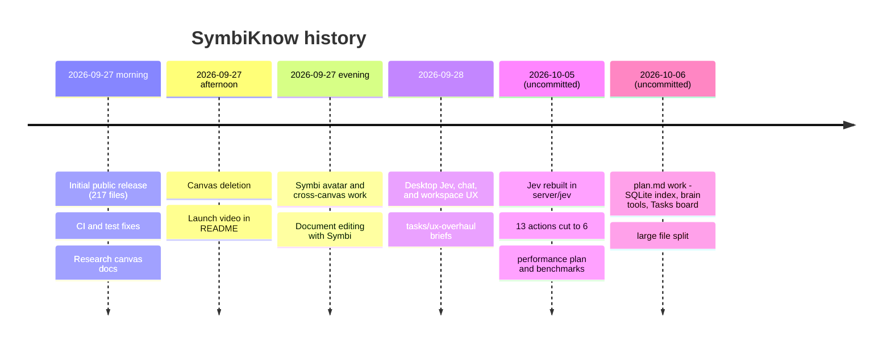

# Project history and the refactor

How SymbiKnow got from its first public commit to today's large uncommitted working tree: the commits, what the refactor removed and added, the plans and measurements behind it, and the old names that still work.

> Historical snapshot from before the Tasks feature was retired on 2026-10-06. References below to the Tasks board, its API, or its files describe an earlier implementation. Counts are approximate; check `git status` before relying on an exact number.

## 1. Commit timeline on `main`

`main` has 11 commits. All of them are from 2026-09-27 and 2026-09-28 (times are +03:00). Everything after that is uncommitted.

| Commit | Date | Size | What changed |
| --- | --- | --- | --- |
| `671e3dd` | 2026-09-27 14:32 | 217 files, +46,975 | **Initial public SymbiKnow release.** The whole app: node:http server (`server/index.ts`, `storage.ts`, `chat-stream.ts`, `mcp.ts`), the Jev "insights" engine (`insights.ts`, `gaps.ts`, `duplicates.ts`, `runs.ts`, …), React UI (`App.tsx`, `Canvas.tsx`, `InsightsPanel.tsx`), WebMCP, CI, brand files. |
| `b95aa41` | 14:34 | 1 file | Show failed test details in CI (`.quality/run-tests.mjs`). |
| `15c47aa` | 14:37 | 3 files | Build before tests in fresh checkouts (`package.json`, `.github/workflows/ci.yml`). |
| `5c69755` | 14:44 | 4 files | Document the research canvas and the view-aware assistant (`docs/research-canvas.md`, `API.md`, `README.md`). |
| `93921f4` | 15:11 | 1 file | Ignore local drafts and generated tool output (`.gitignore`). |
| `6fdb2f1` | 16:23 | 16 files | Confirmed canvas deletion and cleanup (`server/storage.ts`, `src/App.tsx`, `src/AppDialogs.tsx`, Gherkin scenario in `features/canvas.feature`). |
| `f9d855b` | 16:44 | 3 files | Launch video and poster in the README (`brand/symbiknow-launch.mp4`). |
| `2f8c2b1` | 16:49 | 1 file | Launch video link in the README (author `benrben`, made on GitHub). |
| `5f55227` | 19:19 | 51 files | Polish Symbi UI and cross-canvas work: Symbi avatar art (`src/SymbiAvatarArt.tsx`, `src/symbi-avatar.css`), icon options in `brand/`, more `server/cross-canvas.ts` logic. |
| `5b3540a` | 19:56 | 15 files | Better document editing with the Symbi assistant (`server/chat-stream.ts`, `src/MarkdownEditor.tsx`, `src/chat-context.ts`). |
| `70ffba2` | 2026-09-28 10:12 | 100 files, +7,583 / −1,514 | **Desktop Jev, chat, and workspace UX.** Chat proposals (`server/chat-proposals.ts`), saved investigations (`server/investigations.ts`, `src/SavedInvestigations.tsx`), MCP activity log (`server/mcp-activity.ts`), Jev inbox and intake (`jev-inbox.ts`, `jev-intake.ts`), version preview, Settings connections, and the `tasks/ux-overhaul/` briefs. |

## 2. Size of the uncommitted refactor

| Measure | At `HEAD` | Now (working tree) |
| --- | --- | --- |
| `server/` files (code / tests) | 39 / 36 | ~233 / ~267 |
| `src/` files (code / tests) | 67 / 26 | ~262 / ~131 |
| `shared/` files (code / tests) | 12 / 7 | 18 / 12 |
| `server/index.ts` lines | 679 | 144 |
| `server/storage.ts` lines | 1,088 | 466 |
| `src/App.tsx` lines | 1,578 | 61 |
| `server/chat-stream.ts` / `src/AIElementsChat.tsx` lines | 990 / 828 | 20 / 8 |

In tracked files the diff is 112 modified files (+5,146 / −14,244 lines) and 58 deleted files (−9,194 lines). New files in `server/`, `src/`, and `shared/` add about 78,000 lines. Big files became thin entry points that import many small modules (see [Architecture](architecture.md)).

## 3. What the refactor removed

At `HEAD`, Jev was an **on-demand analyzer**. A person opened the Jev panel, ran an analysis, got a list of "insight items", and chose which to apply. The refactor replaced this with an **automatic daemon** (Symbi Reflex) that runs six fixed actions on every saved document. Almost every deleted module belonged to the old analyzer. A test now checks that the old routes return `404` (`server/index.jev-removal.test.ts`, `features/jev-removal.feature`).

### Server modules

| Deleted file (`HEAD` size) | What it did | Replacement now |
| --- | --- | --- |
| `server/insights.ts` (846 lines) | Central analyzer `analyzeCanvas`. Ran 17 question "families" (order, lane, purpose, work_area, stale, steps, reviewer, links, quality, duplicates, tags, move, gap, tasks, …) and built an `InsightReport`. Route `POST /canvases/:id/insights`. | The six-action runtime in `server/jev/` (`runtime-document.ts`, `actions/*.ts`). See [Symbi Reflex](symbi-reflex.md). |
| `server/gaps.ts` (75) | Asked Jev whether a document depends on a concept that no other title covers ("documentation gap"). | None. `flag_gap` is now a retired action name. |
| `server/relations.ts` (164) | Typed link questions (prerequisite, implements, supersedes, contradicts, …), "supersedes → mark stale", task-to-document suggestions. | The `link` action chooses a typed, directed relation. Supersedes, contradicts, and stale marking are gone. |
| `server/runs.ts` (409) | Preview / apply / undo of canvas and workspace "runs" (`dedupe`, `tidy`, `connect_all`) with a journal of before/after snapshots. Routes `/automations`, `/api/jev-runs/:id/undo`. | Automatic processing with per-change receipts and checked Undo in `server/jev/` (`proposals.ts`, `parent-undo.ts`, `workspace-journal.ts`). |
| `server/automation.ts` (61) | Applied one insight action (layout, update, cross_link, move, merge) to the store. | Guarded mutations in `server/jev/mutations.ts` and `server/storage-jev-executor.ts`. |
| `server/duplicates.ts` (258) | Duplicate pairs with merge plans (identical, contains, partial). Could propose merges. | `flag_duplicate` action. It only records findings and never merges. |
| `server/tags.ts` (172) | Tag suggestions from a tag vocabulary. | `label` action (reuses existing tags and label definitions). |
| `server/quality.ts` (107) | Scored clarity, completeness, actionability, evidence, scope; computed "canvas health". | None. `score_quality` is retired; old results stay readable. |
| `server/feedback.ts` (109) | Logged applied/dismissed findings in `DATA_DIR/jev-feedback/` and suggested threshold calibration. | None. Six per-action confidence thresholds (default 70%) in `src/JevThresholds.tsx`. |
| `server/reading-paths.ts` (57) | Built a named reading order per group. | None (retired `order_reading`). |
| `server/cross-canvas.ts` (344) | Found connections between documents on different canvases. | Partly `suggest_home_canvas`. Cross-canvas link finding as such is gone. |
| `server/moves.ts` (117) | Suggested moving or splitting documents into a better canvas. | `suggest_home_canvas` action. |
| `server/jev-inbox.ts` (154) | Review inbox that checked at most two changed documents per request; dismiss/apply findings. | Reflex progress and findings in `src/JevPanel.tsx` and `server/jev/runtime-progress.ts`. |
| `server/jev-intake.ts` (140) | Read-only label/canvas/link suggestions for a file before upload. | None. Uploads save directly (`src/app-intake.ts`: "without semantic review"); Reflex processes them afterwards. |
| `server/jev-usage.ts` (71) | Wrote token usage to `DATA_DIR/jev-usage/YYYY-MM.jsonl`; `GET /api/jev/usage` showed monthly cost. | Only the `onJevUsage` listener in `server/jev.ts`; `server/api-symbi.ts` counts usage per brain-tool call. No usage file is written now. |
| `server/jev-cache.ts` (170) | Per-canvas cache of Jev answers keyed by question family and content hash. | `server/jev/actions/question-answer-cache.ts` and `server/symbi-judgment-cache.ts`. |
| `server/search-ranking.ts` (85) | Asked Jev to rerank the first 20 search hits (1.5 s deadline). | Local SQLite index `server/symbi-index.ts` and `server/search-candidates.ts`. See [Search and brain tools](search-and-brain-tools.md). |
| `server/task-insights.ts` (104) | Scored open tasks (urgency, importance, effort, blocked) and linked them to documents. | None. The Tasks board (`src/TasksCanvasBoard.tsx`) has no AI scoring; `assign_owner` and `attach_doc_to_task` are retired. |

### Shared types

| Deleted file | What it held | Replacement |
| --- | --- | --- |
| `shared/insights.ts` (188) | `InsightItem`, `InsightAction`, `InsightReport`, `CanvasHealth`, `TaskScore`, `ReadingPath`. | `shared/jev-types.ts` (actions, proposals, receipts), `shared/jev-evidence.ts`. |
| `shared/policy.ts` (41) | `JevPolicy`: `show` and `apply` thresholds for ~20 action kinds. | One threshold per action in Jev settings (`server/jev/automatic-policy.ts`). |

### UI components

| Deleted file | What it did | Replacement |
| --- | --- | --- |
| `src/InsightsPanel.tsx` (946) + `insights.css` | The Jev panel with tabs Review, Groups, Connections, Labels, Duplicates, More. | `src/JevPanel.tsx` (the **Symbi Reflex** tab beside Chat) with `JevThresholds`, `JevDocumentProgress`, `JevFacts`, `JevReset`. |
| `src/GroupSuggestions.tsx` (151) | Previewed AI grouping from `POST /insights` before saving. | Automatic `file` action; `src/BrowseGroups.tsx` for browsing saved groups. |
| `src/SmartIntakeDialog.tsx` (68) | Upload dialog with suggested canvas, purpose, work area, tags, links. | Direct upload (`src/app-intake.ts`). |
| `src/TasksPanel.tsx` (223) + `tasks.css` | List-style task panel with AI task analysis. | `src/TasksCanvasBoard.tsx` + `tasks-canvas.css`. See [Tasks board](tasks-board.md). |
| `src/CanvasNavigation.tsx` (39) | Back/forward buttons, bookmarks, and recent canvases bar. | Place history is still kept by `src/useCanvasJourney.ts` and used by `src/app-navigation.ts` (for example, returning from chat). No bookmark bar was found in the UI. |

### Acceptance features

| Deleted feature | What it tested | Now |
| --- | --- | --- |
| `features/canvas-run.feature` | Preview a canvas run, apply one change, undo; skip a document edited after preview. | `features/jev-removal.feature` checks these routes are gone; `features/symbi-reflex.feature` and `features/jev-document-operation.feature` test the new path. |
| `features/jev-experience.feature` | Focused analysis of one card, intake preview, review inbox batches. | Same as above. |

## 4. What the refactor added or split

Counts are new, untracked files (code / tests). They do not include modified files.

| Family | Code / tests | What it is |
| --- | --- | --- |
| `server/api-*.ts` | 16 / 17 | HTTP routes split out of `server/index.ts`: `api-router.ts`, `api-documents.ts`, `api-tasks.ts`, `api-chat*.ts`, `api-symbi.ts`, `api-jev.ts`, `api-connections.ts`, … |
| `server/chat-*.ts` | 21 / 17 | Chat agent split out of `chat-stream.ts`: agent loop, tools, session, SSE, prompt, proposal journal and validation. |
| `server/storage-*.ts` | 12 / 16 | `CanvasStore` split by concern: documents, files, tasks, settings, merges, validation, Jev fields and executor. |
| `server/mcp-*.ts` | 11 / 8 | MCP split: brain tools (`ask_symbi`, `symbi_reflex`), Jev tools (legacy), files, scope, HTTP sessions and activity. |
| `server/symbi-*.ts` | 10 / 2 | New SQLite + FTS5 index, MiniLM embedding worker, retrieval, judgment cache, benchmarks. |
| `server/version-*.ts` | 6 / 2 | Per-document Git history split: identity, initialization, merge recovery, references. |
| `server/jev/` | 94 / 155 | The new Reflex daemon: runtime, queue, scheduler, proposals, receipts, Undo, workspace ledger codec, and `actions/` (79 files). |
| Other server groups | ~30 / ~14 | `search-candidate*`, `investigations-*`, `document-*` (moves, deletion, snapshots), `similarity-*`, `merge-*`, `coordination-*`. |
| `shared/` | 6 / 5 | `jev-types.ts`, `jev-evidence.ts`, `jev-action-labels.ts`, `symbi-contract.ts` (v1 contracts), `document-state.ts`, excerpt helpers. |
| `src/` | ~203 / ~109 | Big components split into views, hooks, and type files: Canvas (34), Chat (33), AnswerCanvas/research (22 + 8), App shell (21), SavedInvestigation (16), Jev/Reflex (13), Connections (13), Settings (10), Version (9), WebMCP (7), Inspector (6). |
| `features/` | ~37 files | New scenarios: `symbi-reflex`, `tasks-canvas`, `jev-removal`, `jev-document-operation`, `jev-indexed-grouping`, `engine`, `canvas-loading`, `app-safety`, avatar features. |

New dependencies (from `work/plan-implementation-log-20261006.md`): `better-sqlite3@12.8.0` and `@huggingface/transformers@3.8.1`.

## 5. Planning and design documents

### `tasks/ux-overhaul/` (committed in `70ffba2`)

A desktop UX plan for 1440px and 800px, light and dark. Work was split between "worker" agents with owned files.

| File | Summary |
| --- | --- |
| `README.md` | The product journey (signal → scope → evidence → finding → proposal → approval → receipt → Undo), the color palette and `--sk-*` tokens, owners, release order, and 10 added findings (A1–A5, D1–D3, C1–C2). Last status: A2–A5 and C2 implemented, C1 (replayable timeline) planned. Unit 668/668, Cucumber 45 scenarios passed; full quality gate still `FAIL` (210 items, coverage/complexity/file size). |
| `01-shell-search-history.md` | 800px shell layout, modal focus and dirty-close guard, keyboard search over all results, branch/history preview before switch/merge/restore. |
| `02-jev-theme.md` | Jev dark-mode contrast, the six Jev views (Review, Groups, Connections, Labels, Duplicates, More), ARIA tabs, preview/Apply/Undo as one flow. Targets `InsightsPanel.tsx`, which the refactor later deleted. |
| `03-settings-tasks-intake.md` | MCP server form, external tools vs. agent access, token revoke, Task delete Undo, empty upload-intake state. Targets `TasksPanel.tsx` and `SmartIntakeDialog.tsx`, both later deleted. |
| `04-chat-mcp-integration.md` | Shared investigation/evidence record, Chat claim checks, pre-apply chat proposals, saved conversations, scoped MCP tokens and Agent Activity ledger. |

### `docs/jev/` (uncommitted)

| File | Summary |
| --- | --- |
| `performance-plan.md` (2026-10-05) | Plan for "durable document completion under 2 seconds". Baseline with the then **13-action** chain: 21,386 ms from admission to checkpoint, 68 workspace reads / 40 writes, 4 provider requests, 462 questions, a 17.5 MB ledger with 3,050 receipts. Proposes one leased document plan, incremental (SQLite) storage, a question dependency graph, and progress projection. |
| `performance-plan-evidence/` | `fresh-benchmark.json` (the baseline above), `candidate-probe.json` (146 documents, 24 candidates each, 130 of 132 kept their category candidate, median evidence coverage 23%), `tests.json` (257 tests in 25 files passed), `source-hashes.json`, and the two `.mts` harnesses. |
| `simpler-document-results.md` (2026-10-05) | The "simpler document operation" result: **21,845 ms → 2,285 ms (9.56× faster)**, reads 68 → 4, writes 40 → 3, questions 462 → 174, still 285 ms over the 2,000 ms target. 3,922 tests passed. |
| `README.md`, `decision-contract.md`, `sdk-reference.md` | Current Reflex behavior, the six-action contract, and the Jev SDK. Summarized in [Symbi Reflex](symbi-reflex.md). |

### `docs/plans/symbi-engine.md` (uncommitted, 2026-10-06)

"Symbi: lightweight knowledge, automatic organization, and useful MCP tools." It **replaces the 13-action plan**. Documents stay files; SQLite holds only rebuildable search data. One local index (FTS5 + MiniLM) serves grouping, UI search, and MCP. Reflex keeps exactly six actions. Agents get two brain tools, `ask_symbi` and `symbi_reflex`, instead of nine Jev tools. MCP writes become version-checked. A canvas-style Tasks board is added. Targets: under 2,000 ms execution per document and at most two Jev requests per document. Section 13 (logical canvas layout) is plan-only. Task-by-task status is in [Plan status](plan-status.md).

### `work/` folder (uncommitted measurement artifacts)

All runs used five test documents (Release checklist, Rollback procedure, Release validation, New hire access, First-week onboarding) unless noted. "exec" is execution time per document.

| Folder or file | What it holds | Key numbers |
| --- | --- | --- |
| `jev-live-20261005/` | Live 13-action run on the retained app with a real provider (`baseline.json`, `latest.json`, `events.jsonl`, 17 MB `before-state.json`). | 139 provider requests, 7,796 questions, 2.6 M input tokens in 672 s. First five attempts: 1 failed ("document context changed"), others 715–1,285 ms after claim, queue wait up to 3.7 s. |
| `jev-simple-20261005/` | Offline paired benchmark behind `simpler-document-results.md`; test, acceptance, and selected quality reports. | 9.56× faster; 3,922 tests passed. |
| `jev-six-actions/` | Logs of the 13 → 6 action migration (`verification.json`). | Kept: profile, file, label, link, flag_duplicate, suggest_home_canvas. Removed 7. Regression 3,932 / 3,933 (one obsolete assertion fixed); migration rerun 50 / 50. |
| `jev-six-live-20261005/` | First six-action run with a real provider. | 1 request per document, exec 359–531 ms, but **0 documents grouped** (`insufficient_group_evidence`). |
| `jev-logical-grouping-20261005/` | First grouping fix. | 3–5 requests per document, exec 1,037–1,692 ms; 4 grouped, but each in its own group. |
| `jev-logical-grouping-final-20261005/` | Next attempt, plus `probe.json`. | 2 requests per document, exec 650–948 ms, 0 grouped. |
| `jev-logical-grouping-verified-20261006/`, `jev-logical-grouping-scope-20261006/` | Final grouping runs with full test and lint logs. | 14–15 requests (2–4 per document), exec 833–1,313 ms; 4 of 5 grouped into two shared groups (release engineering, employee onboarding). Limits: Rollback stayed out (coherence 0.68 < 0.70), two-request target not met for every document. |
| `symbi-comparison-20261006.json` | Lexical vs. hybrid search on 5 documents + 12 distractors, 8 queries. | Recall 6/7 lexical vs. 7/7 hybrid; hybrid p50 4.09 ms, p95 12.53 ms. |
| `symbi-retrieval-final-20261006.json` | Index lifecycle proof (restart, deletion, permission filter, long document). | Six-document indexing 1,345 ms; warm unchanged pass 0.86 ms. |
| `symbi-pipeline-offline-benchmark*.json` + `.mts` | Offline six-action run, full checkpoint vs. delta journal. | 10 requests (2 per document), 152 questions; wall 407 ms vs. 430 ms; journal writes ~51% fewer bytes but reads more. |
| `symbi-pipeline-implementation-log.md` | Plan tasks A5 and C1–C5: question audit per action, 18 roles, 16 topics, typed links. | — |
| `plan-implementation-log-20261006.md` | Progress log of `docs/plans/symbi-engine.md` by task ID, worker ownership. | First full `npm test`: 4,048 tests, 27 failed. |
| `reflex-ui-concepts/reflex-ui-concepts.html` | Three UI mockups for Reflex: Decision inbox, Conversation first, Canvas first. | — |

## 6. Retired names and compatibility

The project was first called **allteam** (the repository folder still is). Old names keep working so existing setups do not break. The rules are in `server/auth.ts`, `server/mcp.ts`, `server/jev-api-principal.ts`, and `README.md` line 76. They were already present at `HEAD`.

| Old name | New name | How it still works |
| --- | --- | --- |
| `ALLTEAM_ACCESS_TOKEN` | `SYMBIKNOW_ACCESS_TOKEN` | Both tokens are accepted (`server/auth.ts`). New browser sessions use the new token. |
| `ALLTEAM_MCP_TOKEN` | `SYMBIKNOW_MCP_TOKEN` | Both accepted as fixed MCP tokens (`env-token-legacy` in `server/jev-api-principal.ts`, `server/storage-settings.ts`). |
| `ALLTEAM_AGENT_NAME` | `SYMBIKNOW_AGENT_NAME` | The new name wins if both are set (`server/mcp.ts`). |
| Cookie `allteam_session` | `symbiknow_session` | Old cookie is still checked (HMAC salt `allteam-session-v1`); logout clears both. |
| Header `x-allteam-actor` | `x-symbiknow-actor` | Used when the new header is missing (`server/auth.ts`). |
| MCP server name `allteam-canvas` | `symbiknow` | Only a client config label. Old entries still connect; `.mcp.json` uses `symbiknow`. |

### Jev vs. Symbi Reflex

- At `HEAD` the organizer was called **Jev** everywhere in the UI ("Jev panel", "Jev Groups").
- Now the UI calls it **Symbi Reflex** (tab beside Chat in `src/AppAssistantPanel.tsx`). The chat guide is **Symbi**.
- **Jev** remains the internal name: the TypeSafe engine (`server/jev.ts`, SDK in `server/sdk.ts`), the `server/jev/` folder, `/jev` routes, `jev_*` MCP tools, and the "Reset and rerun Jev" button.
- Old Git revision authors such as `Jev` and `SymbiKnow assistant` keep their names (`README.md`).
- The nine `jev_*` / brain diagnostic MCP tools (`jev_profile`, `find_by`, `related`, `memory_map`, `jev_activity`, `brain_inbox`, `jev_do`, `jev_job`, `jev_propose`) are hidden unless `SYMBIKNOW_LEGACY_BRAIN_TOOLS=1` or a token lists them (`server/mcp.ts`). They were added during the uncommitted work, not at `HEAD`.

### Retired Jev actions

`shared/jev-types.ts` keeps old action names in the `JevAction` type, so **old receipts stay readable and can still be undone**. New requests for them fail with `400` ("Invalid Symbi Reflex action" in `server/jev/configuration.ts`; the list of current actions is in `server/jev/automatic-policy.ts`).

| Group | Names |
| --- | --- |
| Removed in the 13 → 6 cut | `vocab_lifecycle`, `score_quality`, `flag_conflict`, `recheck_links`, `attach_doc_to_task`, `assign_owner`, `recall` |
| Removed earlier (uncommitted iterations) | `set_headline`, `set_freshness`, `flag_sensitive`, `order_reading`, `suggest_archive`, `mark_supersedes`, `flag_gap`, `create_task_from_line`, `suggest_task_done`, `prioritize`, `where_to_put`, `route_chat`, `digest`, `review_agent_edit` |

Old analyzer routes (`/insights`, `/jev-inbox`, `/intake/preview`, `/duplicates`, `/cross-connections`, `/quality`, `/automations`, `/merge`, `/tasks/insights`, `/api/jev-runs/*`, `/api/jev/usage`, `/api/jev/calibration`, `/api/settings/jev-feedback`) return `404` (`server/index.jev-removal.test.ts`).

## Uncertain points

- Steps between `70ffba2` and today were never committed. The order (analyzer → daemon with many actions → 13 → 6 → `docs/plans/symbi-engine.md`) is rebuilt from type names, `work/` folder dates, and logs.
- File counts change while the other session works. The numbers here come from one `git status` run on 2026-10-06.
- `work/` timestamps inside JSON are UTC; folder names use local dates (+03:00). That is why runs from the night of 10-05 have `20261006` folder names.
