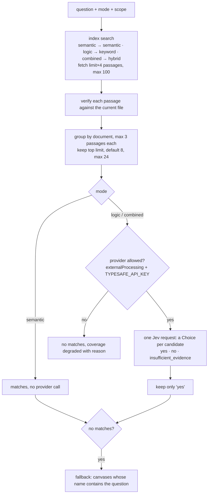
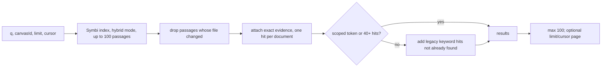

# Search and brain tools

The new local search index and the two agent-facing "brain" tools from `docs/plans/symbi-engine.md`: `ask_symbi` (find knowledge) and `symbi_reflex` (check a claim). This is the newest part of the code and was still changing when this page was written.

## Pieces

| File | Job |
| --- | --- |
| `shared/symbi-contract.ts` | Version 1 wire contract: passages, coverage, provider usage, ask/reflex requests and results, progress |
| `server/symbi-index.ts` | `SymbiIndex`: SQLite schema, incremental upsert, removal, rebuild, search, memory cache |
| `server/symbi-retrieval.ts` | Chunking, vector normalization, query tokens, hybrid ranking |
| `server/symbi-embedding.ts` + `symbi-embedding-worker.mjs` | `MiniLmEmbedder`: one worker thread, bounded queue, offline-only model loading |
| `server/symbi-index-lifecycle.ts` | Rebuilds the index from files at startup and refreshes it on every save event |
| `server/api-symbi.ts` | `POST /api/symbi/ask`, `/reflex`, and the compatibility routes `/find` and `/related` |
| `server/mcp-brain-tools.ts` | Registers `ask_symbi` and `symbi_reflex` as default MCP tools |
| `server/symbi-index-benchmark.ts`, `server/symbi-compare.ts` | Benchmark harness and retrieval comparison fixture (B5, in progress) |
| `server/symbi-judgment-cache.ts` | Durable cache of paid brain-tool judgments (`DATA_DIR/symbi-judgments.json`) |

## The index

The index is a cache. Delete `DATA_DIR/symbi-index.sqlite` and it rebuilds from the document files.

```sql
index_documents(canvas_id, block_id, content_hash, metadata_revision, title, tags, group_name,
                purpose, links, status /* pending | ready | degraded */, reason, indexed_at)
index_passages(rowid, canvas_id, block_id, ordinal, start_offset, end_offset, excerpt,
               chunk_hash, vector BLOB /* Float32, normalized */, model_version)
passage_fts USING fts5(title, excerpt, metadata)   -- keyword search, bm25
```

- **Chunking:** about 1,000 characters per passage, broken at a space or newline after 65% of the length. Offsets are UTF-16 and cover the whole document, so nothing is truncated.
- **Incremental updates:** a chunk's vector is reused when its SHA-256 and model version match; only new chunks are embedded, 16 per batch.
- **Pending first:** `markPending` runs before embedding, so searches report unindexed documents instead of pretending coverage is complete.
- **Embeddings:** `Xenova/all-MiniLM-L6-v2` INT8, pinned revision `57cbdab…`. The worker refuses to download; it loads `<SYMBI_MODEL_ROOT>/Xenova/all-MiniLM-L6-v2/model_int8.onnx`. Limits: 32 texts × 1,600 chars per call, 64 pending calls. If the model is missing, documents are indexed for keywords and marked `degraded`.
- **Cache:** ranked results are cached per query and scope, 4 MB by default (max 64 MB). Any write increments a generation number and clears the cache; old cursors then fail as stale.
- **Lifecycle:** at startup `rebuild()` compares every document's hash and metadata revision. Save events upsert changed documents, delete events remove them, and moves trigger a rebuild.

## Ranking

`rankPassages` blends three signals with reciprocal-rank fusion (k = 60):

```text
score = keywordWeight  / (60 + keywordRank)        // FTS5 bm25 top 500; weight 1, or 0.35 in semantic mode, 0 if no hit
      + semanticWeight / (60 + semanticRank)       // only if cosine > 0.18; weight 0 in keyword mode
      + metadataScore × 0.008                      // title hit 2, tags/group/purpose/links hit 1, divided by tokens × 3
```

Ties break by canvas id, block id, then offset, so pages are stable. Scope filters (`allowedCanvasIds`, `canvasId`, `documentIds`) are applied in SQL before ranking. A principal search without `allowedCanvasIds` is rejected.

## Coverage, an honest answer about completeness

Every result says how much was searched:

```json
{ "status": "pending", "checkedDocuments": 41, "eligibleDocuments": 44, "pendingDocuments": 3,
  "indexedAt": "2026-10-06T00:52:10.000Z", "reason": "3 document(s) awaiting indexing" }
```

`degraded` means the embedder or provider was unavailable. The API also re-reads each returned passage from the current file. If the hash or the exact excerpt changed, the passage is dropped and counted as stale.

## `ask_symbi`: find knowledge



Request and response:

```json
{ "question": "Find our rollback instructions", "mode": "combined",
  "canvasId": "5d206584-9349-4e3e-9666-5c3bc858223e", "limit": 5, "navigate": true }
```

```json
{
  "version": 1,
  "matches": [{
    "canvasId": "5d206584-…", "blockId": "rollback-runbook", "title": "Rollback runbook",
    "reason": "Provider-validated source evidence",
    "passages": [{ "canvasId": "5d206584-…", "blockId": "rollback-runbook", "contentHash": "3f9a1c0b7d2e4a51",
                   "startOffset": 0, "endOffset": 912, "excerpt": "# Rollback runbook\n\n1. Freeze deploys…", "score": 0.031 }],
    "href": "https://symbiknow.example.com/?canvas=5d206584-…&doc=rollback-runbook"
  }],
  "coverage": { "status": "ready", "checkedDocuments": 12, "eligibleDocuments": 12, "pendingDocuments": 0 },
  "providerUsage": { "requests": 1, "questions": 4, "inputTokens": 2310, "outputTokens": 96, "model": "jev-1.13.0" },
  "navigation": { "canvasId": "5d206584-…", "href": "https://…/?canvas=5d206584-…", "activated": false }
}
```

`navigate: true` returns a deep link only when all matches are on one canvas. It never switches anyone's open UI (`activated: false`).

## `symbi_reflex`: check a claim

```json
{ "claim": "The release checklist requires a rollback plan", "canvasId": "5d206584-…",
  "documentIds": ["release-checklist"], "comparisonDocumentId": "rollback-runbook" }
```

1. Hybrid search (limit 24) over the scope, including `comparisonDocumentId`.
2. Verify passages against current files. If none remain: `insufficient_evidence`, confidence 0, no provider call.
3. If the provider is not allowed: `insufficient_evidence` with `coverage.status: "degraded"`.
4. Otherwise one Jev Choice: `yes` (directly supported), `no` (directly contradicted), or `insufficient_evidence`.
5. A `no` is downgraded to `insufficient_evidence` unless coverage is `ready`, because a failed search is not proof that something does not exist.

```json
{ "version": 1, "verdict": "yes", "confidence": 0.88,
  "explanation": "The checked passages support the claim.",
  "passages": [ … ], "coverage": { "status": "ready", … },
  "providerUsage": { "requests": 1, "questions": 1, "inputTokens": 1480, "outputTokens": 31 } }
```

The tool never edits content, applies organization, or merges duplicates.

## Permissions

Both routes resolve the caller with `jevApiPrincipal`. A token with a tool list must include `ask_symbi` or `symbi_reflex` (`403` otherwise). `allowedCanvasIds` is enforced in the SQL scope and in `expectedDocumentIds`, so out-of-scope documents never reach Jev.

## Paid judgments are cached and resumable

Every Jev call made by `ask_symbi` or `symbi_reflex` goes through `SymbiJudgmentCache` (`server/symbi-judgment-cache.ts`), stored in `DATA_DIR/symbi-judgments.json`.

- **Key:** SHA-256 of `brain-v1`, the principal (id, access, tools, allowed canvases), a fingerprint of the workspace policy (settings and vocabulary), a fingerprint of the provider key, the model, the exact state and questions, and the `(canvasId, blockId, contentHash)` of every source passage. Any change in scope, policy, or source means a fresh judgment.
- **States:** `running`, `complete`, `failed`. A `running` entry left behind by a crash is reported as `interrupted`; repeating the same question never silently pays again.
- **Reuse:** a completed answer is returned with `providerUsage` all zero, because no new request was made.
- **Concurrency:** identical in-flight calls share one promise.
- **Size:** at most 256 entries; the oldest finished entries are dropped first.
- **Continuation:** `ask_symbi` returns `continuationId` (the judgment key). Sending it back resumes the same judgment; if the sources or scope changed, the call fails with `409` and asks for a new question.

## Compatibility routes for legacy tools

The legacy MCP tools now reuse the shared retrieval instead of profile-only data:

| Legacy tool | Now calls | Behavior |
| --- | --- | --- |
| `find_by` | `POST /api/symbi/find` | Same as `ask_symbi` in `semantic` mode. If only `blockId` is given, the document title is the question |
| `related` | `POST /api/symbi/related` | Other documents on the same canvas with reasons: `linked`, `same group`, `same topic` (shared tag), `source similarity` (hybrid search on title, purpose, and tags). Sorted by number of reasons; `limit` default 25, max 100; numeric `cursor`; includes coverage |
| `jev_profile`, `memory_map`, `jev_activity`, `brain_inbox` | `/jev/agent/state?view=…` | Now accept `limit` and `cursor` |

## Other search paths

### `GET /api/search` (UI search and `search_docs`)



- Scoped tokens get index results only, so the legacy path cannot leak other canvases.
- Hits carry `retrieval.kind` (`semantic` from the index, or `exact`, `phrase`, `terms`, `fuzzy_title` from the legacy path) and `evidence` with the exact passage.
- No provider calls.

### Legacy keyword scoring (`server/search-candidates.ts`)

`CanvasStore.search(query)` reads all canvases and ranks non-archived documents. Queries are limited to 200 characters and 12 distinct terms; default 40 results, max 100.

| Match | Score |
| --- | --- |
| Whole query in title | 1,000 |
| Whole query in body | 900 |
| Two adjacent query words in title | 750 |
| Two adjacent query words in body | 650 |
| Enough terms (at least 2, or all if fewer, and at least 30%) mostly in title | 450 + up to 100 for coverage, −35 per fuzzy title word |
| Same, mostly in body | 300 + up to 100, −35 per fuzzy title word |

Fuzzy matching only applies to title words (`search-candidate-fuzzy.ts`). Ties sort by canvas name, title, then id. The excerpt is the best matching body line.

### In-memory similarity index (`server/similarity*.ts`)

Each workspace has a `SimilarityIndex` (term frequencies and document frequency, rebuilt from canvases as they load). It returns weighted neighbors for a document and is used by chat retrieval. It is memory-only and rebuilt after restart.

### Chat answer retrieval (`server/answer-retrieval.ts`)

When Symbi answers a question, it picks up to 20 source documents from the whole workspace:

| Signal | Added score |
| --- | --- |
| Similarity to the question (similarity index, top 24) | the similarity score |
| Selected, open in reader, or focused document | +0.35 |
| In the active group | +0.32 |
| Focused source of the current research answer | +0.30 |
| Visible source of the current research answer | +0.22 |
| Visible on screen | +0.20 |
| In a visible group | +0.12 |
| Already cited earlier in the conversation | +0.07 |

`server/answer-sources.ts` turns them into sources with excerpts and scores. `server/answer-surface.ts` decides **chat** or **research canvas** with local word patterns: "in chat", "quick answer" force chat; "draw/build … canvas", "mind map", "diagram", "roadmap", "kanban", "architecture" force canvas; words such as "compare", "research", "plan", "dependencies", "root cause", "timeline" lean to canvas. The layout comes from the same words: roadmap, kanban, architecture, otherwise mind map. No provider is asked for these choices.

### Retrieval benchmark (`server/symbi-compare.ts`)

A fixture script that copies probe documents and runs paraphrased queries in three categories: `specific`, `ambiguous`, `missing`. Example: "How do we recover after a production rollout fails?" should find *Rollback procedure*. It compares retrieval quality between methods (plan task B5).

## Known gaps

- No MiniLM model is installed in this checkout, so semantic results fall back to keywords and show as `degraded`. Set `SYMBI_MODEL_ROOT` to a folder with the pinned model.
- `logic` mode retrieves with keywords only; the plan's graph and metadata expansion is not there yet.
- `providerUsage.requests` is counted as 1 per new judgment rather than measured from the transport.
- Paging (`cursor`) is page-by-passages, and documents are grouped after paging, so one document can show up on two pages.
- Benchmarks B5 and E1–E3 have not been run.
