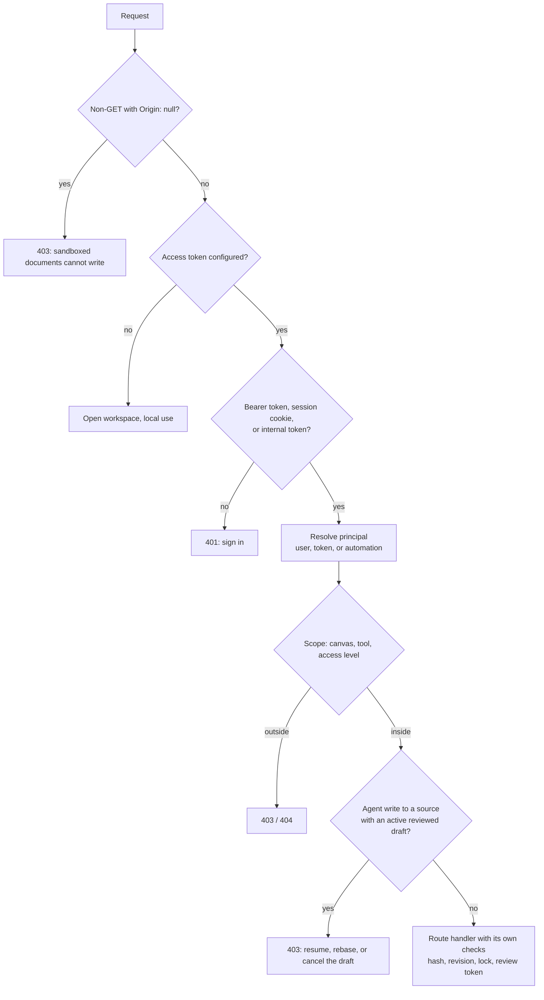

# Security and access

Who can reach SymbiKnow, how each caller is identified, what each caller may do, and how untrusted content is kept away from the app.

## Layers at a glance

## Workspace access token

| Item | Behavior (`server/auth.ts`) |
| --- | --- |
| Token source | `SYMBIKNOW_ACCESS_TOKEN` and/or legacy `ALLTEAM_ACCESS_TOKEN`; both stay valid during a migration |
| No token set | Every request is allowed. The server prints a warning if `HOST` is not loopback |
| Browser sign-in | `POST /api/session { token }` sets `symbiknow_session` (HttpOnly, SameSite=Strict, Path=/, 30 days, `Secure` when the request is HTTPS or `x-forwarded-proto: https`) |
| Scripts | `Authorization: Bearer <access token>` |
| Comparisons | Always `timingSafeEqual` on equal-length buffers (`safeEqual`) |
| Cookie value | Derived from the token, never the token itself; changing the token logs every browser out |
| Sign-out | `DELETE /api/session` clears both the new and the legacy cookie |

## MCP tokens

- Created in **Settings → MCP connections** (`POST /api/mcp/tokens`). The token is shown once; only its SHA-256 hash and a short preview are stored.
- A token can be limited by `access` (`read`, `propose`, `write`), `allowedCanvasIds`, and `tools`. A tool list that exceeds the access level is rejected (`400`).
- Read tokens only see tools in `readableMcpTools` (`server/settings.ts`): `ask_symbi`, `symbi_reflex`, `list_canvases`, `read_canvas`, `search_docs`, `read_doc`, `download_file`, `list_tasks`, `list_versions`, plus the read-only legacy Jev views.
- `scopedRegistration` (`server/mcp-scope.ts`) registers only the allowed tools and filters every result to allowed canvases. If a result cannot be filtered safely, the call fails instead of leaking data.
- Revoking a token takes effect on the next call; the Jev routes recheck current grants each time.

## Principals

Every Reflex and brain-tool call resolves a `JevPrincipal` (`server/jev-api-principal.ts`, `server/jev/authorization.ts`):

| Caller | Principal | Can approve | Can configure |
| --- | --- | --- | --- |
| Signed-in browser / access token | `workspace-owner`, kind `user`, access `write` | Yes | Yes |
| MCP over HTTP | kind `token`, the token's access, canvases, and tools | No | No |
| Local stdio agent | `local-stdio-agent`, kind `token`, access `write` | No | No |
| Background Reflex | kind `automation` | Runs the checked automatic policy only | No |

MCP-over-HTTP calls reach the API on loopback with an internal random token generated at startup. To stop an agent from impersonating another one, the MCP host adds `x-symbiknow-jev-principal: <id>.<HMAC signature>`. Only the server can produce that signature; a missing or wrong proof is rejected with `403`.

Rules that follow from this:

- **Agents never approve.** `requireApprove` needs a `user` principal with `canApprove`. Agent proposals wait for a person.
- **Reset needs the owner** (`requireResetOwner`).
- **Headers never grant authority.** Actor and transport headers only name or restrict a caller.
- Reflex state returned to a token is filtered by `scopedState` to its canvases, and the principal fingerprint is part of every answer-cache key.

## Agent write guard

`requireReviewedAgentWrite` (`server/jev-agent-write-guard.ts`) runs before every route. When the request comes from MCP and changes a source (`PUT`/`DELETE` on a block, or a branch switch, merge, or restore), it checks for an active reviewed draft on that document. If one exists, the write fails with `403` until the draft is resumed, rebased, or cancelled.

## WebMCP is different

WebMCP tools (`src/webmcp*.ts`) run inside the signed-in browser tab and call the API as that browser session:

- Their writes are recorded as actor `Browser`, not as an agent.
- They do not send `x-symbiknow-agent-transport: mcp`, so the agent write guard does not apply.
- MCP token scopes do not apply; the tab's full access does.
- `edit_doc`, `upload_file`, and `remove_doc` send no `expectedContentHash`, so they can overwrite a newer change.

Use WebMCP only on your own machine with an agent you trust. See [Jev SDK and WebMCP](sdk-and-webmcp.md).

## Request hygiene (`server/api-http.ts`)

| Check | Result |
| --- | --- |
| Body is not `application/json` | `415`; blocks cross-site form posts |
| Body larger than 2,000,000 bytes | `413` |
| Non-GET with `Origin: null` | `403` |
| JSON responses | `cache-control: no-store` |
| Static files | `x-content-type-options: nosniff` |
| Unknown errors | Generic `500 Internal server error`; details only in the server log |

## Untrusted content in the browser

| Content | Protection (`src/Loaders.tsx`) |
| --- | --- |
| Markdown with inline HTML | `rehype-raw` then `rehype-sanitize`, which strips scripts, event handlers, and unsafe URLs |
| HTML documents | `iframe srcdoc` with `sandbox="allow-scripts allow-forms allow-popups allow-popups-to-escape-sandbox allow-modals"` and no `allow-same-origin`, so the page has an opaque origin: no cookies, storage, or API access, and its writes get `403` |
| Slides | Rendered inside `sandbox=""` (no scripts) |
| Website previews | Static build served from the app's own route |
| MDX | Only the built-in `Calculator` and `Chart` components; imports, JavaScript expressions, and unknown components are rejected |

Document text sent to Jev is treated as untrusted evidence. Instructions inside a document do not change what Reflex is allowed to do.

## Secrets

- Provider keys, named secrets, and MCP server headers live in `settings.json` on the server. `GET /api/settings` never returns them.
- External MCP servers reference secrets as `Bearer <secret>` or `${secret:NAME}`; the value is substituted on the server.
- Settings and secrets are never committed to document Git histories.
- Recovery journals are written with mode `0600`.

## Deployment checklist

1. Set `SYMBIKNOW_ACCESS_TOKEN` (long random value) whenever the server is reachable from another machine.
2. Serve over HTTPS so the session cookie gets `Secure`.
3. Set `PUBLIC_URL` so deep links and MCP setup show the right address.
4. Give each agent its own MCP token with the smallest access, canvas, and tool scope it needs.
5. Treat `/mcp/t/<token>` URLs as secrets.
