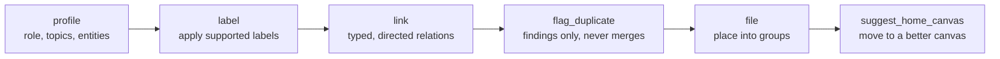
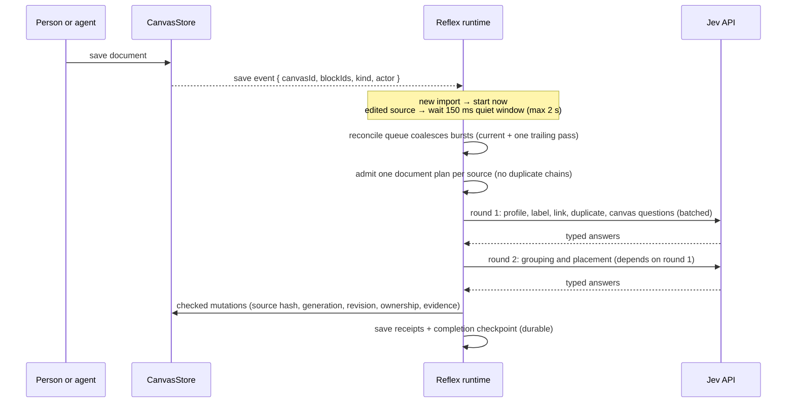

# Symbi Reflex (Jev)

The automatic organizer. Symbi Reflex runs six actions on every saved document, using the TypeSafe Jev engine for typed judgments and saving only changes that exact source evidence supports.

## The Jev engine (`server/jev.ts`)

Jev is a typed decision API. The caller sends a JSON `state` and named **questions**; Jev returns one typed answer per question, and the SDK validates every answer.

| Question type | Builder | Caller defines | Jev returns |
| --- | --- | --- | --- |
| Choice | `choice(instructions, { option: description })` | Named options | Selected option, probabilities, confidence |
| Score | `score(instructions, [labels…])` | Ordered labels | Numeric level, probabilities, confidence |
| Noul | `noul(instructions, { true?, false? })` | Optional criteria | A probability between 0 and 1 |

```ts
import { choice, noul, decideWithJev } from './jev.js';

const answers = await decideWithJev(apiKey,
  { claim: 'We roll back by redeploying the previous tag', passages: [{ id: 'p0', excerpt: '…' }] },
  {
    verdict: choice('Do the passages support or contradict the claim?',
      { yes: 'Directly supported', no: 'Directly contradicted', insufficient_evidence: 'Unclear or missing' }),
    mainTopic: noul('Is "release rollback" a main topic of the passages?'),
  });
// answers.verdict → { type: 'choice', choice: 'yes', confidence: 0.91, … }
```

| Setting | Value |
| --- | --- |
| Model | `TYPESAFE_MODEL` or `jev-1.13.0` |
| Key | `TYPESAFE_API_KEY` (Settings secret or environment) |
| State token limit / request token limit | 32,000 / 64,000 (estimated) |
| Parallel chunks per wave | at most 4 active calls |
| Transport | `server/jev-transport.ts`: timeout, bounded response, retry, cancellation |
| Usage reporting | `onJevUsage` listeners (token counts per call). The old monthly log `DATA_DIR/jev-usage/YYYY-MM.jsonl` came from `server/jev-usage.ts`, which this refactor deleted |

Jev only sees the state you send. It has no access to files. The public SDK boundary is `server/sdk.ts`, built to `dist/sdk/sdk.js` by `npm run build:sdk`.

## The six actions, in order

`documentActions` in `server/jev/runtime-document.ts` fixes the order. Later actions depend on earlier results.



| Action | UI name | What it decides | Evidence and limits |
| --- | --- | --- | --- |
| `profile` | Understand documents | Primary role, up to 16 candidate topics, substantive entities, representative passage | Role from an 18-role catalog (shortlist of 10 + `none` + `unknown`); each topic needs a Noul check and an exact passage |
| `label` | Suggest labels | Which existing labels apply | Candidates: current tags, active label definitions, validated topics, headings, shared phrases. Manually removed labels stay excluded |
| `link` | Find useful connections | Whether source → target is useful and which relation | Up to 12 relevant neighbors (hard max 24). Relations: prerequisite, implements, example_of, same_topic, related. Manual edges are never rewritten |
| `flag_duplicate` | Compare possible duplicates | Whether two documents duplicate each other | Identical content is decided locally without a provider call. Saves findings only |
| `file` | Organize into groups | Group membership, possibly a new group | Group meaning, exact membership passage, coherence for new groups; up to three rejected selections can add rounds |
| `suggest_home_canvas` | Find a home canvas | Whether the document belongs on another canvas | Skips Jev when only one canvas is eligible; existing move and reference checks apply |

**Roles:** overview, specification, decision, report, instructions, runbook, checklist, meeting_notes, reference, proposal, plan, policy, research, incident_report, postmortem, tutorial, faq, changelog (`server/jev/actions/role-catalog.ts`).

**Removed actions** stay readable in history and can still be undone, but cannot be requested: vocab_lifecycle, score_quality, flag_conflict, recheck_links, attach_doc_to_task, assign_owner, recall, and older ones such as set_headline, digest, prioritize. Requests for them return `400`.

## How processing runs



Key pieces in `server/jev/`:

| File | Role |
| --- | --- |
| `runtime.ts` | The runtime: subscribes to saves, debounces edits, schedules, shuts down cleanly |
| `runtime-reconcile.ts` | `JevReconcileQueue`: one active pass per workspace plus a trailing pass |
| `runtime-queue*.ts`, `runtime-scheduler.ts` | Durable queue, admission, batching, retries |
| `runtime-document*.ts` | The document plan (`JevDocumentPlan` v2): original sources, completed actions, active job, timings |
| `runtime-question-prefetch.ts`, `actions/question-*.ts` | Batches independent questions, shares source text, caches validated answers |
| `proposals.ts`, `runtime-proposals.ts`, `proposal-inverse.ts` | Proposed changes, automatic apply, inverse proofs |
| `parent-undo.ts`, `proposal-inverse.ts` | Causal Undo for a change and its automatic descendants, including moves |
| `reset.ts` | "Reset and rerun Jev": journaled cleanup of generated metadata, then a fresh chain |
| `runtime-progress.ts` (new) | Compact six-action progress and on-demand decision inspection |
| `workspace*.ts` | Compact encoded state in `jev/workspaces/<ws>/state.json` |

## Thresholds and ownership

- One confidence threshold per action, 0.5–1.0, default 0.7, set in the Reflex tab. Raising a threshold makes that action more selective. Below-threshold conclusions are saved as uncertain, never applied.
- Confidence alone never authorizes a write. Exact passages, current revisions, and ownership must also pass.
- Manual metadata always wins. `jevOwnership` records pins, removed labels, removed links, and managed fields.
- Missing provider access is shown as a status; ordinary work keeps going.

## Progress (new contract)

`documentProgress(state, jobId)` returns a `SymbiDocumentProgress`. It reads only current jobs and proposals and never scans receipt history.

```json
{
  "version": 1, "canvasId": "…", "blockId": "rollback-runbook", "contentHash": "3f9a1c0b7d2e4a51",
  "durable": true, "checkpointId": "job-…", "updatedAt": "2026-10-06T00:41:12.000Z",
  "actions": [
    { "action": "profile", "state": "changed", "decisionId": "job-…" },
    { "action": "label", "state": "no_change", "reason": "No label met the 0.7 threshold" },
    { "action": "link", "state": "changed" },
    { "action": "flag_duplicate", "state": "no_change", "reason": "No supported change" },
    { "action": "file", "state": "waiting" },
    { "action": "suggest_home_canvas", "state": "waiting" }
  ]
}
```

A document counts as complete only when all six actions are done and `completionPreparedAt` is saved.

## Reflex HTTP endpoints

Under `/api/workspaces/:workspaceId/jev` and `/api/canvases/:canvasId/jev`:

| Method | Suffix | Purpose |
| --- | --- | --- |
| GET | `/state` | Scoped settings, jobs, proposals, receipts, profiles |
| PUT | `/settings` | `confidenceThresholds`, `paused`, `externalProcessing`, `people` (owner only) |
| POST | `/connection` | Test the TypeSafe key without sending documents |
| POST | `/actions` | Queue an action (agents: proposal only) |
| POST | `/jobs/:jobId/cancel` | Cancel a job |
| POST | `/proposals/:id/apply` · `/dismiss` · `/suppress` · `/revise` | Review proposals (authorized reviewer) |
| POST | `/receipts/:id/undo` | Checked Undo |
| POST | `/groups/approve` | Approve a reviewed group definition and memberships |
| GET/POST | `/drafts/:blockId` · `/drafts/:blockId/cancel` | Staged edits (canvas endpoint) |
| POST | `/undo-parent` | Causal Undo (canvas endpoint) |

## Further reading

- [Symbi Reflex internals](reflex-internals.md): job lifecycle, caches, batching, storage codecs, reset, and authorization in depth

- `docs/jev/README.md`: automatic behavior in depth
- `docs/jev/decision-contract.md`: what Jev receives and returns
- `docs/jev/sdk-reference.md`: SDK exports, limits, retries, failures
- `work/symbi-pipeline-implementation-log.md`: the 2026-10-06 question audit (A5) and C1–C6 changes
