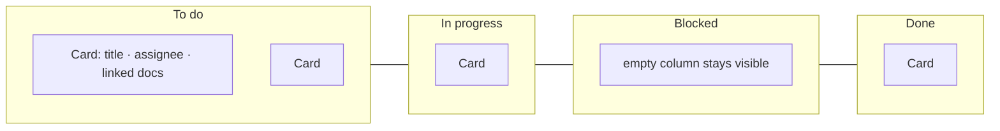

# Tasks board

The Tasks page is a board built from the regular canvas components. Tasks are cards in four fixed status columns, in this order: **To do → In progress → Blocked → Done**.

## Where it lives

| Part | File |
| --- | --- |
| Board UI | `src/TasksCanvasBoard.tsx`, `src/tasks-canvas.css` |
| Page switch | `src/App.tsx` (`page: 'canvas' \| 'tasks'`), `src/AppWorkspaceView.tsx` (Sidebar **Tasks** button) |
| Task rules | `server/coordination.ts` (`newTask`, `patchedTask`, `boardOrder` validation) |
| Storage | `server/storage-tasks.ts` |
| HTTP | `server/api-tasks.ts` |
| MCP | `list_tasks`, `create_task`, `update_task`, `delete_task`, `claim_task`, `comment_task` in `server/mcp-tools.ts` |
| Acceptance | `features/tasks-canvas.feature` |

## Layout



- Columns are 330 px wide with 36 px gaps; cards stack at 132 px intervals starting 92 px below the column top.
- The board uses React Flow (`@xyflow/react`) with pan, zoom, minimap, and controls, the same as the document canvas.
- Column nodes are fixed board structure. They are not document groups, and moving tasks never moves document cards.
- Order within a column: `boardOrder` ascending, then `createdAt`, then `id`, so refreshes never reshuffle.

## Interactions

| Action | What happens |
| --- | --- |
| Click a card | Opens details: status control, details, assignee, linked documents, comments, add comment |
| Create in a column | "+" on the column, or the create bar; the task gets that column's status and `boardOrder = max + 1000` |
| Drag to another column | `PUT` with the new `status` and a computed `boardOrder` |
| Drag within a column | `PUT` with a new `boardOrder` halfway between the neighbors |
| Status select | Accessible alternative to dragging |
| Save fails | Error banner, the last saved positions return, and the board reloads |

Every save sends `expectedRevision`, so a concurrent change from MCP gives a conflict instead of a silent overwrite. The board polls every 3 seconds, so `update_task` from an agent moves the card on everyone's screen.

## Same records from MCP

```json
// update_task
{ "canvasId": "5d206584-…", "taskId": "t-42", "status": "blocked", "boardOrder": 3000, "expectedRevision": 5 }

// list_tasks: bounded page
{ "canvasId": "5d206584-…", "status": "in_progress", "assignee": "Codex - laptop", "limit": 20 }
// → { "items": [ … ], "nextCursor": "20" }

// delete_task: needs the revision; an audit record goes to tasks/<canvasId>.audit.json
{ "canvasId": "5d206584-…", "taskId": "t-42", "expectedRevision": 6 }
```

## Ordering math

```ts
// src/TasksCanvasBoard.tsx: nextOrder (simplified)
before = siblings[target - 1]?.boardOrder
after  = siblings[target]?.boardOrder
if (!before && !after) return 0
if (before === undefined) return after - 1000   // dropped at the top
if (after === undefined)  return before + 1000  // dropped at the bottom
return (before + after) / 2                     // dropped between two cards
```

## Known issue

> **Dropping a card at the top of a column can fail.** The first task created in a column gets `boardOrder: 0`. Dropping another card above it computes `0 - 1000 = -1000`, but the server and the MCP schema require a non-negative `boardOrder`, so the save is rejected with `400`. Fix it by clamping and renumbering (for example, give the top card `after / 2`, and renumber the column when the gap gets too small), or allow negative values in `server/coordination.ts` and the MCP schema.

Two earlier problems were fixed during implementation. The polling effect no longer resets the board on every save, and cards no longer carry the `nodrag` class that blocked dragging.
