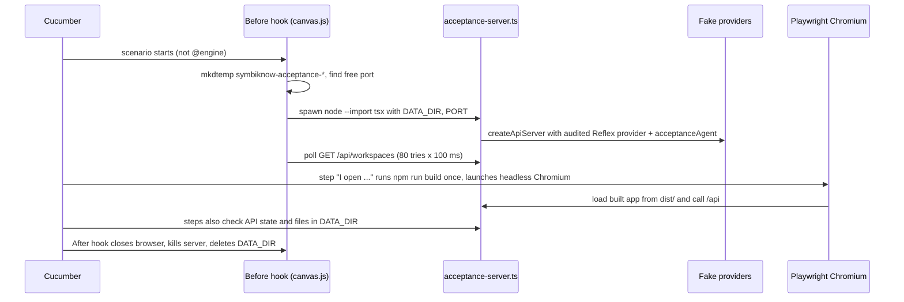
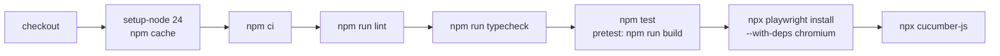

# Testing and CI

How SymbiKnow is tested: about 400 Vitest files, 13 Cucumber features with 69 scenarios, and one GitHub Actions job that runs lint, types, tests, and acceptance.

> Snapshot of the working tree on 2026-10-06. Another session was changing code at the same time, so counts can move a little. Commands and environment variables are in [operations.md](operations.md). The latest pass/fail numbers are in [plan-status.md](plan-status.md#test-results).

## Commands at a glance

| Command | What it runs | Defined in |
| --- | --- | --- |
| `npm test` | `pretest` builds first (`npm run build`), then `node .quality/run-tests.mjs` runs all Vitest projects | `package.json` |
| `npx vitest run <file>` | One or more Vitest files, fast | `vitest.config.ts` |
| `npx cucumber-js` (or `npm run acceptance`) | All `features/*.feature` with Playwright; `npm run acceptance` builds first | `package.json` |
| `npm run smoke` | `features/smoke.js`: the built SDK makes one real HTTP decision against a local provider | `package.json` |
| `npm run lint` | `eslint .` | `eslint.config.js` |
| `npm run typecheck` | `tsc --noEmit` | `tsconfig.json` |

## Test pyramid and counts

Most tests sit next to the code they test. The name tells you the kind:

- `*.test.ts(x)`: unit test, or a test with a special focus (`.boundaries`, `.flows`, `.http`, `.persistence`, ...).
- `*.public.test.ts(x)`: tests only through public functions and HTTP routes.
- `*.native.test.ts(x)`: real files, real server, real SDK, local HTTP providers, temporary data folder.
- `*.test.fixture.ts`, `*.test.helpers.ts(x)`, `*.fixture.ts`: shared setup, not tests.

Counts of test files (from `find`, on 2026-10-06):

| Folder | Test files | Native | Public | Other unit | Fixture / helper files |
| --- | --- | --- | --- | --- | --- |
| `server/` (top level) | 107 | 21 | 27 | 59 | 6 (`api-chat`, `api-connections`, `chat-session`, `chat-stream`, `mcp-http` `.test.fixture.ts`, `symbi-index.fixture.ts`) + `server/tests/restoration.ts` |
| `server/jev/` (incl. `actions/`) | 153 | 104 | 0 | 49 | 2 (`queue-boundary.test.fixture.ts`, `actions/question-state-pool.test.helpers.ts`) |
| `src/` | 125 (103 are `.tsx`) | 28 | 29 | 68 | 6 (`native-workspace.test.fixture.ts`, 5 `*.test.helpers.ts(x)`) |
| `shared/` | 12 | 0 | 2 | 10 | 0 |
| `features/` | 1 | 1 | 0 | 0 | 5 provider/server files (see below) |
| `tests/` | 2 | 0 | 0 | 2 | 0 |
| **Total** | **400** | **154** | **58** | **188** | |

Above Vitest sit the 69 Cucumber scenarios (13 features). The last full Vitest run had 4,048 tests; see [plan-status.md](plan-status.md#test-results).

Note: on this date most of these test files (367 of them) were still untracked in Git. They exist in the working tree only.

## Vitest setup

**Config.** `vitest.config.ts` merges `vite.config.ts` (React plugin, Tailwind, the `@` alias to `src/`). It uses `pool: 'threads'` and two projects:

| Project | Files | Settings | Why |
| --- | --- | --- | --- |
| `native-persistence` | `server/jev/runtime-admission-drain.native.test.ts`, `server/jev/runtime-scheduler.native.test.ts`, `src/research-edits.public.test.tsx` | `fileParallelism: false`, `sequence.groupOrder: 0` (runs first) | Measures canonical writes and queue behavior without other test workers competing |
| `suite` | Everything else (Vitest default include, minus `configDefaults.exclude` and the 3 files above) | `sequence.groupOrder: 1` | Normal parallel run |

**Environments.** The config sets no `environment`, so the default is `node`. UI tests opt in with a first-line comment `// @vitest-environment jsdom`. 109 of the 125 `src/` test files do this. One file, `src/AppWorkspaceView.remote.test.tsx`, also sets `// @vitest-environment-options {"url":"https://workspace.team.test/"}`. UI tests use Testing Library (`@testing-library/react`, `screen`, `within`, `fireEvent`, `waitFor`). `tsconfig.json` loads `vitest/globals` types.

**`.quality/run-tests.mjs`** (what `npm test` calls):

1. Deletes the old `.quality/vitest-results.json`.
2. Runs `vitest run --maxWorkers=4 --reporter=json --outputFile=.quality/vitest-results.json`, plus any extra arguments you pass.
3. On failure, prints `FAIL <test name> (<file>)` and each failure message, then exits with Vitest's exit code. If no report exists it prints `Vitest exited before producing a test report.`
4. On success, prints `# tests`, `# pass`, `# fail`, `# skipped`. It throws if any total is missing.

**Coverage.** `vitest.config.ts` has no coverage block. `@vitest/coverage-v8` is installed. A local quality script, `.quality/metrics-adapter.mjs`, runs Vitest with `--coverage.enabled --coverage.reporter=json --maxWorkers=4` over `server/**`, `src/**`, `shared/**`, `public/**`, and writes `.quality/coverage/coverage-final.json`. This script is git-ignored (`.gitignore` ignores `/.quality/*` except `run-tests.mjs`), so CI does not measure coverage.

**`tests/` folder** (tests for the test tooling):

| File | Checks |
| --- | --- |
| `tests/quality-runner.test.ts` | `run-tests.mjs` with a fake `node_modules/.bin/vitest` in a temp folder: totals on success, `FAIL ...` lines and exit code 2 on failure, the "no report" message, and a malformed report |
| `tests/metrics-adapter.test.ts` | `isProductionSource` (test and fixture files are not production code) and `promiseCatchPath` from `.quality/metrics-boundaries.mjs` |

Both pass (7 tests, run on 2026-10-06).

## Native tests

Native tests use the real code paths. Only the network edge to paid services is replaced. The pattern is always the same:

1. `mkdtemp(path.join(tmpdir(), 'symbiknow-...-'))` makes a fresh data folder.
2. `createApiServer({ dataDir, fetcher?, agentFactory? })` from `server/index.ts` builds the real server. `fetcher` replaces the Jev (Symbi Reflex) provider call. `agentFactory` replaces the chat model.
3. `server.listen(0, '127.0.0.1')` picks a free port. The test calls it with real `fetch`.
4. `afterEach` closes the server (`closeAllConnections()`, `close()`) and removes the folder with `rm(..., { recursive: true, force: true })`.

Example: `server/api-http.body.native.test.ts` sends a 2,000,001-byte body and expects HTTP 413.

**No paid calls.** Tests never reach a real provider:

| Fake | File | What it does |
| --- | --- | --- |
| Jev provider (function) | `features/acceptance-reflex-provider.ts` | Accepts only `https://api.typesafe.ai/v1/systemone` and model `jev-1.13.0`. Returns fixed answers: `noul` 0.01 for risk questions (`addressesAi`, `unrelatedDeletion`, `unsupportedClaim`, `requirementConflict`, `targetStated`) and 0.99 otherwise, `score` 1, a deterministic `choice` |
| Jev provider (audit) | `features/acceptance-provider-audit.ts` | Wraps the one above and appends each request (model, state, questions, no headers) to `reflex-provider-requests.jsonl` in the data folder |
| Jev provider (HTTP) | inside tests, e.g. `server/jev/runtime-scheduler.native.test.ts` | A real `node:http` server on port 0 that calls `acceptanceReflexProvider`. 38 Jev native test files create a local `node:http` server like this |
| SDK provider | `features/engine-provider.js` | `openProvider()` returns `{ requests, fetcher, setReply, close }`. Used by `features/smoke.js` and the `@engine` steps |
| Chat model | `server/api-chat.test.fixture.ts` (`answerAgent`) | A `DeepAgentFactory` that yields one `AIMessage('HTTP chat completed.')`. Settings point to `http://localhost:1234/v1` with key `fixture-key` |
| Remote MCP server | `server/chat-stream.test.fixture.ts` (`notebook`) | A real MCP server (Streamable HTTP) with a `read_note` tool, for chat tool tests |

Tests also clear secrets with `vi.stubEnv('TYPESAFE_API_KEY', '')` or `vi.stubEnv('SYMBIKNOW_ACCESS_TOKEN', '')`.

**Important fixtures:**

| Fixture | Use it for |
| --- | --- |
| `src/native-workspace.test.fixture.ts` | UI tests against a real server. `workspaceFixture()` creates "Workspace Alpha" and "Workspace Beta", two canvases, and two documents. It replaces global `fetch` so `/api/...` goes to the real server and records every call (`calls`). `hold(route)` pauses a response so you can test loading and race states. `closeWorkspaceFixtures()` waits for in-flight server work, then deletes the folder. Used by 17 `src/` files |
| `server/jev/queue-boundary.test.fixture.ts` | Jev queue tests. `queueBoundaryFixture()` gives a store, a workspace with two canvases, Reflex in `auto` mode, and `enqueue`, `admit`, `followups`, `maintenance` helpers |
| `server/jev/actions/question-state-pool.test.helpers.ts` | Decodes shared question texts and sources that the SDK packs into one request. Used by the provider fakes and step definitions |
| `server/symbi-index.fixture.ts` | Five offline documents (rollback runbook, release plan, a duplicate copy, onboarding, ambiguous notes) and expected retrieval, group, link, and duplicate outcomes. Used by `server/symbi-index.test.ts` and `server/symbi-index-benchmark.ts` |
| `server/tests/restoration.ts` | `expectRestoredCanvas()`: a restore keeps logical fields while generation counters only grow |
| `src/*.test.helpers.tsx` | `canvas-model`, `CanvasNodes`, `AppAssistantPanel`, `AppWorkspaceView` helpers: `mount`, `camera`, `installCanvasBrowser`, `assistantFixture` |

## Acceptance tests (Cucumber + Playwright)

**Config.** There is no Cucumber config file. Cucumber 13 uses its defaults: features from `features/**/*.{feature,feature.md}`, support code from every `features/**/*.{js,cjs,mjs}`. That means `features/smoke.js` and `features/engine-provider.js` are also loaded. So the smoke check runs once each time Cucumber starts. The default step timeout is `setDefaultTimeout(60_000)` in `features/step_definitions/canvas.js`.

**`.feature` and `.feature.yaml`.** The YAML file is the source. Each `.feature` starts with `# Generated by code-discipline gherkin_yaml; source: <name>.feature.yaml`. The YAML has `feature`, `scenarios` (each with `name` and `steps` as `given`/`when`/`then`/`and`), and `tags`. Edit the YAML, then regenerate with the code-discipline skill script, `~/.claude/skills/code-discipline/scripts/gherkin_yaml.py --root . --feature features/<name>.feature.yaml`. This script lives outside the repository.

**How one scenario runs.** For every scenario without the `@engine` tag, a `Before` hook in `canvas.js` starts a fresh server:



**The acceptance server** (`features/acceptance-server.ts`) needs `PORT` and `DATA_DIR` and listens on `127.0.0.1`. It passes two fakes to `createApiServer`:

- `fetcher: auditedReflexProvider(dataDir)`: the Jev fake above, with a request log.
- `agentFactory: acceptanceAgent(dataDir)`: a scripted chat agent. It logs each request to `chat-requests.jsonl`. If the `draw_research_canvas` tool is offered, it searches "Launch evidence", reads it, and draws a research canvas (3 blocks and 2 edges, or 6 rich blocks for "Show me every format on a temporary research canvas"), logging to `chat-research.jsonl`. Otherwise it answers with fixed text (for example "The mobile release has two failing tests.").

`features/acceptance-provider-audit.native.test.ts` (Vitest) checks that the audit stores no credentials and fails safely when it cannot write.

**Playwright.** Steps use `chromium.launch({ headless: true })`, usually at viewport 1440x900, and collect `pageerror` messages. Selectors are mostly roles and labels (`getByRole`, `getByLabel`). The `@avatar-preview` feature does not use the app; it starts a Vite dev server on port 0 for `brand/symbi-avatar-demo.html`. `@engine` features use no browser and no server. They call the built SDK (`dist/sdk/sdk.js`) or run `CanvasStore` and `JevRuntime` in process with their own temp folder.

**Features** (69 scenarios):

| Feature file | Scenarios | Tags | What it verifies |
| --- | --- | --- | --- |
| `app-safety.feature` | 8 | — | Removed controls stay gone; compact navigation creates workspaces and canvases; moves keep references; Undo keeps later edits, citations, and human metadata; damaged research entries; selection survives refresh; zoom does not change documents |
| `assistant-avatar.feature` | 3 | `@avatar-preview` | Every pose for Symbi and Symbi Reflex in both themes; reduced motion; failed activity never shows "done" |
| `canvas-discovery.feature` | 11 | — | Nested groups and tags in search; search reveals a match; group connections; supergroup/group/subgroup/file drill-down; connection focus keeps positions; follow-up research answers extend one live canvas; chat draft kept after a connection failure |
| `canvas-loading.feature` | 2 | — | A large canvas shows its overview before reading files and keeps fresh edits; an expanded rich canvas stays responsive |
| `canvas.feature` | 17 | — | Core canvas: dark mode, reload, external edits, no overlapping cards, create and find, API key never returned to the browser, chat config errors, delete document and canvas, layout, labels, edges, new chat, panel resize, HTML upload, chat cannot delete documents |
| `chat-avatar.feature` | 1 | `@chat-avatar` | One enlarged avatar stays in the chat header across answers and reload |
| `engine.feature` | 7 | `@engine` | Built SDK: typed decisions, invalid answers fail then recover, retry on transient error, cancel and empty batch do no network work, oversized state refused, no credential leak |
| `jev-document-operation.feature` | 2 | `@engine @document-operation` | Six action outcomes share one durable document completion; removed actions cannot restart or change a document |
| `jev-indexed-grouping.feature` | 3 | `@engine @indexed-grouping` | Grouping uses the durable Jev index; a link or random words cannot force a group; retrieval cannot lower the confidence threshold |
| `jev-removal.feature` | 3 | — | With Reflex off, chat and settings work without a Tasks tab; retired analysis endpoints stay unavailable; a plain upload saves without Jev |
| `review-fixes.feature` | 2 | — | Escape closes only the topmost surface; entering a scattered group shows every document |
| `symbi-reflex.feature` | 8 | `@automatic-reflex` | Reflex runs the six actions automatically: shared provider requests, source isolation, results survive reload, refresh on source change, one threshold per action, reset, unavailable provider reported |
| `tasks-canvas.feature` | 2 | — | Task columns on the canvas board; drag saves status without moving documents; column order survives reload |

Step definitions live in `features/step_definitions/` (14 files, 3,304 lines with the support files). Steps are global, so a step in `canvas.js` (for example "a fresh workspace" or "I open SymbiKnow in a browser") is reused by many features.

## CI

`.github/workflows/ci.yml` has one job, `validate`, on `ubuntu-latest`. It runs on pushes to `main` and on every pull request, with `contents: read` permission.



All steps must pass; any failure stops the job. Notes:

- `npm test` triggers `pretest`, which runs `npm run build`: `prebuild` (`scripts/sync-symbi-avatar-preview.ts`), then `tsc --noEmit`, `vite build`, and `build:sdk`. So types are checked twice, and `dist/` and `dist/sdk/` exist before Cucumber.
- `npx cucumber-js` does not trigger `preacceptance`. It relies on the build from `npm test`. Browser steps still run `npm run build` once per Cucumber process (60,000 ms timeout).
- There is no coverage step and no Node version matrix.

**ESLint** (`eslint.config.js`): only `typescript-eslint` `configs.recommended`. No React or hooks plugin, no custom rules. Ignored: `node_modules/**`, `dist/**`, `data/**`, `.venv/**`, `coverage/**`, `.quality/**`, `public/webmcp.js`. Test files and `features/**/*.js` are linted.

**TypeScript:**

| Config | Purpose | Key settings |
| --- | --- | --- |
| `tsconfig.json` | Type check for app, server, shared (`npm run typecheck`) | `strict`, `target` ES2022, `moduleResolution` Bundler, `jsx` react-jsx, `noEmit`, `paths` `@/*` to `src/*`, types `vite/client`, `vitest/globals`, `node`. `include`: `src`, `shared`, `server`, `vite.config.ts` |
| `tsconfig.sdk.json` | Builds the published SDK to `dist/sdk` (`npm run build:sdk`) | Extends the base; `NodeNext`, `declaration`, `rootDir` `server`. Only `server/jev.ts`, `jev-transport.ts`, `jev-answers.ts`, `errors.ts`, `sdk.ts` |

`features/` and `tests/` are not in any `include`, so `tsc` does not type-check `features/*.ts` or `tests/*.ts`. Vitest and `tsx` run them without type checks.

## How to write a new test

Checklist:

1. Put the file next to the code. Pick the name by kind: `x.test.ts`, `x.public.test.ts`, or `x.native.test.ts` (`.tsx` for React).
2. For UI, add `// @vitest-environment jsdom` as the first line. Query by role and label with Testing Library.
3. Never use `data/` or a real provider. Use `mkdtemp` and a fake `fetcher` or `agentFactory` (see the table above). Clear keys with `vi.stubEnv`.
4. Reuse a fixture before writing a new one: `workspaceFixture`, `chatHttpFixture`, `queueBoundaryFixture`, `acceptanceReflexProvider`.
5. Clean up in `afterEach`: close servers, delete folders, `vi.restoreAllMocks()` or `vi.unstubAllEnvs()`.
6. Assert real effects too: HTTP status and body, saved files, or the store re-read from disk (`reload()`).
7. If the test measures write counts or queue timing and breaks under parallel load, add it to `nativePersistenceTests` in `vitest.config.ts`.
8. For user-visible behavior, add a scenario to the `.feature.yaml`, regenerate the `.feature`, and reuse existing steps.
9. Run only your file: `npx vitest run path/to/file.native.test.ts`. Then run `npm run lint` and `npm run typecheck`.

Skeleton, taken from `server/api-http.body.native.test.ts`:

```ts
import { afterEach, describe, expect, it, vi } from 'vitest';
import { mkdtemp, rm } from 'node:fs/promises';
import os from 'node:os';
import path from 'node:path';
import type { Server } from 'node:http';
import { createApiServer } from './index.js';

const opened: Array<{ server: Server; dataDir: string }> = [];

async function serverFixture() {
  const dataDir = await mkdtemp(path.join(os.tmpdir(), 'symbiknow-my-feature-'));
  const server = await createApiServer({ dataDir }); // add fetcher / agentFactory fakes here
  await new Promise<void>(resolve => server.listen(0, '127.0.0.1', resolve));
  opened.push({ server, dataDir });
  const address = server.address();
  if (!address || typeof address === 'string') throw new Error('Missing server address');
  return { base: `http://127.0.0.1:${address.port}`, dataDir };
}

afterEach(async () => {
  for (const { server, dataDir } of opened.splice(0)) {
    await new Promise<void>((resolve, reject) => server.close(error => error ? reject(error) : resolve()));
    await rm(dataDir, { recursive: true, force: true });
  }
  vi.restoreAllMocks();
});

describe('my feature', () => {
  it('does one observable thing', async () => {
    const { base } = await serverFixture();
    const response = await fetch(base + '/api/workspaces');
    expect(response.status).toBe(200);
  });
});
```

For a UI test, copy the shape of `src/CanvasOverview.native.test.tsx` (jsdom comment, `installCanvasBrowser()`, `mount(...)`, `screen.findByRole`).

## Known traps

- `tests/metrics-adapter.test.ts` imports `.quality/metrics-boundaries.mjs`. That file is git-ignored, so this test will fail on a clean checkout (for example in CI) until the file is committed or the test moves.
- Step files `jev-document-operation.js`, `jev-indexed-grouping.js`, and `symbi-reflex.js` import `.ts` files directly (for example `../../server/storage.ts`). This needs Node's built-in TypeScript stripping. CI uses Node 24, but `package.json` `engines` also allows `^20.19.0`. `app-safety.js` avoids this by using `tsImport` from `tsx`.
- Because Cucumber loads every `features/**/*.js`, a new helper `.js` file in `features/` will run at Cucumber start. Keep it free of side effects, like `engine-provider.js`.
- Native tests start many servers. Always pass port `0` and `127.0.0.1`, never a fixed port.
