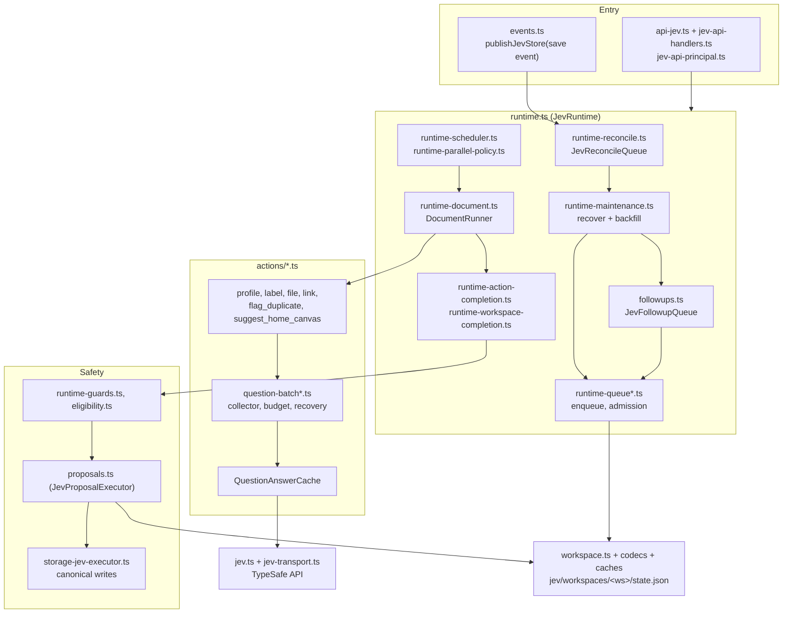
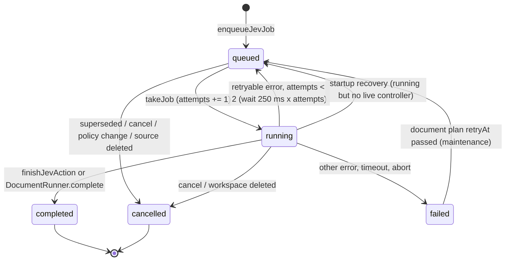
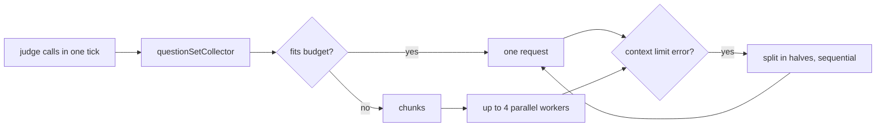
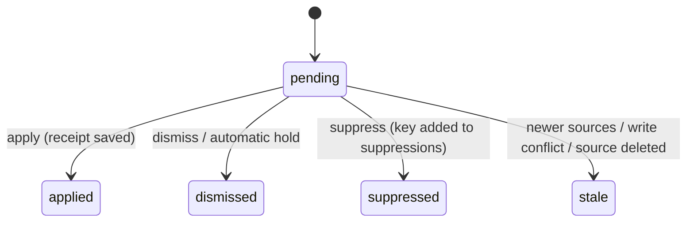
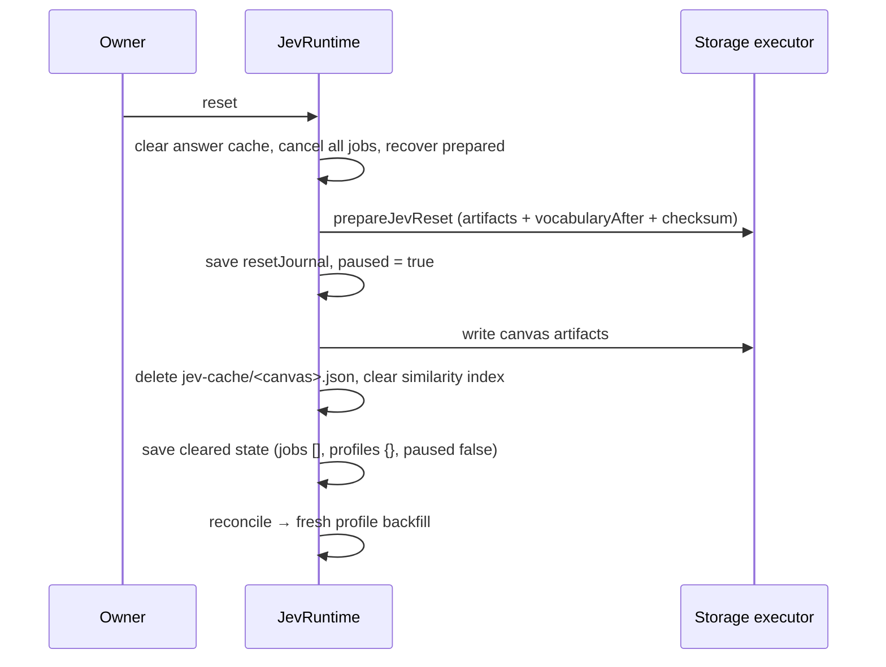

# Symbi Reflex internals

How the Reflex runtime under `server/jev/` admits, schedules, runs, stores, checks, and undoes its work. Read [symbi-reflex.md](symbi-reflex.md) first for the engine basics, the six actions, and the endpoint list.

## Source isolation and card attribution

Decision requests can share transport only when every original question set has the same exact source objects and compatible context. Filing candidate definitions and origins stay separate from profiling and labelling, while candidates for the same filing source share bounded requests. `actions/question-source-scope.ts` splits unrelated documents before request budgeting, concurrent transport, answer validation, and cache reuse; answers return in their original order. Source-derived headings nominate labels and repeated category headings nominate root groups, while semantic checks and exact source evidence still decide whether changes apply.

The canvas projects checked applied duplicate findings onto both current cards. This projection checks source incarnation, generation, content hash, availability, and processing eligibility without adding duplicate metadata to the source documents. Cards display “Reflex did it” and briefly highlight new applied mutation stamps. Symbi Reflex saved activity shows “Reflex” for automatic receipts while retaining the stored actor ID and original timestamps.

## Component map



One `JevRuntime` exists per `CanvasStore` (`getJevRuntime` keeps it in a `WeakMap`). `server/index.ts` creates it with a `retrieveNeighbors` hook that asks the Symbi search index for semantic neighbors.

## Job lifecycle

A job is one `StoredJevJob` (`server/jev/runtime-queue.ts`): the public `JevJob` plus `principal`, `authorizationFingerprint`, `settingsKey` (the settings as JSON), `attempts`, and optional followup fields.



| Rule | Value | Where |
| --- | --- | --- |
| Pending jobs per workspace | 200, then `429 Symbi Reflex queue is full` | `prepareQueue`, `availableCapacity` |
| Finished jobs kept | Last 200, plus history that shares a `followupKey` with a pending job | `retainJobs` |
| Parallel executions | 4 in total, across all workspaces | `fillExecutions` in `runtime.ts` |
| Execution timeout | 15,000 ms per `executeJob` call (abort reason `execution_timeout`) | `runtime.ts` |
| Retryable errors | `ApiError` 429, 502, 503, 504, not billing, `attempts < 2` | `retryable()` |
| Document plan cooldown | `retryAt` = now + 60 s after a transient failure, timeout, or abort | `failJob()` |
| Proposals per evaluation | 100 | `validateJevEvaluation` |
| Request limits | `blockIds` ≤ 100, `query` ≤ 8,000 chars, `options` ≤ 1,100,000 JSON chars, `idempotencyKey` ≤ 200 chars | `configuration.ts` |

**Idempotency.** A request with a known `idempotencyKey` returns the existing job. The same key with different arguments returns `409`.

**Superseded jobs.** When the automation principal enqueues a request, older *queued* automation jobs with the same action, canvas, and `blockIds` become `cancelled` with error `Superseded by a newer source revision`. `compactJevState` hides these from progress reads.

**Cancellation.** `cancelJevJob` sets `cancelled` and aborts the job's `AbortController` with reason `cancelled`. A token principal may cancel only its own jobs. Changing settings in a way that changes the policy key cancels every pending job. Deleting a document cancels pending jobs that use it and marks its proposals `stale`.

**Queued source refresh.** Before a queued automatic `profile` or `label` job runs, `runtime-queued-source-refresh.ts` may take a fresh metadata guard, but only if the source bytes and identity are unchanged.

## The document plan

When an automation `profile` job selects exactly one block, has no `query` or `options`, external processing is on, Reflex is not paused, and every mode is `auto`, the job becomes a *document operation* (`automaticDocumentEligible`). It runs all six actions inside one root job.

```ts
interface JevDocumentPlan {            // server/jev/runtime-document.ts
  version: 2; originalSources: JevSourceSnapshot[]; completedActions: JevCurrentAction[];
  activeJob?: StoredJevJob; claimPreparedAt: string; completionPreparedAt?: string;
  queueWaitMs: number; retryAt?: string; failedAction?: JevCurrentAction; failureReason?: string;
  contextProof?: DocumentContextProof;
}
```

```json
{
  "id": "5c1e9a2e-…", "questionVersion": "symbi-reflex-12", "state": "running", "attempts": 1,
  "request": { "action": "profile", "canvasId": "ops", "blockIds": ["rollback-runbook"],
    "idempotencyKey": "source:ops:rollback-runbook:7f0c…:3:symbi-reflex-12:automatic-knowledge-13:1a2b3c4d5e6f" },
  "followupKey": "document:5c1e9a2e-…", "followupActions": ["file", "suggest_home_canvas"],
  "documentPlan": { "version": 2, "completedActions": ["profile", "label", "link", "flag_duplicate"],
    "claimPreparedAt": "2026-10-06T08:12:03.114Z", "queueWaitMs": 412, "originalSources": ["…"] }
}
```

How `DocumentRunner` works:

1. Each later action runs as a child job with id `<rootId>:<action>` and key `document:<rootId>:<action>`.
2. The `contextProof` holds hashes of all source snapshots, canvases, and vocabulary (`runtime-document-context.ts`). Before each step the runner checks that nothing changed except what this operation's own receipts explain. Otherwise: `409 The document context changed during automatic processing`.
3. If all of a step's proposals are workspace-only (`derived`, `vocabulary`, or held), the step is only *staged* in memory. No disk write yet.
4. If a step has a canonical change (document metadata, move), the runner saves `activeJob` first, then applies each proposal through `JevProposalExecutor.applyInside`. A `400`/`409` from a write marks that proposal `stale` or `dismissed` and fails the step.
5. `complete()` writes the organization checkpoint, sets the root `completed`, and sets `completionPreparedAt`, all in one flush.
6. If the document's `group` field is pinned or not managed, `file` returns `no_change` without calling Jev (`protectedFiling`).

## Admission, scheduling, and followups

**Save events.** `CanvasStore` calls `publishJevStore` after a successful write. Events from the automation principal itself are ignored. A new import starts at once. A revised source (all `sourceGeneration > 1`) waits a quiet window: `editDebounceMs`, default 150 ms, capped at 2,000 ms. `JevReconcileQueue` keeps one active pass per workspace plus one trailing pass.

**Backfill.** `JevRuntimeMaintenance.reconcile` scans every canvas and queues a `profile` for each document whose stored profile is not current (same source, `JEV_QUESTION_VERSION`, and profile threshold). The base key is:

```
source:<canvasId>:<blockId>:<incarnation>:<sourceGeneration>:<JEV_QUESTION_VERSION>:<JEV_ORGANIZATION_VERSION>:<sha256(policy)[0..12]>
```

Retry suffixes: `:retry:cancel:<hash>` after a cancel, `:retry:profile-cutoff:<hash>` after a completed profile, `:retry:<minute>` after a failure. A failed profile waits 60 s before backfill tries again. Bulk profile admission goes through `enqueueJevJobs` (`runtime-queue-batch.ts`), which accepts only single-block automatic profiles.

**Scheduler** (`runtime-scheduler.ts`). Jobs from people or agents always go first, oldest first. Then automation jobs by priority:

| Priority | Jobs |
| --- | --- |
| 0 | `file` |
| 1 | `label` |
| 2 | other actions inside an admitted followup chain |
| 3 | `profile` |
| 5 | everything else ("background") |

After 6 organization picks in a row, the next slot goes to background work. Within one workspace, a document operation always runs alone. Other jobs may overlap only if both are automatic `profile`/`label` jobs with disjoint sources (`canRunJevCandidate`).

**Followups** (`followups.ts`). Outside the document plan, a finished automatic `profile` starts a chain: `label → link → flag_duplicate → file → suggest_home_canvas`. Each step is enqueued only after the previous one completes, so it sees a fresh canonical snapshot. Admission metadata `{ key, remaining }` is private: only the automation principal may supply it, and the step key must be `<key>:<action>` (`runtime-followup-admission.ts`). A pending chain for the same source identity blocks a second chain (`hasPendingSourceFollowup`).

When a chain ends, the profile gets an organization checkpoint: `organizationKey` and `organizationContextKey` (sha256 of `automatic-knowledge-13`, settings, vocabulary, and every canvas's block inputs). A failed chain stores `organizationFailedContextKey` and `organizationRetryAt` = now + 60 s instead.

**Maintenance tick.** Every 60,000 ms (`setInterval`, `unref`). Each tick runs, per workspace: reset recovery, pruning, parent-Undo recovery, prepared-mutation recovery, approved-ownership reconciliation, document-plan resume, requeue of interrupted `running` jobs, then backfill.

**Shutdown.** `close()` stops the timer, clears the answer cache, and aborts running jobs with reason `shutdown`. `shutdown()` then waits until no source events, maintenance passes, or drains are pending. `server/index.ts` also waits for the storage serializer to drain.

## Questions

### How actions build questions

| Action | Main questions (`actions/*.ts`) | Limits |
| --- | --- | --- |
| `profile` | `role` (Choice), `keyPassage` (Choice), `entity_i` (Noul), `logicalTopic_i` (Noul) + `logicalTopicEvidence_i` (Choice) | ≤ 8 entities, ≤ 16 topic candidates |
| `label` | per candidate: `label_i` (Noul) + `evidence_i` (Choice) | ≤ 8 candidates, ≤ 20 tags saved |
| `link` | per pair: `supported` (Noul), `sourceEvidence`, `targetEvidence` (Choice), `usefulness` (Score, 3 levels), `relation` (Choice) | ≤ 12 neighbors, hard max 24; ≤ 20 links saved |
| `flag_duplicate` | same pair set without `usefulness` | identical content skips Jev |
| `file` | `group` (Choice over existing groups), then `evidence` + `purpose_i` / `containment_i` / `coherent` | ≤ 16 existing groups, ≤ 3 selection rounds |
| `suggest_home_canvas` | `canvas` (Choice), then `evidence` (Choice) | ≤ 16 canvases |

Every Choice question gets two extra options: `none` and `unknown` (`candidates()` in `actions/context.ts`, max 24 named options). Evidence options are exact passages: up to 8 per document, each quote at most 600 chars (`source-passages.ts`). Answers are validated: probabilities must sum to 1 ± 0.015, the chosen option must be the leader, scores must be in range.

### Batching, budget, and waves



- **Collector** (`question-set-collector.ts`): independent `judge` calls made in the same tick become one wave.
- **Shared transport** (`question-state-pool.ts`, `question-text-pool.ts`): repeated source states become `{ "$jevSourceRef": n }`. Repeated text of 64+ chars becomes `$jevQuestionText:n`. Cache keys still use the original, unpooled inputs.
- **Budget** (`question-request-budget.ts`): an ordinary request must fit 16,000 estimated tokens. A shared bundle must keep state + longest question ≤ 32,000 and state + all questions ≤ 64,000. Bundles reserve 4,200 tokens for provider overhead (200 for ordinary requests). Over budget at send time: `413`.
- **Waves** (`question-batch-parallel.ts`): at most 4 chunk calls run at once. After a failure no new chunk starts. The earliest failed chunk's error is thrown.
- **Recovery** (`question-batch-recovery.ts`): if the provider rejects a multi-set bundle for context length, it is split in half recursively.
- **Prefetch** (`runtime-question-prefetch.ts`): an automatic `profile` with ≤ 8 blocks also asks the questions of `label`, `link`, `flag_duplicate`, and `suggest_home_canvas` in the same waves. Only answers are prefetched. `file` waits because it needs the applied labels and links. Failed optional prefetches are listed in `result.prefetchDeferredActions`.
- **Transport**: Reflex calls use `maxRetries: 0`. Retries happen at job level instead. `jev-transport.ts` itself has a 20 s request timeout, 262,144-byte response limit, and up to 5 s backoff.

### Answer cache

`QuestionAnswerCache` (`actions/question-answer-cache.ts`). The runtime creates it with a 15-minute TTL. Defaults: 2,048 entries, 8 MiB, LRU eviction.

| Key part | Meaning |
| --- | --- |
| `partition` | `<transportVersion>:<sha256>` of workspace, canvas, sorted block ids, authorization fingerprint, policy key, and source identities |
| `sha256(apiKey)` | Never reuse across keys |
| `wire` | Exact JSON of `{ state, questions }` |

Only exact automation jobs with explicit `blockIds` and no `query` or `options` get a partition. The cache is cleared on reset, shutdown, and transport change (`useTransport`). An answer that arrives after a clear is not stored.

### Other caches

| Cache | File | Limits | Key |
| --- | --- | --- | --- |
| Source passages | `actions/source-passage-cache.ts` | 1,024 entries, 32 MiB | exact content string |
| Read packet | `workspace-packet-cache.ts` | 64 entries, 32 MiB | state file + digest |
| Decode plan | `workspace-decode-cache.ts` | 16 entries, 128 MiB (content bytes × 4 estimate) | state file + digest |
| Grouping index | `actions/group-signals.ts` | `WeakMap`, rebuilt when any signature changes | first document object |

## Grouping internals

- **Signals** (`group-signals.ts`): a TF-IDF index over title, passages, and validated topics (weight 3). Neighbor rank = similarity + 0.2 per shared label (max 3) + 0.3 per shared logical topic (max 3) + 0.25 if linked. A link is never group evidence. The provider sees the top 12 index terms and 8 neighbors.
- **Topics** (`group-topics.ts`): candidate groups come from native groups, logical topics, level 1–2 headings (level 2 under level 1 becomes `parent/child`), tags, and the title. Up to 8 per source, up to 24 in the catalog, 4 origin passages each. A subgroup is reusable only if the text of at least 2 documents mentions it (`rankedTopic`).
- **Passages** (`group-passages.ts`): filing uses prose passages as evidence options.
- **Assessment** (`group-assessment.ts`): first an `evidence` choice. With `selectiveGroupAssessment` (always on in the document plan), the semantic checks (`purpose_i`, `containment_i` for subgroups, `coherent` for new groups) run only for the chosen passage.
- **New groups** (`grouping.ts`): a new group produces a `vocabulary` proposal (`define` or `promote`, id `group_<sha256(key)[0..16]>`) and a `document` proposal `{ group }`. Filing is held until the definition is active. Parent definitions are proposed first.
- **Vocabulary** (`server/jev/vocabulary.ts`): operations `nominate, define, promote, rename, alias, retire, restore, merge, split, remove`; kinds `group, label, entity`; states `candidate, active, retired`. A parent must be active, the path must match, cycles are rejected, a parent with live subgroups cannot be removed.
- **Hierarchy** (`actions/vocabulary-hierarchy.ts`): picks a parent among ≤ 16 active `custom:` groups with depth < 8, with a `containment` Noul and an exact passage.
- **Group approval** (`group-approval.ts`): a reviewer approves 1–100 proposals of one group at once. Two proposals for the same document are rejected. Progress is saved to `jev/workspaces/<ws>/group-approvals/<sha256>.json` after each receipt.
- **Group labels** (`group-labels.ts`, `jev-canvas-projection.ts`): canvas reads get `groupLabels` (group key → plain name) from active group terms. The ETag includes a hash of these labels. If Reflex state is broken, labels are left out and the canvas still loads.

## Safety

### Stamps and ownership (`stamps.ts`, `move-stamps.ts`)

| Stamp | Changes when |
| --- | --- |
| `incarnation` | Never (UUID at first stamp) |
| `sourceGeneration` | Content, title, or kind changes |
| `metadataRevision` | Any source or metadata change |
| `jevMutationId` | Set to the receipt id of a Reflex write |

On first stamp, metadata fields that already have values become `pins`. `managed` starts as `group, tags, headline, freshness, links, crossLinks` minus pins. A manual write pins the changed fields and records removed labels and links. A Reflex write adds `link:<canvasId>:<blockId>` markers for new edges. A move rewrites these markers and bumps `metadataRevision`.

### Guards before a write

1. `checkFinishingPolicy` (`runtime-guards.ts`): not cancelled, not paused, same settings key, same principal fingerprint. Else `409`.
2. `validateJevEvaluation`: action matches, mutation is valid, canvases are allowed, every source is in the context, document targets are reviewed sources, and every evidence quote equals `content.slice(start, end)`. Else `502`.
3. `checkSources`: the full source snapshot (all 7 fields) still matches. Else `409 The source changed since Symbi Reflex reviewed it`.

### Automatic policy (`eligibility.ts`)

`automaticHoldReason` returns the first reason that applies. A held canonical proposal from automation is saved as `dismissed` with `automaticHoldReason`.

| Check | Example reason |
| --- | --- |
| Policy | `Symbi Reflex is paused`, `External processing consent is required` |
| Evidence | `Exact supporting evidence is required` |
| Confidence | `Decision confidence is below the 70% automatic threshold` (every value in `decisionConfidences` must pass) |
| Document | `A field is pinned or managed manually`, `A removed label correction prevents this change`, `Processing exclusions require explicit review` |
| Group | `The supported group definition must be applied before filing` |
| Move | `The destination must be inside the authorized canvas scope` |
| Content | `Automatic source editing has no supported action` |

### Proposals, receipts, and two-phase writes



- `proposalKey` = sha256 of canonical `[action, mutation]`. A new candidate with the same key and different sources makes the old pending one `stale`.
- **Workspace mutations** (`derived`, `vocabulary`) change `profiles` or `vocabulary` and are saved with the job completion in one state write.
- **Canonical mutations** (`document`, `move`, `content`) use two phases in `storage-jev-executor.ts`: check sources → plan artifacts → save a `prepared` entry in workspace state → write artifacts → save the receipt. `recoverInside` finishes any `prepared` entry after a crash, but only if each file equals its `before` or `after` copy.
- **Undo** (`proposals.ts`, `proposal-inverse.ts`): creates a proposal with `jobId: "undo:<receiptId>"` whose mutation is the receipt's `before`. It fails with `409` if a field changed since, a pin was added, vocabulary changed, or the source generation moved. Ownership is restored only for the fields the receipt touched (`inverseOwnership`).
- **Parent (causal) Undo** (`parent-undo.ts`, `parent-browser.ts`): undoes a person's create or edit plus every automatic document receipt caused by that exact source generation. A journal in `jev/parent-undo/<uuid>.json` (`prepared → compensated → completed`) makes it crash-safe. A new reference to a created document blocks the Undo.
- **Drafts** (`drafts.ts`): `jev/drafts/<canvasId>/<blockId>.json`, states `staged, ready, held, review_unavailable, needs_rebase, applied, cancelled`, expire after 24 h. Another actor's active draft returns `409` unless the caller is a reviewer.

## Authorization

| Principal | How it is built | Can |
| --- | --- | --- |
| `jev-workspace-automation` | `automationPrincipal` | Run and auto-apply its own checked proposals |
| `workspace-owner` (user) | Session request from the same origin (`jev-api-principal.ts`) | Configure, approve, reset |
| MCP token | Bearer token or HMAC proof header `x-symbiknow-jev-principal` from the MCP host | Run within its `allowedCanvasIds` and `tools`; never approve |
| `local-stdio-agent` | Session request on the `/jev/agent/` path | Like a token with write access |

- `currentPrincipal` re-reads token grants at every step. A revoked token fails with `403`.
- `principalFingerprint` = sha256 of id, kind, access, flags, sorted scopes and tools, plus the env token value. Changing a grant while a job waits fails the job with `403 The authorization changed while the action was queued`.
- Tool grants: running needs one of `jev_do`, `jev_propose`, `<action>`, `jev_<action>`. Reviewing needs `jev_resolve`. Undo needs `jev_resolve` or `undo_jev`.
- `requireApprove`: write access, `canApprove`, kind `user`. An agent can never approve its own proposal.
- `scopedState` removes jobs, proposals, receipts, vocabulary, and profiles outside the caller's canvases, and always strips `prepared`, `suppressions`, and `schedules`.
- **Approval origin** (`approval-origin.ts`, `approval-chain.ts`): when a reviewer approves an unedited, evidence-backed proposal, its fields should stay Reflex-managed. Maintenance walks the receipt chain and, if no later correction exists, applies an internal `origin-migration:<receiptId>` proposal that moves those fields from `pins` back to `managed`. These records are hidden from reads (`withoutOriginMigrations`).

## State storage

All state for one workspace lives in `DATA_DIR/jev/workspaces/<ws>/state.json` (mode `0600`, atomic write). `JevWorkspaceFiles.serial` runs one operation at a time per workspace. Every write increments `revision`.

```json
{ "schemaVersion": 1, "revision": 42,
  "settings": { "paused": false, "externalProcessing": true, "automaticPolicyVersion": 1,
    "modes": { "profile": "auto", "…": "auto" }, "confidenceThresholds": { "profile": 0.7, "…": 0.7 },
    "people": [], "schedules": [] },
  "jobs": [], "proposals": [], "receipts": [], "vocabulary": [], "profiles": {}, "suppressions": [], "prepared": [] }
```

**Codecs** (`workspace-codec.ts`, `workspace-artifact-codec.ts`, `workspace-derived-value-pool.ts`). If nothing repeats, the file is plain JSON. Otherwise it is an envelope:

| Version | Adds | Pools |
| --- | --- | --- |
| 1 | `sources`, `vectors`, `references` | Source snapshot lists in jobs, proposals, receipts, profiles, prepared |
| 2 | `blocks`, `blockVectors`, `blockReferences` | Canvas blocks in receipt and prepared artifacts |
| 3 | `derivedValues`, `derivedValueReferences` | `recall`, `linkRechecks`, `qualityRubric`, `keyPassages` |

```json
{ "codec": "jev-source-vectors", "version": 1,
  "sources": [{ "workspaceId": "w1", "canvasId": "ops", "blockId": "rollback-runbook", "incarnation": "7f0c…",
    "sourceGeneration": 3, "contentHash": "3f9a1c0b7d2e4a51", "metadataRevision": 9 }],
  "vectors": [[0]], "references": [{ "path": ["jobs", 0, "sources"], "vector": 0 }],
  "state": { "schemaVersion": 1, "jobs": [{ "sources": [] }] } }
```

On read, pooled values become lazy getters (`workspace-lazy-source-vectors.ts` and the two other codecs). JSON is parsed only when code touches the field. On the next write, untouched lazy values reuse their original text.

**Journal** (optional). With `SYMBI_JEV_JOURNAL=1`, writes append hash-chained `jev-delta` records to `state.json.journal` (`workspace-journal.ts`). A torn last line is ignored. The journal is folded into a new checkpoint at 96 KiB or 32 records.

**Read packet** (`workspace-read-packet.ts`). A small, checked projection with progress (compact jobs, one key passage per profile) and queued jobs. The scheduler and owner summary reads use it, so polling does not decode the full history.

**Pruning** (`lifecycle.ts`). Removes jobs, proposals, receipts, prepared entries, vocabulary terms, and profiles whose source (`canvas:block:incarnation`) is gone, unless a move receipt shows where it went. `purgeJevOrphans` deletes state folders, drafts, and parent-Undo journals of deleted workspaces, canvases, or blocks.

## Reset and rerun

`POST …/jev/reset` (`reset.ts`). Requires the unrestricted workspace owner, a provider key, and external processing on.



The journal reverts only fields that are managed, not pinned, and still equal what a trusted receipt (automatic, or approved without edits) wrote. If the server stops mid-reset, the next maintenance pass runs `recoverJevResetInside` first and finishes it.

## Settings

`updatedJevSettings` (`configuration.ts`, `automatic-policy.ts`). Only the owner may change settings.

| Field | Rule |
| --- | --- |
| `confidenceThresholds` | Per current action, 0.5–1.0, default 0.7 |
| `modes` | Forced to `auto` for all six actions; any other value is `400` |
| `paused` | Blocks enqueue (`409`) and every write |
| `externalProcessing` | When `false`, no provider call (`403`) and no backfill |
| `people` | ≤ 200 entries, unique valid ids, name 1–120 chars, role ≤ 200 chars |
| `schedules`, `calibratedActions` | Must be empty or absent (`400`) |

Any change to the settings JSON cancels all pending jobs, because each job stores `settingsKey`. Saving with processing on and not paused starts a reconcile. At evaluation time, `people` is extended with names found in up to 32 documents (`automaticPeople`).

## Endpoints not listed in symbi-reflex.md

| Method | Suffix | Purpose |
| --- | --- | --- |
| GET | `/progress` | Six-action progress for documents whose content still matches |
| GET | `/inspect?jobId=&action=` | Details of one decision (`409` if the source changed) |
| POST | `/reset` | Reset and rerun |
| PUT | `/metadata` | Owner correction with explicit `pins` / `managed` |

## Notes and open points

- The 15 s execution timeout wraps the whole `executeJob`, which for a document plan includes all six actions. A slow plan fails with `Automatic document execution timed out` and retries after 60 s.
- `actions/automatic.ts` still exports `automaticVocabulary` and `automaticRecall`, and `actions/work.ts` exists, but no current evaluator uses them. Only `automaticPeople` is used.
- `eligibility.ts` and `auto-outcomes.ts` still check `vocab_lifecycle` and `recheck_links`. These are removed actions and can no longer be requested.
- Another session was editing this code while this page was written. Check the cited files before relying on exact numbers.
