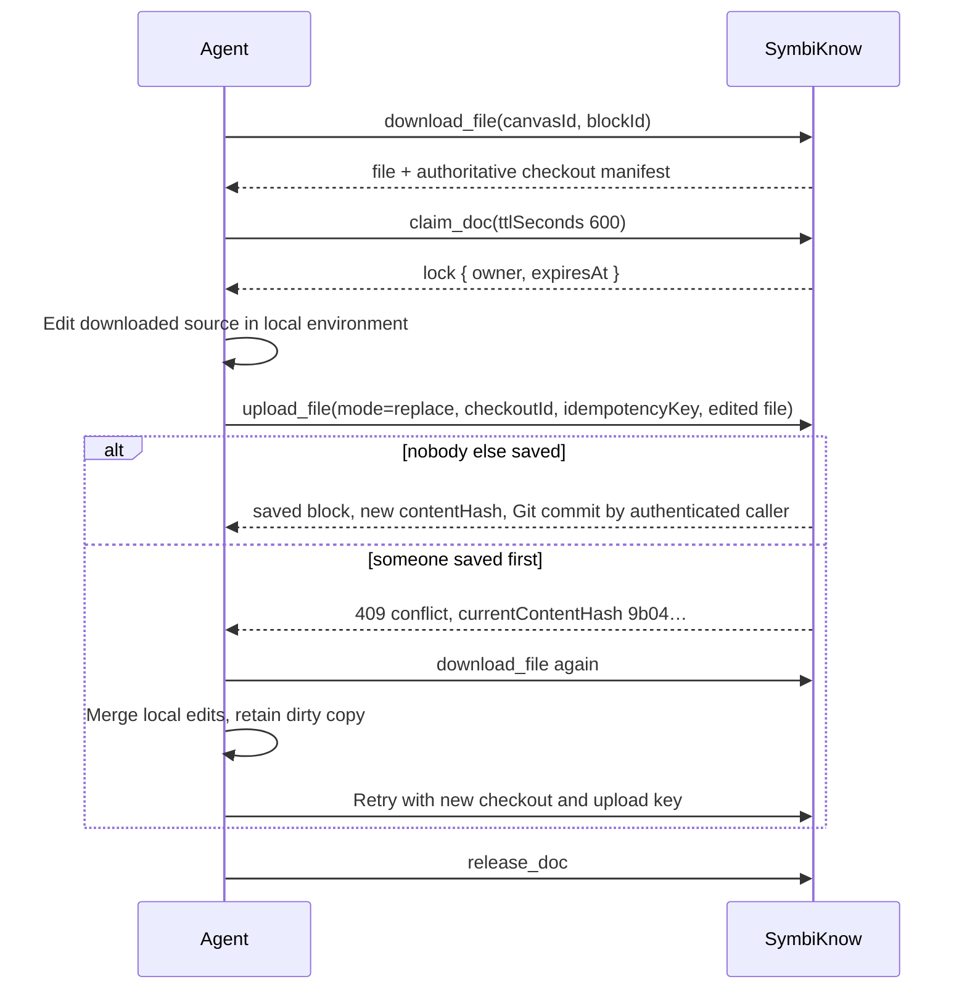

# Safe collaboration

How people and agents change the same documents without losing work: content hashes, locks, review tokens, per-document Git history, and branch-targeted edits.

## The rule: say what you read

Every write that replaces existing content names the version it was based on. The server compares it inside the serialized write queue, so two writers cannot both pass the check.

| Guard | Where it applies | On mismatch |
| --- | --- | --- |
| `expectedContentHash` | Edits, uploads replacing a document, deletions, branch edits | `409`; the body carries `currentContentHash` (branch edits put it in the message) |
| `expectedDocumentState` | Review token from `shared/document-state.ts` (content versions + metadata, not locks) | `409` |
| `expectedSavedCrossLinks` | JSON of reviewed outgoing cross-canvas links, on update and delete | `409`; references stay for review |
| Lock | Content, title, or loader change while another actor holds the lock | `423` |

MCP content changes use downloaded files. `upload_file` requires an explicit mode, a server-owned checkout for replacement or proposal, and an idempotency key. The checkout binds caller, canvas, document incarnation, branch, loader, content hash and revision. `delete_doc` requires the current content hash. On conflict, download again and merge locally before retrying.

## A safe agent edit



Example MCP call:

```json
{
  "canvasId": "5d206584-9349-4e3e-9666-5c3bc858223e",
  "mode": "replace",
  "checkoutId": "c728f8d7-401d-4854-8776-88dccce8cd24",
  "filename": "rollback-runbook.md",
  "idempotencyKey": "rollback-freeze-step-1",
  "content": "# Rollback runbook\n\n1. Freeze deploys …",
  "message": "Add freeze step"
}
```

Over MCP, a conflict comes back as a structured result instead of a plain error:

```json
{ "error": "This document changed since you read it. Read it again and reapply your edit.",
  "code": "conflict", "currentContentHash": "9b04e2d1c7aa3310",
  "instruction": "Download the current file and merge in your environment before retrying; keep your edited working copy." }
```

Locks last 30–3600 seconds (default 600). The card shows who is editing, locks expire on their own, and a person can take one over from the editor.

## History: one Git repository per document

Each document has its own repository under `DATA_DIR/.versions/<blockId>`. Saving creates a commit authored by the actor (`Browser`, `Symbi`, `Codex - laptop`). Positions, links, other documents, settings, and credentials are never part of these commits.

| Operation | Effect |
| --- | --- |
| `list_versions` | `{ current, branches, commits }`, UTC ISO 8601 times; `limit`/`cursor` page commits |
| `create_branch` | Branch for this one file |
| `download_file` / `upload_file` with a branch checkout | Reads or commits a non-current branch in a temporary detached worktree. The visible document stays the same for everyone. Branch edits change content only and need the branch's own hash |
| `switch_branch` | Shared mutation: changes the visible document for everyone |
| `merge_branch` | Merges into the current branch; a conflict aborts and leaves the file unchanged |
| `delete_branch` | Deletes a fully merged branch; `main`, the current branch, and unmerged branches are protected |
| `restore_revision` | Restores an old revision as a new commit; nothing is rewritten |

Deleting a document records a final commit naming who deleted it; the last content stays in history.

## Deleting safely

A delete can carry `{ expectedContentHash, expectedDocumentState, expectedSavedCrossLinks, requireUnreferenced }`. With `requireUnreferenced: true` it fails while any saved incoming reference exists on another canvas, archived sources included. An empty body keeps the browser's existing behavior; MCP always sends the hash.

## Repeat-safe imports

`POST /api/canvases/:id/imports` takes 1–20 documents, each with an `idempotencyKey` (max 128 chars). Retrying with the same key returns the same document; reusing a key for different content returns `409`.

```json
{ "results": [
  { "index": 0, "ok": true, "blockId": "…", "contentHash": "…", "revision": "a1b2c3d", "processing": "pending" },
  { "index": 1, "ok": false, "error": "idempotencyKey is required" }
] }
```

## Chat proposals and Reflex changes

- **Symbi chat never writes directly.** Its edit, move, and link tools prepare a proposal the person reviews and applies. Apply re-checks every source (`409` with conflicts if changed), and applied changes can be undone while later edits allow it. Agents cannot approve their own proposals.
- **Symbi Reflex** writes only through checked mutations that verify source identity, generation, revision, ownership, and exact evidence. Every change leaves a receipt with an inverse proof for Undo.
