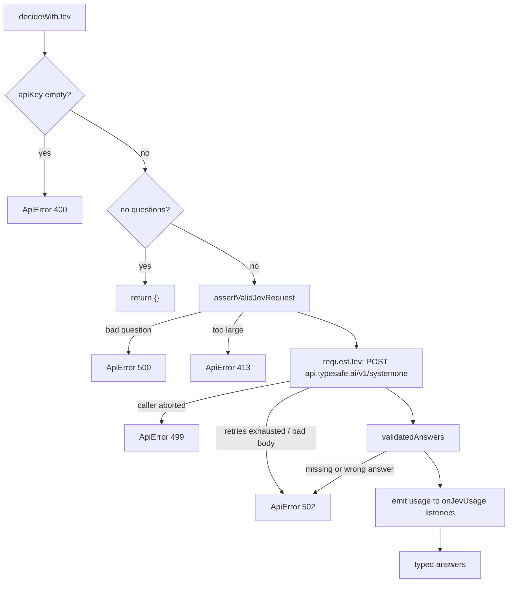
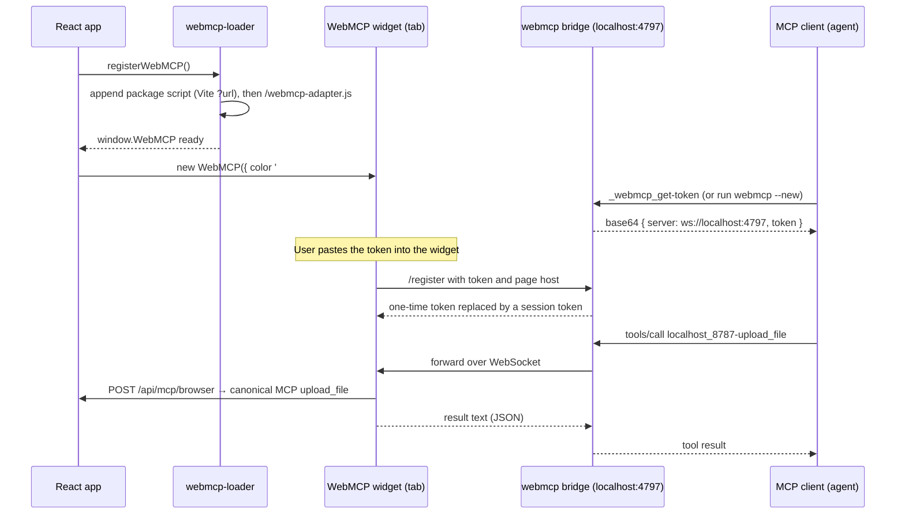

# Jev SDK and WebMCP

This page covers two small agent-facing surfaces: the typed Jev SDK that `server/sdk.ts` exports, and the WebMCP tools that let a local agent drive the open browser tab.

> For what Jev is used for inside the app (the six Reflex actions), see [Symbi Reflex](symbi-reflex.md). For the HTTP MCP server and its tokens, see [MCP and API](mcp-and-api.md). The short reference in `docs/jev/sdk-reference.md` and the contract in `docs/jev/decision-contract.md` describe the same SDK; this page adds the code-level details.

## Part 1: the Jev SDK

### What it is

The SDK is a thin, typed client for the TypeSafe Jev decision API. You send a JSON `state` and named questions. Jev returns one typed answer per question. The SDK checks the request before sending, and checks every answer after receiving.

It has no dependency on the canvas, the store, or the HTTP server. `tsconfig.sdk.json` compiles only `server/jev.ts`, `server/jev-transport.ts`, `server/jev-answers.ts`, `server/errors.ts`, and `server/sdk.ts`. The compiler also pulls in `server/jev-provider-error.ts`, because the transport imports it.

### Build and import

| Item | Value | Source |
| --- | --- | --- |
| Build command | `npm run build:sdk` (`tsc -p tsconfig.sdk.json`) | `package.json` |
| Also built by | `npm run build`, and `presmoke` before `npm run smoke` | `package.json` |
| Output | `dist/sdk/sdk.js` + `dist/sdk/sdk.d.ts` (ES modules, `NodeNext`) | `tsconfig.sdk.json` |
| `main` / `types` | `./dist/sdk/sdk.js` / `./dist/sdk/sdk.d.ts` | `package.json` |
| `exports["."]` | `types` → `sdk.d.ts`, `import` → `sdk.js` (no `require` entry) | `package.json` |
| `files` | `dist/sdk`, `docs/jev` | `package.json` |
| Runtime | Node `^20.19.0 \|\| >=22.12.0`; uses `AbortSignal.any`, `fetch`, `process.env` | `package.json`, `server/jev-transport.ts` |

The package is named `symbiknow` and is `"private": true`, so it is not published to npm. Use it by path, as `features/smoke.js` does (`import * as sdk from '../dist/sdk/sdk.js'`), or install the repository as a `file:` or Git dependency and `import … from 'symbiknow'`. Only ESM `import` is supported.

### Public exports

Everything below comes from `server/sdk.ts`. Anything not listed (for example `requestJev`, `JEV_REQUEST_TOKEN_LIMIT`, `isJevBillingFailure`) is internal.

| Export | Kind | What it does |
| --- | --- | --- |
| `choice(instructions, criteria)` | function | Builds `{ type: 'choice' }`. Keeps option keys literal (`const` type parameter). |
| `score(instructions, levels)` | function | Builds `{ type: 'score' }` with an ordered label list. |
| `noul(instructions, criteria?)` | function | Builds `{ type: 'noul' }`; `criteria` may have `true` and/or `false`. |
| `decideWithJev(apiKey, state, questions, fetcher?, options?)` | function (`JevDecider`) | Validates, calls Jev, validates answers, emits usage. |
| `askJev(decider, apiKey, state, questions, options?)` | function | Calls any `JevDecider` and returns `AnswersFor<Q>`, typed to the literal questions. |
| `choiceAnswer(answers, id, options)` | function | Returns `{ value, confidence }`; `value` is narrowed to `options`. |
| `scoreAnswer(answers, id)` | function | Returns the `ScoreAnswer`. |
| `noulAnswer(answers, id)` | function | Returns the probability as a number. |
| `topScore(answer)` | function | Returns `answer.score` (the selected level). |
| `expectedScore(answer, levels)` | function | Σ `level × p(level)` divided by `levels − 1`, so the result is 0 to 1. |
| `assertValidJevRequest(state, questions)` | function | The pre-send checks, callable on their own. |
| `estimateJevTokens(value)` | function | `ceil(UTF-8 bytes of JSON.stringify(value) / 3)`. |
| `onJevUsage(listener)` | function | Subscribes to usage events; returns an unsubscribe function. |
| `JEV_MODEL` | constant | `process.env.TYPESAFE_MODEL` (trimmed) or `'jev-1.13.0'`, read once at module load. |
| `JEV_STATE_TOKEN_LIMIT` | constant | `32_000`. |
| `ApiError` | class | `Error` with `status: number` and optional `details`. |

Exported types: `ChoiceQuestion`, `ScoreQuestion`, `NoulQuestion`, `JevQuestion`, `ChoiceAnswer`, `ScoreAnswer`, `NoulAnswer`, `JevAnswer`, `AnswerFor`, `AnswersFor`, `JevCallOptions` (`signal`, `maxRetries`, `baseDelayMs`), `JevDecider`, and `JevUsage` (`model`, `inputTokens`, `outputTokens`, `questions`, `at`).

Answer shapes (`server/jev.ts`):

| Type | Fields |
| --- | --- |
| `ChoiceAnswer` | `choice` (one of your keys), `probabilities` (per key), `confidence` |
| `ScoreAnswer` | `score` (0 to levels−1), `probabilities` (keys `"0"`, `"1"`, …), `confidence`, optional `legend` |
| `NoulAnswer` | `noul` (0 to 1) |

### Complete example

```ts
import { askJev, choice, choiceAnswer, decideWithJev, expectedScore, noul, noulAnswer,
  onJevUsage, score, scoreAnswer, ApiError } from 'symbiknow';

const stop = onJevUsage(u => console.log(`${u.model}: ${u.inputTokens} in / ${u.outputTokens} out, ${u.questions} questions`));

const state = {
  claim: 'We roll back by redeploying the previous tag.',
  passages: [{ id: 'p0', excerpt: 'Rollback: run deploy.sh with the last green tag.' }],
};
const questions = {
  verdict: choice('Do the passages support the claim?',
    { yes: 'Directly supported', no: 'Directly contradicted', unclear: 'Missing or ambiguous' }),
  quality: score('How complete is the rollback description?', ['none', 'partial', 'complete']),
  isRunbook: noul('Is this passage part of an operations runbook?'),
};

const controller = new AbortController();
try {
  // askJev keeps the literal types: answers.verdict.choice is 'yes' | 'no' | 'unclear'.
  const answers = await askJev(decideWithJev, process.env.TYPESAFE_API_KEY ?? '', state, questions,
    { signal: controller.signal, maxRetries: 1 });

  const verdict = choiceAnswer(answers, 'verdict', ['yes', 'no', 'unclear'] as const);
  const quality = scoreAnswer(answers, 'quality');
  const runbook = noulAnswer(answers, 'isRunbook');

  console.log(verdict.value, verdict.confidence);          // 'yes', 0.91
  console.log(quality.score, expectedScore(quality, 3));   // 2, 0.87
  console.log(runbook > 0.5 ? 'runbook' : 'other');
} catch (error) {
  if (error instanceof ApiError && error.status === 413) console.error('Send less state.');
  else throw error;
} finally {
  stop();
}
```

`askJev` passes `undefined` as the fetcher. To inject a custom `fetch` (tests, proxies), wrap the decider: `(k, s, q, _f, o) => decideWithJev(k, s, q, myFetch, o)`. `features/smoke.js` calls `decideWithJev` directly with a fake fetcher.

### Call flow



### Request validation and token budget (`server/jev.ts`)

| Check | Rule | Error |
| --- | --- | --- |
| Question id | `/^[A-Za-z0-9_]{1,128}$/` | `500 Invalid Jev question id` |
| Instructions | Not empty after `trim()` | `500` |
| Choice | 2 to 255 option keys; no empty key | `500` |
| Score | 2 to 10 levels | `500` |
| Noul criteria | Keys only `true` / `false` | `500` |
| State + largest question | ≤ `JEV_STATE_TOKEN_LIMIT` (32,000 estimated tokens) | `413` |
| State + all questions | ≤ `JEV_REQUEST_TOKEN_LIMIT` (64,000, not exported) | `413` |

Status `500` here means "our code built a bad question", not bad user input. The token estimate is deliberately conservative (bytes ÷ 3), so it overcounts English text.

Answer validation: every requested id must come back with the same `type`. `confidence`, `noul`, and every probability must be finite and in `[0, 1]`. A choice must be one of your keys, with a probability for every key. A score must be in `[0, levels − 1]`, with a probability for every level index. The sum of probabilities is not checked. Any failure is `502 Jev returned an invalid answer for <id>`.

### Transport (`server/jev-transport.ts`)

| Setting | Value |
| --- | --- |
| Endpoint | `POST https://api.typesafe.ai/v1/systemone`, `Authorization: Bearer <key>` |
| Body | `{ model: JEV_MODEL, state, questions }` |
| Per-attempt timeout | 20,000 ms (`AbortSignal.timeout`, combined with your `signal`) |
| Retries | `maxRetries` default 2 (so up to 3 attempts) |
| Retried statuses | 429, 500, 502, 503, 504, 529, and network errors (including the 20 s timeout) |
| Backoff | `min(baseDelayMs × 2^attempt, 5,000)` ± 25% jitter; `baseDelayMs` default 500 |
| `Retry-After` | Seconds or HTTP date. Used instead of backoff if ≤ 10,000 ms; if larger, no retry |
| Response cap | 262,144 bytes, read as a stream; the reader is cancelled when exceeded |
| Not retried | 401 (bad key) and any other non-retryable status |

Cancellation: if your `signal` aborts before an attempt, during a failed fetch, or during a backoff sleep, the call throws `ApiError(499, 'Jev request was cancelled')` at once. There is no cache and no global state, except the usage listener set.

Usage events: after answers pass validation, if the response has finite `usage.input_tokens` and `usage.output_tokens`, each listener gets a `JevUsage`. A listener that throws is caught and logged with `console.warn`; the result is still returned. Listeners are process-wide. In the app, `server/api-symbi.ts` uses one listener with `AsyncLocalStorage` to add tokens to the current brain request.

### Errors

All failures are `ApiError` from `server/errors.ts` (`status`, `message`, optional `details`).

| Status | When | Message (examples) |
| --- | --- | --- |
| 400 | No API key | `A TypeSafe Jev API key is required` |
| 413 | Over the token budget | `Jev state is too large for a single decision…` |
| 499 | Your `signal` aborted | `Jev request was cancelled` |
| 500 | Bad question construction | `Jev score question q must have 2 to 10 levels` |
| 502 | Key rejected (provider 401) | `TypeSafe Jev rejected the API key (401)…` |
| 502 | Network failure after retries | `Could not reach TypeSafe Jev` |
| 502 | Provider error status | `TypeSafe Jev rate limit reached (429)…`, `…overloaded (529)…`, `Jev request failed (402): <detail>` |
| 502 | Bad body | `Jev returned an empty response`, `…invalid JSON`, `…response is too large`, `…no answers` |
| 502 | Bad answer | `Jev returned an invalid answer for <id>` |

Provider error details are taken from `detail` (string, `error_type`, or the first two validation entries) or `message`, cut to 250 characters.

`server/jev-provider-error.ts` keeps two private tags on these 502 errors, in `WeakSet`s: a billing failure (provider 402) and a context-limit failure (provider 400 with "max tokens exceeded"). Reflex uses them (`server/jev/runtime.ts` does not retry billing failures; `server/jev/actions/question-batch-recovery.ts` splits a batch on context-limit failures). These helpers are **not** exported from the SDK. SDK users see only status 502 and the message.

### What the SDK deliberately does not do

- It does not read `.env` files or settings. You pass the API key on every call. Only `JEV_MODEL` reads `process.env`.
- It does not send documents. Jev sees only the `state` and questions you pass.
- It has no thresholds, evidence checks, permissions, Undo, or write logic. Answers alone authorize nothing. Those rules live in Symbi Reflex (see [Symbi Reflex](symbi-reflex.md)).
- It does not cache decisions, batch questions, or run calls in parallel.
- It does not persist usage. It only emits events.

## Part 2: WebMCP

### What it is

WebMCP lets an MCP client on your computer call tools that the open SymbiKnow tab registers. The tab runs the tool code in the page, using the page's own `/api` session. It uses the vendored `@jason.today/webmcp` 0.1.13 widget and its local bridge.

### Files

| File | Role |
| --- | --- |
| `src/webmcp.ts` | `registerWebMCP()`, the tool list, widget options |
| `src/webmcp-loader.ts` | Loads the widget script once, then the adapter |
| `src/webmcp-context.ts` | Stack of `{ getActiveCanvasId, onChanged }`; the newest registration wins, disposal restores the previous one |
| `src/webmcp-types.ts` | `WebMCPInstance`, `JsonSchema`, `ToolResult`, and `window.WebMCP` |
| `public/webmcp-adapter.js` | One line: `window.WebMCP = WebMCP;` |
| `vendor/jason.today-webmcp-0.1.13.tgz` | Upstream package; only change: the npm `http` dependency was removed (`vendor/README.md`, OSV `MAL-2025-22760`) |

`src/app-canvas-data.ts` calls `registerWebMCP(() => activeCanvasId.current, reload)` in a mount effect. `onChanged` reloads the canvas after a write.

### Canonical tools and browser bridge

The browser fetches `/api/mcp/browser` to discover the real MCP tool schemas. Each invocation posts `{name, arguments}` to that owner-session endpoint, which executes the canonical MCP server and records the authenticated `browser-owner` identity. There is no separate browser tool inventory or handwritten document mutation handler. Required `canvasId` arguments can default to the active canvas; optional search scopes remain global.

Browser agents use `download_file` and explicit `upload_file` modes with the same authoritative checkout, idempotency, conflict, branch and website-package rules as other clients. Successful mutations reload the canvas. The `active_canvas` resource uses canonical `read_canvas`.

### How the loader and widget work



Loader details (`src/webmcp-loader.ts`):
- The upstream file is a classic script that declares `class WebMCP` globally but does not set `window.WebMCP`. The adapter script fixes that.
- `libraryLoaded` stops the library script from loading twice (a second `class` declaration would fail). The adapter can load again.
- If loading fails, `scriptPromise` is reset, so a later mount can retry. The error is logged as `WebMCP unavailable:`.
- Only one widget instance exists per page (`instance` in `src/webmcp.ts`). New mounts only push a new context.

Upstream widget behavior (not set by SymbiKnow): the session token lives in `sessionStorage` (`webmcp_token`); the widget disconnects after 5 minutes of inactivity; the bridge times out a tool call after 30 seconds. `src/brand-theme.css` restyles `.webmcp-trigger` with the SymbiKnow icon.

### Running the bridge

```sh
# MCP client config: run the bridge over stdio
./node_modules/.bin/webmcp --mcp

# Or print a one-time connection token without asking the model
./node_modules/.bin/webmcp --new

# Stop the background server / remove all authorized tokens
./node_modules/.bin/webmcp --quit
./node_modules/.bin/webmcp --clean
```

```json
{ "mcpServers": { "symbiknow-tab": { "command": "./node_modules/.bin/webmcp", "args": ["--mcp"] } } }
```

The bin points to `node_modules/@jason.today/webmcp/build/index.js`. The default port is 4797 (`--port` changes it). State is kept in `~/.webmcp/` (`.env` with `WEBMCP_SERVER_TOKEN`, `.webmcp-tokens.json`, a PID file). Avoid upstream `--config`: it writes `npx @jason.today/webmcp@latest`, which bypasses the vendored copy.

Steps: start the agent with the bridge configured, open a canvas, ask the agent to "get a WebMCP token" (tool `_webmcp_get-token`), click the widget at the bottom left, paste the token. Some clients need a restart to see new tools.

### Limits and security

| Topic | Behavior |
| --- | --- |
| Machine | Same machine only. The token's server address is `ws://localhost:4797`, so the browser and bridge must share a host. The Settings note in `src/ConnectionClientSetup.tsx` says the same. |
| Scope | The agent acts with the tab's browser session, not an MCP token. MCP token scopes and canvas limits do not apply. |
| Attribution | Writes are recorded as authenticated `browser-owner` and enter the MCP audit ledger. |
| Write guard | The canonical MCP API transport enforces active reviewed drafts and current permissions. |
| Conflicts | Replacement/proposal uploads require the downloaded checkout; `delete_doc` requires the current content hash. |
| Lifetime | Tools exist only while the tab is open and connected. |

## Further reading

- [Symbi Reflex](symbi-reflex.md): how Reflex uses the SDK.
- [MCP and API](mcp-and-api.md): the HTTP and stdio MCP servers.
- [Security and access](security-and-access.md): principals, tokens, and the agent write guard.
- `docs/jev/sdk-reference.md`, `docs/jev/decision-contract.md`.
